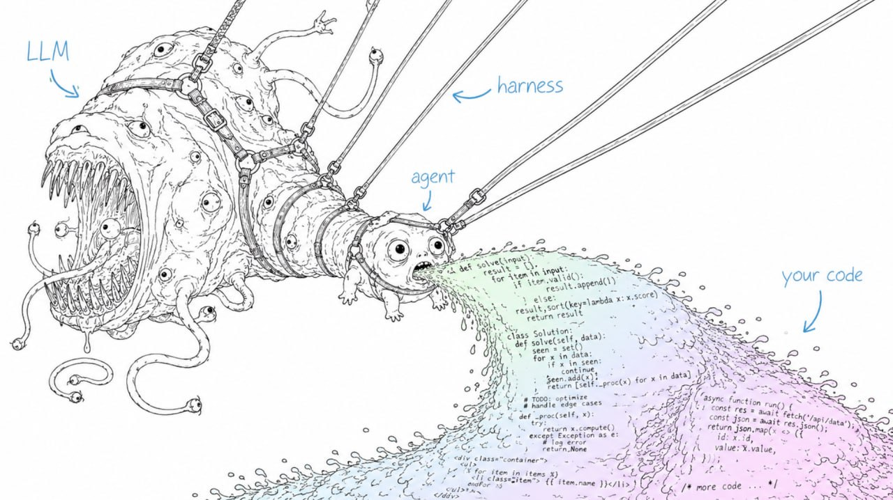

<p align="center">
  
</p>

# LLM-Wiki Skills

Portable Agent Skills for coding agents that help users understand, choose, build, migrate, operate, evaluate and govern **LLM-Wiki** systems.

LLM-Wiki is a pattern where an agent compiles raw sources into a persistent, human-readable, git-versioned Markdown wiki:

```text
raw/  ->  wiki/  ->  AGENTS.md / CLAUDE.md / skills
```

This repository packages that pattern as installable skills for Claude Code, Codex, Cursor, OpenCode and other Agent Skills-compatible coding agents.

## Install

List available skills:

```bash
npx skills add po4yka/llm-wiki-skills --list
```

Install the full pack for Claude Code:

```bash
npx skills add po4yka/llm-wiki-skills --skill '*' -a claude-code
```

Install selected advisory skills for Claude Code and Codex:

```bash
npx skills add po4yka/llm-wiki-skills \
  --skill llm-wiki-orient \
  --skill llm-wiki-faq \
  --skill llm-wiki-choose \
  --skill llm-wiki-setup \
  -a claude-code -a codex
```

Use one skill without installing it:

```bash
npx skills use po4yka/llm-wiki-skills --skill llm-wiki-faq --agent claude-code
```

## What this pack covers

The repository contains a full lifecycle skill system for LLM-Wiki adoption:

```text
learn -> answer objections -> choose -> diagnose -> plan -> set up -> migrate -> operate -> audit -> publish/archive -> evolve
```

It includes skills for:

- explaining the pattern and evidence behind it;
- choosing ready-made versus custom solutions;
- mapping concrete open-source implementations, implementation archetypes, retrieval stacks, ingestion stacks, MCP integrations and eval tooling;
- setting up local-first, repo-docs, Obsidian, MCP/API, retrieval, ingestion or team workflows;
- migrating existing document sets into `raw/` and `wiki/` structure;
- running triage, ingest, query and lint operations;
- benchmarking pilot value and evaluating whether the wiki is useful;
- auditing provenance, claim anchors, trust, security threat model and model/data policy;
- refreshing stale sources, redacting private content, publishing and archiving;
- compiling reusable wiki procedures into installable Agent Skills.

## Skill groups

### Learn and choose

| Skill | Use when |
|---|---|
| [`llm-wiki-orient`](skills/llm-wiki-orient/SKILL.md) | The user is new to LLM-Wiki and wants the pattern, trade-offs and solution landscape explained. |
| [`llm-wiki-faq`](skills/llm-wiki-faq/SKILL.md) | The user asks why LLM-Wiki is needed, what benefits it gives, what evidence exists, how to keep it alive, or whether Obsidian is required. |
| [`llm-wiki-paf-adoption`](skills/llm-wiki-paf-adoption/SKILL.md) | The user asks how LLM-Wiki maps to PAF Nexus/Cortex adoption, company-level Nexus pilots, shared context governance or decision-impact measurement. |
| [`llm-wiki-news-radar`](skills/llm-wiki-news-radar/SKILL.md) | The user asks for fresh news, projects, papers, releases or ecosystem changes. |
| [`llm-wiki-choose`](skills/llm-wiki-choose/SKILL.md) | The user needs help deciding whether to adopt a ready-made solution or build their own. |

### Technology landscape

| Skill | Use when |
|---|---|
| [`llm-wiki-ecosystem-registry`](skills/llm-wiki-ecosystem-registry/SKILL.md) | The user asks what LLM-Wiki implementations or adjacent open-source projects exist, or how OpenWiki, nashsu/llm_wiki, Vouch, RepoAgent and smaller projects compare. |
| [`llm-wiki-implementation-deep-dive`](skills/llm-wiki-implementation-deep-dive/SKILL.md) | The user wants implementation-level comparison, architecture patterns, production-readiness analysis, or what to copy from concrete LLM-Wiki projects. |
| [`llm-wiki-retrieval-architect`](skills/llm-wiki-retrieval-architect/SKILL.md) | The user needs to choose between lexical search, SQLite FTS, hybrid retrieval, vector DBs, rerankers, GraphRAG, metadata filters, MCP retrieval or custom indexes. |
| [`llm-wiki-ingestion-stack`](skills/llm-wiki-ingestion-stack/SKILL.md) | The user has PDFs, Office docs, HTML, web clips, audio/video, code, chats, email, tables, databases, scans or production ETL needs and wants source-preserving ingestion, manifests, fidelity gates or sync/dedupe design. |
| [`llm-wiki-mcp-integration`](skills/llm-wiki-mcp-integration/SKILL.md) | The user wants to expose a wiki to Claude Code, Codex, Cursor, ChatGPT, VS Code, GitHub Copilot, LangGraph or other clients through MCP or a local/remote API. |
| [`llm-wiki-eval-tooling`](skills/llm-wiki-eval-tooling/SKILL.md) | The user wants concrete Ragas, promptfoo, DeepEval, TruLens, LangSmith, retrieval-metric, scorecard, CI or red-team evaluation gates. |

### Diagnose, plan and evaluate

| Skill | Use when |
|---|---|
| [`llm-wiki-doctor`](skills/llm-wiki-doctor/SKILL.md) | An existing vault/docs folder needs read-only diagnosis before changes. |
| [`llm-wiki-migration-planner`](skills/llm-wiki-migration-planner/SKILL.md) | The user wants a dry-run migration plan before moving files. |
| [`llm-wiki-eval`](skills/llm-wiki-eval/SKILL.md) | The user wants to measure whether the wiki is useful, grounded, maintainable and safe. |
| [`llm-wiki-benchmark-suite`](skills/llm-wiki-benchmark-suite/SKILL.md) | The user wants a practical with-wiki versus without-wiki pilot benchmark. |
| [`llm-wiki-provenance`](skills/llm-wiki-provenance/SKILL.md) | Claims need source-level or claim-level provenance. |
| [`llm-wiki-claim-anchors`](skills/llm-wiki-claim-anchors/SKILL.md) | Important claims need deterministic anchors and support labels. |
| [`llm-wiki-conflict-resolver`](skills/llm-wiki-conflict-resolver/SKILL.md) | Lint or review found contradictory wiki claims. |

### Implement and migrate

| Skill | Use when |
|---|---|
| [`llm-wiki-setup`](skills/llm-wiki-setup/SKILL.md) | The user chose a target setup and wants installation, config, hooks, templates or git workflow help. |
| [`llm-wiki-design`](skills/llm-wiki-design/SKILL.md) | The user wants to design or build a custom LLM-Wiki product, plugin, CLI or agent workflow. |
| [`llm-wiki-refactor`](skills/llm-wiki-refactor/SKILL.md) | Existing documents, notes, docs folders or vaults should be reorganized into LLM-Wiki structure. |
| [`llm-wiki-local-first-stack`](skills/llm-wiki-local-first-stack/SKILL.md) | The user wants Markdown/git/Obsidian/local search/local model architecture. |
| [`llm-wiki-obsidian-hardening`](skills/llm-wiki-obsidian-hardening/SKILL.md) | An Obsidian vault needs agent-safe wikilink, attachment, frontmatter and sync rules. |
| [`llm-wiki-repo-docs`](skills/llm-wiki-repo-docs/SKILL.md) | A codebase needs OpenWiki-style agent-readable repository documentation. |
| [`llm-wiki-github-action`](skills/llm-wiki-github-action/SKILL.md) | The user wants scheduled lint, validation, eval, ingestion, publishing, or PR-based maintenance. |

### Capture and domain workflows

| Skill | Use when |
|---|---|
| [`llm-wiki-company-flow-audit`](skills/llm-wiki-company-flow-audit/SKILL.md) | The user wants to map company knowledge flows, automation boundaries, sync points, permissions, review UI needs or maintenance trade-offs into an adoption plan. |
| [`llm-wiki-capture-pipeline`](skills/llm-wiki-capture-pipeline/SKILL.md) | The user wants a general inbox/capture pipeline. |
| [`llm-wiki-channel-capture`](skills/llm-wiki-channel-capture/SKILL.md) | A specific channel such as Telegram, email, browser clips, voice, PDFs, GitHub or Slack needs capture rules. |
| [`llm-wiki-interview`](skills/llm-wiki-interview/SKILL.md) | Tacit knowledge should be extracted through an agent-led interview. |
| [`llm-wiki-adr-memory`](skills/llm-wiki-adr-memory/SKILL.md) | The user wants to recover or maintain decision provenance and ADR memory. |
| [`llm-wiki-domain-pack`](skills/llm-wiki-domain-pack/SKILL.md) | A domain-specific taxonomy, templates and review policy are needed. |

### Operate and trust

| Skill | Use when |
|---|---|
| [`wiki-triage`](skills/wiki-triage/SKILL.md) | Inbox material needs sorting before full ingest. |
| [`wiki-ingest`](skills/wiki-ingest/SKILL.md) | Trusted raw sources should become source/entity/concept/synthesis pages. |
| [`wiki-query`](skills/wiki-query/SKILL.md) | A question should be answered from the compiled wiki and useful answers saved back. |
| [`wiki-lint`](skills/wiki-lint/SKILL.md) | The wiki needs structural health checks, stale-claim detection and review queues. |
| [`llm-wiki-trust-audit`](skills/llm-wiki-trust-audit/SKILL.md) | The user wants an anti-slop, provenance, confidence and human-synthesis audit. |
| [`llm-wiki-source-refresh`](skills/llm-wiki-source-refresh/SKILL.md) | Stale or current-state source-backed claims need refresh reports. |
| [`llm-wiki-privacy-redactor`](skills/llm-wiki-privacy-redactor/SKILL.md) | Private content needs preview redaction before export or model-boundary use. |
| [`llm-wiki-threat-model`](skills/llm-wiki-threat-model/SKILL.md) | The user needs a STRIDE/LINDDUN-style threat model, attack-surface map, risk matrix, security architecture or red-team rollout plan. |
| [`llm-wiki-security-review`](skills/llm-wiki-security-review/SKILL.md) | Existing skills, ingestion, retrieval, MCP/API, CI, vault access, exports or write permissions need security review. |
| [`llm-wiki-model-policy`](skills/llm-wiki-model-policy/SKILL.md) | The user needs local/cloud model and data-use policy. |
| [`llm-wiki-export-publish`](skills/llm-wiki-export-publish/SKILL.md) | A public, internal, agent-readable, API, graph or archive subset of the wiki should be exported or published with manifests, redaction, checksums and release gates. |
| [`llm-wiki-archive`](skills/llm-wiki-archive/SKILL.md) | The wiki needs long-term durability and archive manifests. |

### Skill and memory governance

| Skill | Use when |
|---|---|
| [`llm-wiki-skill-doctor`](skills/llm-wiki-skill-doctor/SKILL.md) | Agent Skills need quality, trigger, overlap or safety review. |
| [`llm-wiki-skill-compiler`](skills/llm-wiki-skill-compiler/SKILL.md) | Procedural wiki knowledge should become installable Agent Skills. |
| [`llm-wiki-agent-memory-bridge`](skills/llm-wiki-agent-memory-bridge/SKILL.md) | The user needs boundaries between wiki, skills, instruction files and agent memory. |
| [`llm-wiki-team-rollout`](skills/llm-wiki-team-rollout/SKILL.md) | A team wants onboarding, ownership, PR review, permissions and knowledge-maintenance workflows. |

## Repository contents

| Path | Purpose |
|---|---|
| [`skills/`](skills/) | Installable Agent Skills. Each folder has a `SKILL.md` with valid Agent Skills frontmatter. |
| [`skills.sh.json`](skills.sh.json) | Directory grouping metadata for skills.sh-style discovery. |
| [`docs/`](docs/) | Conceptual reference docs behind the skills, including [`docs/12-evidence-and-faq.md`](docs/12-evidence-and-faq.md), [`docs/13-ecosystem-matrix.md`](docs/13-ecosystem-matrix.md), [`docs/14-technology-stack.md`](docs/14-technology-stack.md), [`docs/15-implementation-deep-dive.md`](docs/15-implementation-deep-dive.md), [`docs/16-retrieval-architecture.md`](docs/16-retrieval-architecture.md), [`docs/17-mcp-api-integration.md`](docs/17-mcp-api-integration.md), [`docs/18-evaluation-methodology.md`](docs/18-evaluation-methodology.md), [`docs/19-security-threat-model.md`](docs/19-security-threat-model.md), [`docs/20-ingestion-pipelines.md`](docs/20-ingestion-pipelines.md), and [`docs/21-publishing-export.md`](docs/21-publishing-export.md). |
| [`templates/`](templates/) | Starter vault files, source manifests, ingestion profiles, export profiles, schemas and page/report/evaluation/API/security/publishing templates. |
| [`policies/`](policies/) | Policy templates for redaction, retention, review and incident response. |
| [`examples/`](examples/) | Small fixtures for first-run and validation scenarios. |
| [`domain-packs/`](domain-packs/) | Domain-specific starter taxonomies and workflows. |
| [`benchmarks/`](benchmarks/) | Pilot questions and scoring rubric for local evaluation. |

## Validation, distribution, and operational reports

Run deterministic repository checks:

```bash
npm run validate
```

Verify the pack works with the upstream `skills` CLI as a local source:

```bash
npm run smoke:skills
```

Generate offline refresh reports:

```bash
npm run refresh:reports
```

The smoke test lists available skills, renders `llm-wiki-faq` with `skills use` without launching an agent, and installs that skill into a temporary Claude Code project with `skills add --copy -y`.

The refresh reports write `dist/source-refresh-report.md` and `dist/ecosystem-refresh-report.md`. They create review queues for stale source-backed claims and ecosystem registry verification; they do not browse the web and do not update truth claims.

## Safety principle

Automate **bookkeeping**, not belief.

The agent may maintain links, frontmatter, indexes, logs, drafts, MOCs, deduplication candidates and lint reports. Human review remains responsible for synthesis, acceptance of ambiguous claims and promotion from draft to reviewed/verified knowledge.

## Freshness and evidence policy

Skills that answer current ecosystem questions should use fresh sources. Skills that argue for adoption should distinguish direct LLM-Wiki evidence, adjacent evidence from RAG/memory/context-engineering work, and the user's own pilot metrics.
