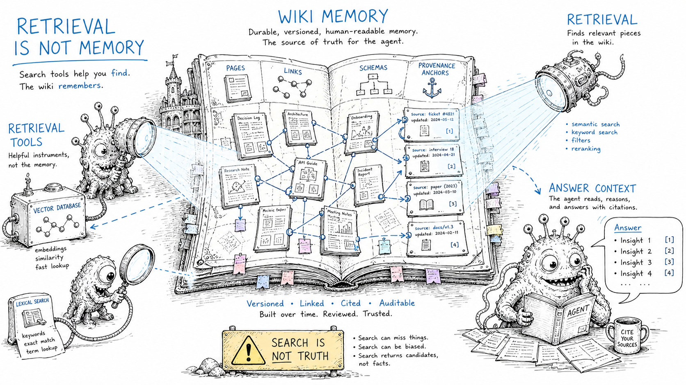

# Tooling landscape

> Status: draft
> Scope: where LLM-Wiki sits among current agent memory, retrieval and knowledge tooling.

## Thesis

LLM-Wiki is not a single tool. It is a pattern that can be implemented with a very small stack and upgraded selectively.

The default stack should be:

```text
Markdown + git + ripgrep + index.md + skills + review gates
```

Only add vector search, graph stores or sidecars when a specific bottleneck appears.



## LLM-Wiki vs RAG

| Question | RAG | LLM-Wiki |
|---|---|---|
| Primary artifact | Index over chunks | Human-readable Markdown wiki |
| When synthesis happens | At query time | During ingest and maintenance |
| What compounds | Embeddings and retrieval config | Pages, links, summaries, comparisons, answers |
| Human inspection | Often indirect | Direct, through files and git |
| Best for | Large source retrieval | Durable domain understanding |

LLM-Wiki can still use retrieval. The distinction is that retrieval serves the compiled wiki; it is not the whole knowledge layer.

## LLM-Wiki vs GraphRAG

GraphRAG and LLM-Wiki both precompute structure. The difference is the primary surface:

- GraphRAG primarily builds a machine-readable graph and summaries for query-time augmentation.
- LLM-Wiki primarily builds a human-readable hypertext corpus that agents can also consume.

GraphRAG ideas are useful for LLM-Wiki linting: entity extraction, relationship typing, community summaries and contradiction detection. But a graph database is not required for a useful first version.

## Claude Code and instruction files

`CLAUDE.md` and `AGENTS.md` are the schema layer, not the wiki itself.

Good pattern:

```text
CLAUDE.md / AGENTS.md -> short boot instructions and pointers
skills/               -> task procedures
wiki/                 -> domain knowledge
```

Bad pattern:

```text
CLAUDE.md -> giant domain dump
```

Large instruction files are hard to review, hard to keep fresh and expensive to load.

## Skills

Skills should encode **how to do a task**:

- ingest a source;
- answer from the wiki;
- lint the wiki;
- triage inbox material;
- migrate frontmatter;
- generate a report.

The wiki encodes **what is known**. Keeping this separation prevents skills from becoming hidden knowledge silos.

## Obsidian

Obsidian is a strong reading and editing surface for LLM-Wiki because it supports:

- Markdown files;
- wikilinks;
- graph view;
- backlinks;
- local-first storage;
- plugin ecosystem;
- manual review.

But Obsidian is not mandatory. The pattern needs files and conventions more than it needs a specific app.

## Retrieval tiers

### Tier 1: `index.md` + `rg`

Best for early and medium personal vaults. Advantages:

- no indexing infrastructure;
- transparent results;
- exact matching for terms, titles and wikilinks;
- easy agent iteration.

### Tier 2: hybrid local search

Use when exact search misses conceptual matches. Combine lexical search, embeddings and reranking.

### Tier 3: graph-aware retrieval

Use when relationships and provenance become the bottleneck. The graph should usually be derived from Markdown and wikilinks, not replace them.

## OpenWiki and wiki memory tools

OpenWiki-style tools are useful signals that the pattern is becoming mainstream, especially for repository documentation and agent-readable memory. Use them as reference implementations, but do not assume they solve personal second-brain trust problems by default.

Before adopting any tool, check whether it supports:

- raw source preservation;
- Markdown output;
- git-based review;
- incremental updates;
- provenance;
- low-confidence staging;
- rejection feedback;
- local or provider-flexible inference;
- no silent overwrite of human edits.

## qmd and hybrid retrieval

`qmd`-style local retrieval is a natural upgrade when `index.md` stops being enough. The key idea is hybrid search: lexical recall, semantic recall and reranking without forcing the wiki into a hosted vector database.

## Local-first storage

For most personal setups:

- Markdown is the source of truth;
- SQLite is enough for state and indexes;
- vector indexes should be reconstructable;
- content hashes should drive incremental updates;
- avoid syncing mutable index files across devices.

## Tool evaluation checklist

A tool is promising if it:

- writes reviewable Markdown;
- keeps raw sources separate;
- supports source hashes or equivalent change detection;
- can run incrementally;
- separates analysis from writing;
- exposes confidence or ambiguity;
- preserves manual edits;
- works without a hosted-only database;
- can be operated through CLI or git workflows.

A tool is risky if it:

- truncates sources without warning;
- rewrites many pages without review;
- hides generated memory in a black box;
- cannot show provenance;
- requires synchronizing non-mergeable index files;
- treats generated summaries as verified truth.
