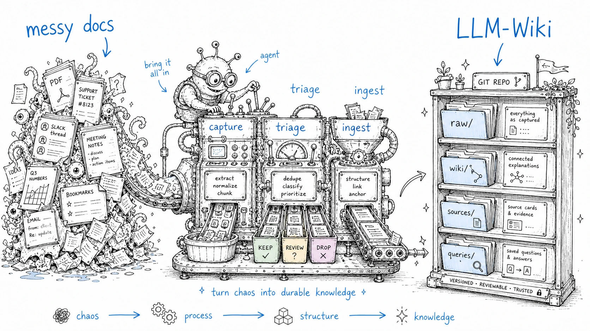

# Implementation playbook

> Status: draft
> Scope: phased adoption path for a personal workflow, a team workflow or a product prototype.
> Current as of: 2026-07-07

## Thesis

Start thinner than feels impressive. A useful LLM-Wiki begins with stable files, explicit review states and repeatable skills. Infrastructure should follow observed bottlenecks.

## Phase 0: repository and vault bootstrap

Create the basic structure:

```text
raw/sources/
raw/assets/
wiki/index.md
wiki/log.md
wiki/sources/
wiki/entities/
wiki/concepts/
wiki/synthesis/
wiki/queries/
inbox/
_meta/schemas/
_agent/reports/
```

Add:

- `AGENTS.md` for vendor-neutral agent instructions;
- `CLAUDE.md` for Claude Code boot instructions;
- a frontmatter schema;
- git;
- a simple backup/sync policy.

Exit criteria:

- the agent can explain the vault layout;
- new pages have required frontmatter;
- raw sources are not rewritten;
- every agent edit is visible in git.

## Phase 1: capture without decisions

Goal: make capture nearly frictionless.

Recommended rule:

> Capture should take less than five seconds and require zero filing decisions.

Use `inbox/` for:

- web clips;
- voice transcripts;
- forwarded messages;
- PDF notes;
- copied snippets;
- chat outputs worth revisiting.

Do not force tags or page placement at capture time. Use `wiki-triage` later.

Exit criteria:

- inbox material is append-only;
- no capture channel writes directly into verified wiki pages;
- triage reports separate useful material from noise.

## Phase 2: source ingest

Use `wiki-ingest` for trusted sources.

Recommended flow:

1. Analyze source without writing final wiki pages.
2. Produce extracted claims, entities, concepts and open questions.
3. Stage low-confidence material.
4. Write source/entity/concept pages.
5. Update `index.md` and `log.md`.

Exit criteria:

- source pages cite raw source paths;
- entity and concept pages accumulate knowledge from multiple sources;
- ambiguous claims are visible rather than hidden.

## Phase 3: query and file-back

Use `wiki-query` to answer questions from the wiki.

The file-back rule is mandatory for compounding:

> If an answer is good enough to reuse, save it as a `wiki/queries/` or `wiki/synthesis/` page.

Exit criteria:

- useful answers survive beyond chat;
- saved query pages link to the source pages they used;
- repeated questions get faster and better.

## Phase 4: lint and review loop

Use `wiki-lint` weekly or after large ingestion batches.

Reports should include:

- broken links;
- orphans;
- pages missing provenance;
- stale pages;
- contradictions;
- taxonomy drift;
- high-impact draft pages.

Exit criteria:

- review queue is visible;
- low-confidence pages do not silently become trusted;
- the user can see where the wiki is weak.

## Phase 5: retrieval upgrade

Upgrade retrieval only after specific symptoms appear.

| Symptom | Upgrade |
|---|---|
| `index.md` is too large to load | split index by domain and add local search. |
| Exact search misses concepts | add embeddings or qmd-style hybrid search. |
| Relationship questions dominate | derive graph edges from wikilinks and frontmatter. |
| Provenance audit is expensive | introduce claim-level anchors. |

## Personal workflow default

Use:

```text
Claude Code + git + Markdown + Obsidian + rg + skills
```

Avoid:

- early vector DBs;
- autonomous bulk rewrites;
- syncing mutable indexes;
- treating generated summaries as reviewed.

## Team workflow default

Teams need stricter write models.

Recommended rules:

- agent writes through pull requests;
- CODEOWNERS or equivalent for high-impact domains;
- lint agents can flag issues but should not resolve truth conflicts;
- secrets and access boundaries must be designed before indexing;
- onboarding docs and decision records are high-value first domains.

## Product prototype default

If building a product or plugin, evaluate features in this order:

1. Safe Markdown writes.
2. Source preservation.
3. Incremental hashing.
4. Review queue.
5. Link and metadata lint.
6. Search integration.
7. Claim-level provenance.
8. Graph UI.

Graph visualization is less important than trust and reviewability.

## Migration strategy

For an existing vault:



1. Freeze schema changes for a week.
2. Run a read-only inventory.
3. Create page-type candidates.
4. Generate a migration plan.
5. Apply to a branch or test copy.
6. Review diffs.
7. Only then run on the real vault.

## Stop conditions

Pause automation if:

- you cannot explain why a page changed;
- lint reports are ignored for multiple cycles;
- retrieval hit rate stays near zero;
- human synthesis sections are being overwritten;
- the wiki grows but is not read.
