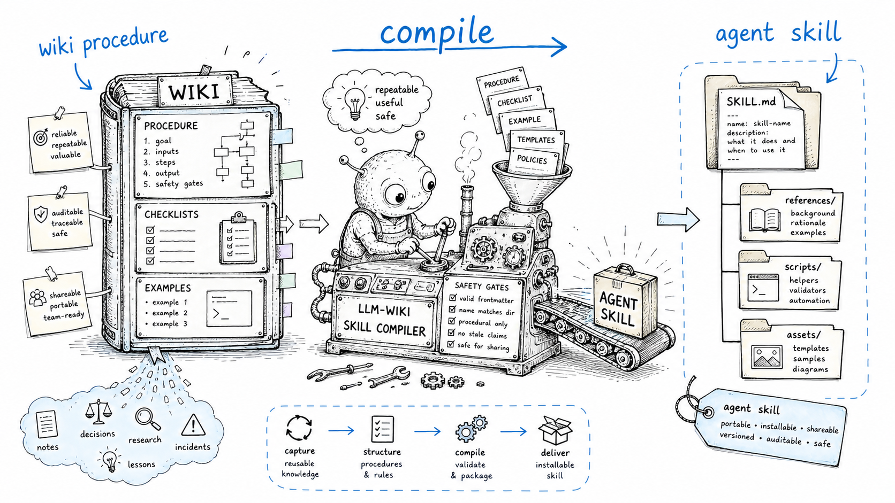

# Skills overview

> Status: draft
> Scope: how the included installable Agent Skills help users adopt and operate LLM-Wiki systems.

## Thesis

This repository is a **skill system for coding agents** that guides a user through the full LLM-Wiki lifecycle:

```text
learn -> answer objections -> choose -> diagnose -> plan -> set up -> migrate -> operate -> audit -> publish/archive -> evolve
```

Skills are operators over the user's context. They should describe **how to work**, not hide domain knowledge inside prompts.

## Skill families

### Learn and choose

| Skill | Purpose |
|---|---|
| [`llm-wiki-orient`](../skills/llm-wiki-orient/SKILL.md) | Explain the LLM-Wiki pattern and solution landscape. |
| [`llm-wiki-faq`](../skills/llm-wiki-faq/SKILL.md) | Answer evidence-backed adoption questions and serious criticism. |
| [`llm-wiki-human-first-design`](../skills/llm-wiki-human-first-design/SKILL.md) | Design human-readable wiki structures, page contracts and agent-free acceptance tests. |
| [`llm-wiki-paf-adoption`](../skills/llm-wiki-paf-adoption/SKILL.md) | Map LLM-Wiki adoption to Product Architecture Framework concepts such as Nexus and Cortex. |
| [`llm-wiki-news-radar`](../skills/llm-wiki-news-radar/SKILL.md) | Browse for fresh ecosystem news, releases, papers and technologies. |
| [`llm-wiki-choose`](../skills/llm-wiki-choose/SKILL.md) | Recommend ready-made vs custom paths. |

### Technology landscape

| Skill | Purpose |
|---|---|
| [`llm-wiki-ecosystem-registry`](../skills/llm-wiki-ecosystem-registry/SKILL.md) | Build or refresh a current registry of LLM-Wiki implementations and adjacent frameworks. |
| [`llm-wiki-implementation-deep-dive`](../skills/llm-wiki-implementation-deep-dive/SKILL.md) | Compare concrete open-source LLM-Wiki implementations at architecture depth. |
| [`llm-wiki-retrieval-architect`](../skills/llm-wiki-retrieval-architect/SKILL.md) | Design the retrieval/indexing layer for an LLM-Wiki. |
| [`llm-wiki-ingestion-stack`](../skills/llm-wiki-ingestion-stack/SKILL.md) | Design a source-preserving ingestion and document-conversion stack. |
| [`llm-wiki-mcp-integration`](../skills/llm-wiki-mcp-integration/SKILL.md) | Design or review MCP/API integration for an LLM-Wiki. |
| [`llm-wiki-eval-tooling`](../skills/llm-wiki-eval-tooling/SKILL.md) | Map evaluation goals to concrete tools, datasets, scorecards and CI gates. |

### Diagnose, plan, and evaluate

| Skill | Purpose |
|---|---|
| [`llm-wiki-doctor`](../skills/llm-wiki-doctor/SKILL.md) | Read-only diagnosis of existing docs or vaults. |
| [`llm-wiki-migration-planner`](../skills/llm-wiki-migration-planner/SKILL.md) | Dry-run migration planning. |
| [`llm-wiki-eval`](../skills/llm-wiki-eval/SKILL.md) | Measure usefulness and retrieval/reuse outcomes. |
| [`llm-wiki-benchmark-suite`](../skills/llm-wiki-benchmark-suite/SKILL.md) | Run a local with-wiki/without-wiki pilot benchmark. |
| [`llm-wiki-critique-audit`](../skills/llm-wiki-critique-audit/SKILL.md) | Stress-test a domain, vault, rollout or product plan against known LLM-Wiki criticisms and residual risks. |
| [`llm-wiki-provenance`](../skills/llm-wiki-provenance/SKILL.md) | Add or repair source and claim-level provenance. |
| [`llm-wiki-claim-anchors`](../skills/llm-wiki-claim-anchors/SKILL.md) | Add deterministic claim anchors and source support labels. |
| [`llm-wiki-conflict-resolver`](../skills/llm-wiki-conflict-resolver/SKILL.md) | Mediate contradictions without auto-fixing truth. |

### Implement and migrate

| Skill | Purpose |
|---|---|
| [`llm-wiki-setup`](../skills/llm-wiki-setup/SKILL.md) | Install and configure a chosen workflow. |
| [`llm-wiki-design`](../skills/llm-wiki-design/SKILL.md) | Design a custom CLI, plugin, product or workflow. |
| [`llm-wiki-refactor`](../skills/llm-wiki-refactor/SKILL.md) | Refactor existing documents into LLM-Wiki structure. |
| [`llm-wiki-local-first-stack`](../skills/llm-wiki-local-first-stack/SKILL.md) | Design local-first storage, search and model stack. |
| [`llm-wiki-obsidian-hardening`](../skills/llm-wiki-obsidian-hardening/SKILL.md) | Harden Obsidian vaults for safe agent edits. |
| [`llm-wiki-repo-docs`](../skills/llm-wiki-repo-docs/SKILL.md) | Build agent-readable repository documentation. |
| [`llm-wiki-github-action`](../skills/llm-wiki-github-action/SKILL.md) | Configure scheduled or PR-based maintenance. |

### Capture and domain workflows

| Skill | Purpose |
|---|---|
| [`llm-wiki-company-flow-audit`](../skills/llm-wiki-company-flow-audit/SKILL.md) | Map company/team information flows into an LLM-Wiki adoption plan. |
| [`llm-wiki-capture-pipeline`](../skills/llm-wiki-capture-pipeline/SKILL.md) | Design general inbox/capture pipelines. |
| [`llm-wiki-channel-capture`](../skills/llm-wiki-channel-capture/SKILL.md) | Design channel-specific capture workflows. |
| [`llm-wiki-interview`](../skills/llm-wiki-interview/SKILL.md) | Extract tacit knowledge through interviews. |
| [`llm-wiki-adr-memory`](../skills/llm-wiki-adr-memory/SKILL.md) | Recover decision provenance and ADR memory. |
| [`llm-wiki-domain-pack`](../skills/llm-wiki-domain-pack/SKILL.md) | Generate domain-specific taxonomies and templates. |

### Operate and trust

| Skill | Purpose |
|---|---|
| [`wiki-triage`](../skills/wiki-triage/SKILL.md) | Sort messy inbox material before ingest. |
| [`wiki-ingest`](../skills/wiki-ingest/SKILL.md) | Convert trusted sources into wiki updates. |
| [`wiki-query`](../skills/wiki-query/SKILL.md) | Answer from the compiled wiki and save reusable answers. |
| [`wiki-lint`](../skills/wiki-lint/SKILL.md) | Run structural and trust health checks. |
| [`llm-wiki-trust-audit`](../skills/llm-wiki-trust-audit/SKILL.md) | Audit anti-slop and human-synthesis boundaries. |
| [`llm-wiki-source-refresh`](../skills/llm-wiki-source-refresh/SKILL.md) | Refresh stale source-backed claims with reports. |
| [`llm-wiki-privacy-redactor`](../skills/llm-wiki-privacy-redactor/SKILL.md) | Preview redactions before publishing or external model use. |
| [`llm-wiki-threat-model`](../skills/llm-wiki-threat-model/SKILL.md) | Build a security threat model across ingestion, retrieval, MCP/API, agents and CI. |
| [`llm-wiki-security-review`](../skills/llm-wiki-security-review/SKILL.md) | Review data boundaries and skill safety. |
| [`llm-wiki-model-policy`](../skills/llm-wiki-model-policy/SKILL.md) | Define model/provider policy by data class and task. |
| [`llm-wiki-export-publish`](../skills/llm-wiki-export-publish/SKILL.md) | Export or publish safe subsets. |
| [`llm-wiki-archive`](../skills/llm-wiki-archive/SKILL.md) | Prepare the wiki for long-term durability. |

### Skill and memory governance

| Skill | Purpose |
|---|---|
| [`llm-wiki-skill-doctor`](../skills/llm-wiki-skill-doctor/SKILL.md) | Review Agent Skills for quality and safety. |
| [`llm-wiki-skill-compiler`](../skills/llm-wiki-skill-compiler/SKILL.md) | Compile wiki procedures into skills. |
| [`llm-wiki-agent-memory-bridge`](../skills/llm-wiki-agent-memory-bridge/SKILL.md) | Separate wiki knowledge from instruction files and agent memory. |
| [`llm-wiki-team-rollout`](../skills/llm-wiki-team-rollout/SKILL.md) | Roll out LLM-Wiki across a team. |
| [`llm-wiki-gitlab-operating-model`](../skills/llm-wiki-gitlab-operating-model/SKILL.md) | Design a team operating model for self-hosted GitLab and internal enterprise environments. |



## Installation model

This repo follows the Agent Skills structure:

```text
skills/<skill-name>/
  SKILL.md
  references/   # optional
  scripts/      # optional
  assets/       # optional
```

`SKILL.md` must have YAML frontmatter with `name` and `description`, and the `name` must match the directory.

## Skill composition

A typical advisory session:

```text
llm-wiki-orient -> llm-wiki-faq -> llm-wiki-critique-audit -> llm-wiki-news-radar -> llm-wiki-choose
```

A typical existing-vault adoption loop:

```text
llm-wiki-doctor -> llm-wiki-migration-planner -> llm-wiki-refactor -> wiki-lint -> llm-wiki-provenance -> llm-wiki-claim-anchors
```

A typical personal operation loop:

```text
llm-wiki-setup -> llm-wiki-channel-capture -> wiki-triage -> wiki-ingest -> wiki-query -> wiki-lint -> llm-wiki-eval -> llm-wiki-critique-audit
```

A typical repo/team loop:

```text
llm-wiki-repo-docs -> llm-wiki-adr-memory -> llm-wiki-github-action -> llm-wiki-team-rollout -> llm-wiki-security-review
```

On self-hosted GitLab, use `llm-wiki-gitlab-operating-model` alongside `llm-wiki-team-rollout` and replace `llm-wiki-github-action` with GitLab CI/CD equivalents.

A typical publication loop:

```text
llm-wiki-source-refresh -> llm-wiki-privacy-redactor -> llm-wiki-export-publish -> llm-wiki-archive
```

A typical skill-builder loop:

```text
llm-wiki-skill-compiler -> llm-wiki-skill-doctor -> npm run validate
```

## Shared rules for all skills

1. Read existing project instructions before writing.
2. Preserve raw sources.
3. Preserve human-owned sections.
4. Prefer diffs and reports over silent rewrites.
5. Mark uncertainty explicitly.
6. For current ecosystem claims, browse and cite fresh sources.
7. Update `wiki/log.md` for durable changes in a user's vault.
8. Update `wiki/index.md` when a page becomes important to navigation.
9. Keep skills procedural and triggerable.
10. Distinguish direct evidence from adjacent evidence when arguing for adoption.
11. Distinguish mitigations from residual risks when answering serious criticism.

## Anti-patterns

- One giant `second-brain` skill that does everything.
- Skills that contain hundreds of lines of volatile landscape facts.
- Skills that write verified pages without review.
- Query answers that are not saved when reusable.
- Lint jobs that rewrite truth instead of surfacing review tasks.
- Evidence claims that overstate what adjacent RAG/memory benchmarks prove.
- Mitigation claims that hide unresolved cognitive, permission or benchmark risks.
- Installation instructions tied to only one agent when the package is meant for multiple Agent Skills-compatible agents.
