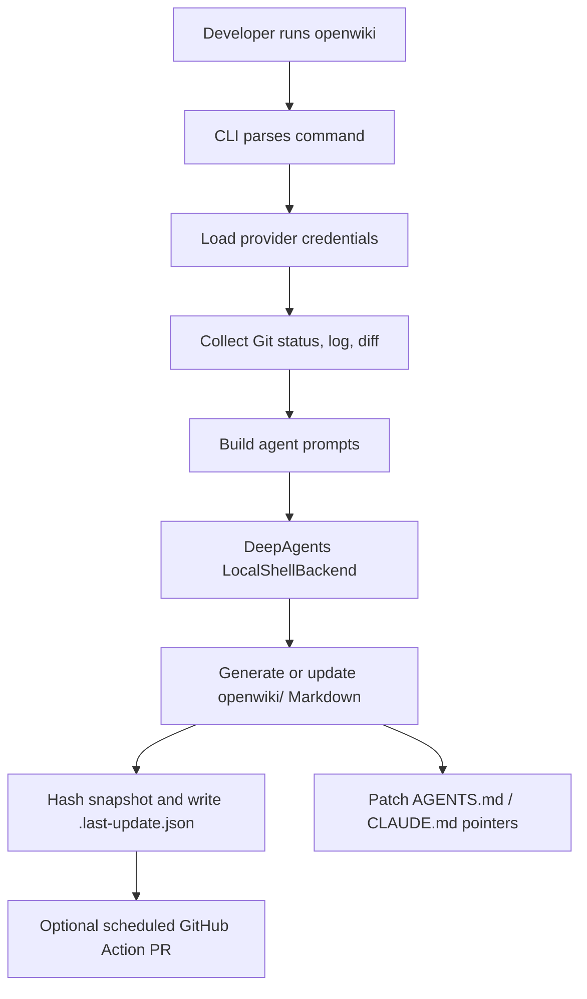
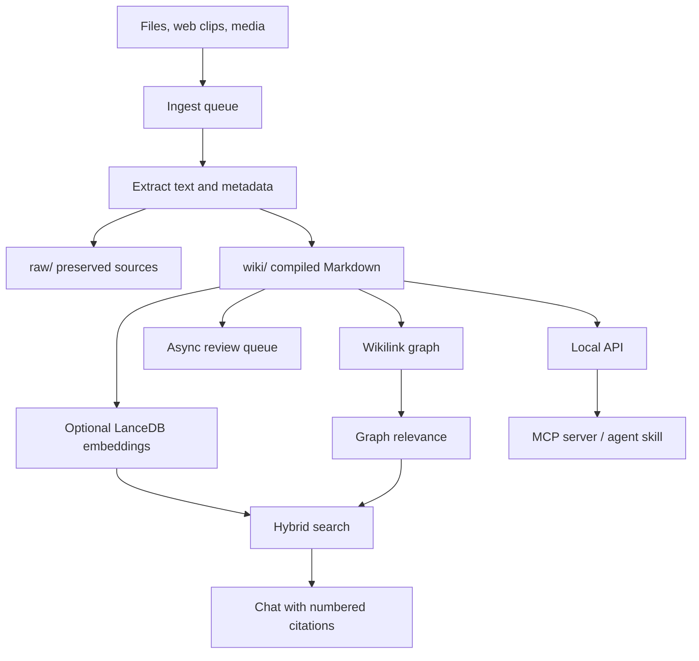
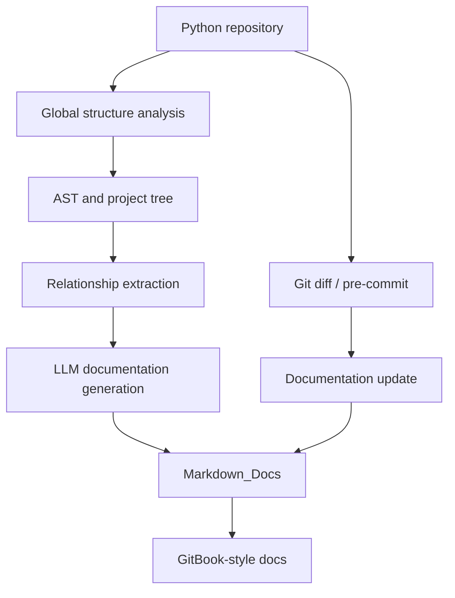
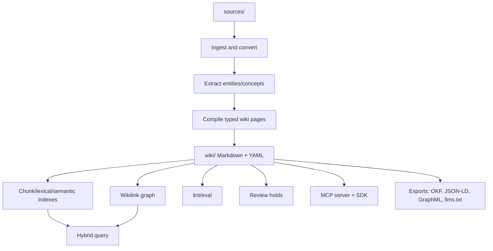

# Implementation deep dive: open-source LLM-Wiki systems

> Status: draft
> Current as of: 2026-07-06
> Scope: implementation-level comparison of public LLM-Wiki and adjacent wiki-memory systems.

## How to use this document

This is a **design and comparison note**, not a permanent maturity claim.

Before recommending a project to a user, re-check the official upstream repository and docs for:

1. current activity, releases and open issues;
2. license and commercial constraints;
3. supported model providers and local/cloud modes;
4. storage layout and export path;
5. retrieval/indexing implementation;
6. MCP/API/client compatibility;
7. review, provenance and security controls.

Use `docs/13-ecosystem-matrix.md` for the compact registry and `docs/14-technology-stack.md` for layer-specific technology choices. This note goes deeper into **how the implementations are built** and what design patterns are worth copying.

## Executive summary

The open-source LLM-Wiki ecosystem has split into several distinct product shapes:

| Archetype | Representative projects | Core thesis |
|---|---|---|
| Repo-docs generator | `langchain-ai/openwiki`, `OpenBMB/RepoAgent` | Codebase documentation is the corpus; Git context and PR review are the maintenance loop. |
| Full local-first desktop wiki | `nashsu/llm_wiki` | A personal knowledge app can own ingestion, graph, retrieval, review, API and MCP in one UI. |
| Review-gated agent memory | `vouchdev/vouch` | Agents may propose durable knowledge, but humans approve it; every claim needs evidence. |
| Compiler-first knowledge system | `atomicstrata/llm-wiki-compiler`, smaller compiler projects | Raw sources compile into typed, cited, linted, queryable wiki artifacts. |
| Obsidian-native workflow | `green-dalii/obsidian-llm-wiki`, other Obsidian plugins | The vault is the UI and durable store; retrieval should exploit wikilinks before embeddings. |
| Session-transcript wiki | `Pratiyush/llm-wiki` | Agent sessions are the raw source; the wiki summarizes work history and exports AI-readable artifacts. |
| Graph-heavy local vault | `swarmclawai/swarmvault` | Ingest many source types into a local graph/wiki/RAG surface for agents. |

The main implementation lesson: **no single open-source project currently dominates every dimension**: broad ingestion, local-first UX, strict review governance, filtered hybrid retrieval, MCP interoperability, evaluation, redaction and production hardening. Serious deployments should be compositional: choose a wiki compiler, add a governance boundary, then add retrieval, MCP, evaluation and security controls only where needed.

## Comparative matrix

| Project | License | Maturity signal | Primary use case | Storage | Retrieval | MCP/API | Review/provenance | Best idea to adopt |
|---|---|---|---|---|---|---|---|---|
| `langchain-ai/openwiki` | MIT | Active, early | Repo docs for coding agents | Markdown in `openwiki/`; update metadata in `openwiki/.last-update.json`; credentials under `~/.openwiki/`; DeepAgents SQLite checkpointer | Git status/log/diff and generated docs; no surfaced user-facing vector/graph system | No surfaced MCP server; integration via `AGENTS.md`/`CLAUDE.md` pointer edits | PR review through GitHub Action; no claim-level evidence gate | Pointer pattern: keep instruction files small and point agents to wiki docs. |
| `nashsu/llm_wiki` | GPL-3.0 | Active desktop app | Personal/local-first wiki OS | `raw/`, `wiki/`, `.llm-wiki/`; optional LanceDB index | Tokenized lexical search, graph relevance, optional vector search, hybrid endpoint | Local HTTP API on `127.0.0.1`; token; local MCP server; read-only skill | Async review queue; page/source-level provenance | Full-stack local-first architecture with desktop UX, graph, hybrid search, MCP and review queue. |
| `vouchdev/vouch` | MIT | Active | Review-gated agent memory/wiki | `.vouch/` plain files, YAML claims, Markdown pages, append-only audit log, rebuildable SQLite FTS5 | Approved claims/pages via FTS-backed `kb_*` tools | MCP over stdio, JSONL transport, local HTTP serve | Strongest gate: proposals, human approval, evidence-required claims, machine-verified citations | Durable write boundary: agents propose, humans approve, pending knowledge cannot influence retrieval. |
| `OpenBMB/RepoAgent` | Apache-2.0 | Research-led, experimental | Python repo documentation | Markdown docs, hierarchy/global structure records, GitBook docs | AST/project-tree reasoning and relationship extraction; no surfaced RAG/MCP serving layer | CLI, pre-commit, GitHub Actions; no surfaced MCP/API | Automated docs plus acknowledged human review need; weak explicit gate | Repository-level structure extraction from AST before generating docs. |
| `atomicstrata/llm-wiki-compiler` | MIT | Active, experimental | General-purpose knowledge compiler | `sources/`, `wiki/`, `.llmwiki/`; typed pages with YAML frontmatter; OKF import/export | Semantic chunk search, BM25 reranking, wikilink graph expansion, lexical fallback | MCP server via `llmwiki serve`; TypeScript SDK | Review holds by confidence, contradiction, schema and provenance rules | Compiler-first model with typed pages, paragraph/claim citations, eval/lint/export surfaces. |
| `swarmclawai/swarmvault` | Check upstream | Active ecosystem signal | Local-first graph/RAG vault | Local vault, Markdown wiki, graph/index artifacts | Graph-heavy local retrieval and context packs | MCP server and agent handoff surfaces | Approval bundles; redaction before persistence in some flows | Broad ingestion palette plus local graph exports/context packs. |
| `green-dalii/obsidian-llm-wiki` | Check upstream | Active Obsidian plugin signal | Obsidian-native LLM-Wiki | Obsidian vault Markdown | Personalized PageRank over wikilinks; zero embedding default | No surfaced MCP server in reviewed docs | Contradiction state machine and pre-ingest requirement gates | Use graph-native vault signals before adding embeddings. |
| `lucasastorian/llmwiki` | Check upstream | Active public project signal | MCP-driven wiki writing with local/hosted split | Local SQLite + filesystem or hosted Postgres + S3 via `VaultFS` abstraction | Agent-mediated wiki reads/writes; project-specific retrieval surface | Explicit MCP workflow for Claude/Codex | Weaker review gate; trust centers on connected agent | Clean local/hosted storage abstraction. |
| `Pratiyush/llm-wiki` | Check upstream | Active session-wiki signal | Agent-session transcript wiki | Session transcripts compiled into wiki and exports | Session/project query surfaces; graph viewer | MCP server with multiple tools | Strong privacy/security docs and redaction posture | Treat agent session logs as first-class raw sources and export `llms.txt`/JSON-LD/RSS/sitemap. |

## Deep dive: OpenWiki

### Shape

OpenWiki is best understood as a **repo-docs generator for coding agents**, not a universal knowledge base. It runs inside or against a code repository, gathers Git context, uses a DeepAgents local shell backend, writes Markdown docs under `openwiki/`, and updates agent instruction files so coding agents know to consult the wiki.



### Strengths

- Very clear target: codebase documentation for coding agents.
- Good first-use path: install CLI, run init/update, get `openwiki/` docs.
- Strong pointer pattern: `AGENTS.md`/`CLAUDE.md` stay short and refer to wiki docs.
- Fits GitHub PR workflows through scheduled update actions.
- Good model for repo-docs freshness because Git is the source of change.

### Weaknesses

- Not a general ingestion system for PDFs, chats, meeting notes or research corpora.
- No surfaced standalone MCP server or wiki API in the reviewed docs.
- No surfaced graph/vector retrieval system for users to configure.
- Trust model is PR review, not claim-level citation governance.
- Better for `repo -> openwiki/` than for `raw/ -> wiki/` multi-source personal knowledge.

### Patterns to adopt

- Instruction-file pointer pattern:

```markdown
For architecture and module maps, read `openwiki/index.md` or `wiki/index.md` first.
```

- Scheduled maintenance via GitHub Actions that opens PRs rather than writing directly.
- Store generated repo wiki in a clearly separated folder.
- Use Git diff/log/status as first-class raw context for repo-docs workflows.

## Deep dive: nashsu/llm_wiki

### Shape

`nashsu/llm_wiki` is the strongest public example of a **full-stack local-first personal LLM-Wiki application**. It combines desktop UI, source ingestion, compiled Markdown pages, graph view, hybrid retrieval, chat with citations, review queue, local HTTP API, MCP server and browser capture.



### Strengths

- Most complete personal/product UX among surveyed projects.
- Clean storage separation: `raw/`, `wiki/`, `.llm-wiki/`.
- Strong local-first posture: Markdown wiki, Obsidian compatibility, localhost API.
- Retrieval is staged: lexical search, graph relevance, optional LanceDB vector search, graph expansion and context assembly.
- Ingestion breadth includes PDFs, Office files, spreadsheets, images, audio/video and web clips.
- Local API and MCP server make the wiki usable by agents without forcing cloud sync.
- Human review queue acknowledges that generated gaps and updates need human acceptance.

### Weaknesses

- GPL-3.0 may constrain commercial embedding into proprietary products.
- Formal evaluation and redaction/PII controls are thinner in public docs than retrieval/UI docs.
- Review model is product-level async review, not a git-native claim approval gate.
- Cloud parser options for complex PDFs require explicit data policy.

### Patterns to adopt

- Keep app state separate from durable raw/wiki state:

```text
raw/          preserved source inputs
wiki/         human-readable compiled pages
.llm-wiki/    app state, history, review queue, generated indexes
```

- Prefer read-only MCP/agent access first.
- Use hybrid retrieval as an upgrade, not as the first default.
- Give users a review queue for low-confidence gaps rather than silently modifying pages.

## Deep dive: Vouch

### Shape

Vouch is the clearest **governance-first** implementation. It treats agent-written knowledge like a supply-chain artifact: agents propose, humans approve, every claim cites a source, pending drafts do not influence retrieval, and durable state is diffable plain files.

```mermaid
flowchart TD
    A[Agent session] --> B[Capture summary/source]
    B --> C[Proposal in proposed/]
    C --> D[Human review]
    D -->|approve| E[Approved claims/pages in .vouch/]
    D -->|reject| F[Rejected draft stays out of durable KB]
    E --> G[Append-only audit.log.jsonl]
    E --> H[Rebuild SQLite FTS5 state.db]
    E --> I[Compile cited pages]
    I --> J[Machine verify citations and wikilinks]
    J --> K[Approved retrieval through kb_* tools]
```



### Strengths

- Strongest review/provenance model in the ecosystem.
- Plain-file durability under `.vouch/` plus rebuildable SQLite FTS5 index.
- Claims require evidence; citations and wikilinks are mechanically checked.
- Approval gate prevents pending or rejected content from contaminating retrieval.
- MCP/transport story is explicit: stdio, JSONL and local HTTP surfaces are documented.
- Append-only audit log gives strong operational traceability.

### Weaknesses

- Ingestion breadth is not the core differentiator; it does not appear to compete with desktop/document ETL tools.
- Retrieval is governance-safe but less graph-rich than graph/RAG-focused implementations.
- More friction than auto-writing tools; review backlog must be managed.

### Patterns to adopt

- `proposer != approver` as a default for shared/team knowledge.
- Pending pages must not participate in retrieval until approved.
- Durable knowledge should be plain-file diffable; indexes should be rebuildable.
- Every claim should have evidence metadata, not just a vague page-level source list.
- Append-only audit logs are useful even for local-first workflows.

## Deep dive: RepoAgent

### Shape

RepoAgent is a repository documentation framework that predates the current LLM-Wiki wave but remains relevant. It analyzes Python repositories through AST/project-tree structures, extracts relationships, generates Markdown documentation and supports update workflows through pre-commit hooks and GitHub Actions.



### Strengths

- Strong conceptual model for codebase docs: analyze global structure before generating local docs.
- AST and relationship extraction are better grounded than naive file summarization.
- Research paper reports blind-preference improvements over human-authored docs in evaluated settings.
- Pre-commit and GitHub Action workflows anticipate living documentation.

### Weaknesses

- Python-centric public scope.
- No surfaced MCP/API layer.
- No general multi-source wiki model.
- No strong citation/review gate like Vouch.
- Better as repo-docs research ancestor than as complete modern LLM-Wiki runtime.

### Patterns to adopt

- For repo docs, extract symbol/module/project relationships before summarization.
- Record a global structure/hierarchy artifact that later documentation updates can reuse.
- Treat documentation updates as a change-detection problem, not a full rebuild every time.

## Deep dive: atomicstrata/llm-wiki-compiler

### Shape

`atomicstrata/llm-wiki-compiler` is the clearest **compiler-first** implementation: raw sources are compiled into typed pages with frontmatter, citations, freshness, links, review state and exports. It treats the wiki as an artifact that can be linted, evaluated, served through MCP and exported to interoperable formats.



### Strengths

- Best articulation of “LLM-Wiki as compiler” rather than note app.
- Typed page model and YAML frontmatter are compatible with Agent Skills and repo workflows.
- Paragraph/claim citations with line ranges are a strong provenance pattern.
- Hybrid retrieval and graph expansion are built into the design.
- MCP server and TypeScript SDK make it integration-friendly.
- Exports such as JSON, JSON-LD, GraphML, `llms.txt` and OKF make it strategically useful.
- `lint` and `eval` commands push quality checks into the normal workflow.

### Weaknesses

- More operator-heavy than desktop-first tools.
- Still experimental; production adoption requires current verification.
- Governance appears rule/hold based, not as strict as Vouch's human approval boundary.

### Patterns to adopt

- Make `compile`, `query`, `lint`, `eval`, `context` and `export` first-class verbs.
- Use review holds for confidence, contradiction, schema and provenance problems.
- Treat exports as a first-class requirement, not an afterthought.
- Support read-only MCP tools without model credentials; require credentials only for LLM-backed actions.

## Smaller but important implementations

### SwarmVault

SwarmVault is notable for breadth: local-first vault, knowledge graph, RAG knowledge base, agent memory, broad ingestion, context packs, MCP server, graph exports and approval bundles. It is most interesting when the user values **source diversity and local graph workflows** more than GUI polish or strict claim approval.

Ideas to adopt:

- Managed source connectors and broad source taxonomy.
- Context packs for agents.
- Graph export formats for inspection and downstream analysis.
- Redaction before raw/wiki persistence when ingesting risky channels.

### green-dalii/obsidian-llm-wiki

This is the most relevant Obsidian-native implementation in the research set. Its most important idea is to exploit **wikilink graph structure** before adding embeddings: personalized PageRank and feedback over links can be cheap, local and explainable.

Ideas to adopt:

- Graph-native retrieval in Markdown vaults.
- Contradiction lifecycle/state machine.
- Pre-ingest requirement gates before writing generated notes.
- Local-only default posture for personal vaults.

### lucasastorian/llmwiki

This project is useful for its local/hosted split. Local mode uses SQLite plus filesystem, while hosted mode uses Postgres plus S3 behind a storage abstraction. It is an implementation pattern for products that need to start local but later offer hosted collaboration.

Ideas to adopt:

- `VaultFS`-style storage abstraction.
- Explicit local versus hosted mode boundaries.
- MCP-driven “agent writes the wiki” workflow.
- Browser/PDF capture as a product surface.

### Pratiyush/llm-wiki

This project is optimized for turning agent session transcripts into a knowledge base. It is relevant because sessions from Claude Code, Codex, Cursor, Copilot and Gemini are increasingly important raw sources.

Ideas to adopt:

- Treat agent sessions as first-class raw sources.
- Export `llms.txt`, `llms-full.txt`, JSON-LD, RSS and sitemap for downstream consumers.
- Maintain privacy/security docs around transcript secrets, tokens and paths.
- Build session/project filters into queries.

### ussumant/llm-wiki-compiler and other small compiler/plugin projects

These projects are useful as pattern signals, especially around Claude Code/Codex plugin packaging and lightweight compilation from scattered Markdown files. They should usually be marked `experimental` or `verify-before-use` unless freshly verified.

## Architecture patterns worth adopting into this repository

### 1. Pointer, not prompt stuffing

OpenWiki's strongest general lesson is that instruction files should point to durable docs instead of containing the whole knowledge base.

```markdown
For durable domain knowledge, read `wiki/index.md` first and follow links to relevant pages.
```

This should remain the default for `AGENTS.md`, `CLAUDE.md`, Codex project memory and similar surfaces.

### 2. Source/wiki/state separation

The durable layout should distinguish original evidence, compiled human-readable pages and rebuildable/generated state.

```text
raw/ or sources/      immutable inputs
wiki/                 compiled Markdown knowledge
.state/ or .llmwiki/  indexes, candidates, evals, app state
```

### 3. Review-gated writes

For shared/team knowledge, use Vouch-style principles:

- agents propose changes;
- humans approve durable writes;
- pending/rejected content is excluded from retrieval;
- approver and proposer should differ;
- every claim has evidence;
- audit logs are append-only.

### 4. Compiler verbs

A next-generation reference architecture should expose stable verbs:

```text
capture -> ingest -> compile -> query -> lint -> eval -> review -> export -> archive
```

### 5. Progressive retrieval

Do not start with GraphRAG. Use upgrade triggers:

| Trigger | Upgrade |
|---|---|
| good filenames and links are enough | `rg`, `index.md`, wikilinks |
| exact search misses concepts | SQLite FTS/Tantivy + embeddings |
| top-k has signal but poor ordering | reranking |
| relationship/multi-hop questions dominate | graph-aware retrieval |
| tenants/permissions/scale dominate | product storage and metadata-filtered retrieval |

### 6. MCP as an interoperability boundary

Adopt a layered MCP contract:

| Tool class | Examples | Default |
|---|---|---|
| Read-only | `search_wiki`, `read_page`, `read_manifest`, `list_reviews` | enabled first |
| Proposal write | `draft_page_patch`, `propose_new_page`, `propose_link_fix` | enabled after review model exists |
| Admin | `rebuild_index`, `rescan_sources`, `export_subset` | disabled unless explicit |

### 7. Evaluation and security are not optional add-ons

The better projects expose lint/eval/security surfaces, but no project fully solves this. A reference architecture should include:

- retrieval recall@k and MRR tests;
- citation coverage and unsupported-claim checks;
- stale verified page counts;
- review backlog and read/write ratio;
- prompt regression tests;
- red-team fixtures for prompt injection and RAG poisoning;
- secret/PII scanning before persistence or publication.

## Recommended stack by use case

### Personal/local-first

Default path:

1. Markdown + git + `index.md` + `rg`.
2. Obsidian or desktop app if human reading/editing is central.
3. nashsu-style local API/MCP only after read-only boundaries are clear.
4. LanceDB/Qdrant/Chroma only after retrieval misses are measured.
5. Review queue for low-confidence generated pages.

### Code repository docs

Default path:

1. OpenWiki-style `openwiki/` folder.
2. `AGENTS.md`/`CLAUDE.md` pointer pattern.
3. Scheduled GitHub Action that opens PRs.
4. CODEOWNERS for important docs.
5. RepoAgent-style AST/module extraction only if basic repo docs are too shallow.

### Governed team/company wiki

Default path:

1. Source-preserving ingestion with manifests.
2. Vouch-style proposal/approval boundary.
3. Compiler-first typed wiki pages with claim citations.
4. Metadata-filtered retrieval by sensitivity, owner, review state and stale date.
5. Read-only MCP first; proposal-write MCP later.
6. Ragas/promptfoo/LangSmith/custom lint gates in CI.
7. Explicit public/private export manifests.

### Product/reference implementation

A next-generation LLM-Wiki product should combine:

- OpenWiki's pointer and PR-maintenance model;
- nashsu's desktop/local-first UX and hybrid retrieval;
- Vouch's review-gated durable write model;
- RepoAgent's code structure extraction;
- `llm-wiki-compiler`'s typed pages, citations, MCP, eval and export model;
- SwarmVault's broad ingestion/context-pack ideas;
- Obsidian plugins' graph-native retrieval;
- Pratiyush's session-transcript ingestion and AI-readable exports.

## Gaps and opportunities

| Gap | Why it matters | Opportunity for `llm-wiki-skills` |
|---|---|---|
| No universal reference architecture | Projects optimize for different archetypes. | Provide archetype-specific decision skills and templates. |
| Weak formal evaluation in most apps | Users cannot prove the wiki helps. | Add eval playbooks, promptfoo/Ragas templates and pilot metrics. |
| Ingestion quality varies widely | Bad extraction creates bad wiki pages. | Add source-type bake-off procedures and manifest schemas. |
| Review gates are inconsistent | Generated knowledge can become trusted too easily. | Normalize Vouch-style proposal/approval patterns. |
| MCP tool boundaries are immature | Agents can over-read or over-write. | Define read/proposal/admin tool classes and response contracts. |
| Security/redaction is uneven | Raw sources often contain secrets and PII. | Add threat model, scanners and pre-publication gates. |
| Exports are inconsistent | Agents and static sites need different surfaces. | Define `llms.txt`, JSONL, JSON-LD, GraphML and static-site export profiles. |

## Source URLs to re-check

- https://github.com/langchain-ai/openwiki
- https://www.langchain.com/blog/introducing-openwiki-an-open-source-agent-for-repo-documentation
- https://github.com/nashsu/llm_wiki
- https://github.com/vouchdev/vouch
- https://github.com/OpenBMB/RepoAgent
- https://arxiv.org/html/2402.16667v1
- https://github.com/atomicstrata/llm-wiki-compiler
- https://github.com/swarmclawai/swarmvault
- https://github.com/green-dalii/obsidian-llm-wiki
- https://github.com/lucasastorian/llmwiki
- https://github.com/Pratiyush/llm-wiki
- https://github.com/ussumant/llm-wiki-compiler
- https://modelcontextprotocol.io/specification/2025-06-18
- https://qdrant.tech/documentation/search/filtering/
- https://docs.lancedb.com/search/hybrid-search
- https://docs.haystack.deepset.ai/docs/metadata-filtering
- https://microsoft.github.io/graphrag/
- https://docs.ragas.io/
- https://www.promptfoo.dev/docs/intro/
