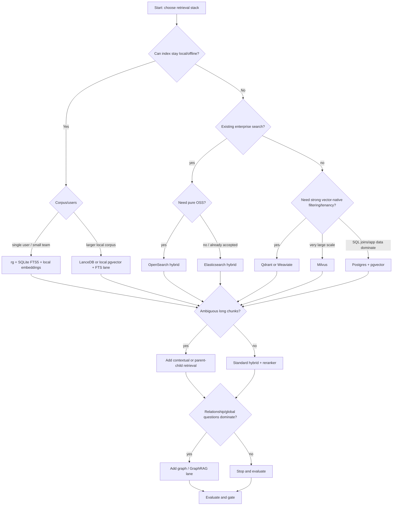
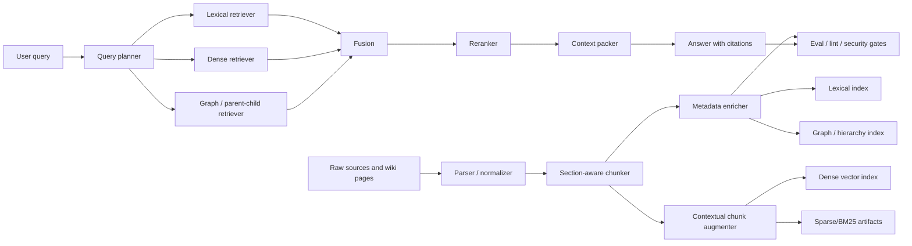

# Retrieval architecture for LLM-Wiki

> Status: draft
> Current as of: 2026-07-06
> Scope: retrieval/index architecture for local-first, repo-docs, hosted, team and product LLM-Wiki systems.

## How to use this document

Use this document when choosing or reviewing the retrieval layer behind an LLM-Wiki.

This note is an architecture guide, not a permanent vendor benchmark. Before recommending a concrete product, re-check official docs for current APIs, license, deployment model, filtering behavior, pricing and operational maturity.

Related skills and docs:

- `skills/llm-wiki-retrieval-architect/SKILL.md`
- `skills/llm-wiki-eval-tooling/SKILL.md`
- `skills/llm-wiki-security-review/SKILL.md`
- `docs/14-technology-stack.md`
- `docs/15-implementation-deep-dive.md`

## Executive summary

For most LLM-Wiki systems, the best default retrieval architecture is **hybrid retrieval**:

```text
lexical search + dense embeddings + metadata filters + reranker + citation-aware context packing
```

Why:

- lexical search catches exact names, IDs, filenames, code symbols, rare terms and quoted text;
- dense retrieval catches semantic similarity, synonyms and natural-language questions;
- metadata filters enforce review state, publication state, sensitivity, tenant and source boundaries;
- reranking improves precision after combining noisy candidates;
- citation-aware context packing preserves source support instead of just returning plausible chunks.

GraphRAG should usually be a **specialized retrieval lane**, not the default for every query. Add it when the user has corpus-level questions, relationship-heavy reasoning, entity traversal, thematic synthesis or multi-hop failures that a hybrid retriever cannot solve.

## Retrieval layers

| Layer | Job | Good default | Add when |
|---|---|---|---|
| Navigation | Give agents a map. | `index.md`, MOCs, backlinks, page titles. | Always. |
| Lexical retrieval | Exact recall. | `rg` first; SQLite FTS5/Tantivy/Pagefind/OpenSearch later. | Exact search is too slow, too broad or needs scopes. |
| Dense retrieval | Semantic recall. | Local embeddings or Qdrant/LanceDB/Chroma/Weaviate/pgvector. | Conceptual queries miss relevant pages. |
| Hybrid fusion | Combine lexical and dense signals. | RRF or weighted fusion. | Both lexical and semantic signals matter. |
| Reranking | Improve candidate ordering. | Cross-encoder for top 20-100 candidates. | Top-k has signal but wrong order/noise. |
| Parent/context retrieval | Return enough context for generation. | Child chunks for recall, parent section/page for answer. | Small chunks retrieve well but answer context is thin. |
| Graph retrieval | Relationship and global questions. | Wikilink/entity graph first; GraphRAG later. | Multi-hop/entity/corpus-level failures repeat. |
| Evaluation | Prove retrieval works. | Recall@k, MRR, nDCG, citation coverage, permission-filter tests. | Before and after every retrieval upgrade. |

## Decision tree



## Technology comparison

| Technology | Role | Best fit | Avoid when | Notes |
|---|---|---|---|---|
| `rg` / grep | Zero-infra lexical search | First 50-100 sources, strong filenames, local workflows. | The agent needs metadata filters, ranking or semantic recall. | Keep as a fallback even after adding indexes. |
| SQLite FTS5 | Embedded lexical index | Local-first desktop/wiki, small-team private vaults. | Large multi-user hosted retrieval is required. | Excellent for offline search and provenance joins. |
| Tantivy | Rust embedded full-text engine | Rust/Tauri desktop apps, high-performance local FTS. | The team wants SQL simplicity. | Useful when you want Lucene-like search without a server. |
| Pagefind | Static-site search | Published docs/wiki sites. | Private live retrieval or fast-changing corpora. | Build-time index; good for exports. |
| Meilisearch | Search API with lexical/semantic/hybrid modes | Product search UX, simple hosted/self-hosted search. | Strict all-OSS enterprise constraints require checking edition boundaries. | Good UX, but treat edition/licensing details as current-fact checks. |
| LanceDB | Embedded/serverless vector + FTS/hybrid | Local-first Python/Rust/product apps needing vector ergonomics. | Strong multi-tenant hosted controls dominate. | Natural upgrade from SQLite when vector operations matter. |
| Chroma | Local/cloud vector store with metadata and hybrid options | Fast app prototyping and local vector workflows. | Complex tenancy/enterprise governance is primary. | Good developer ergonomics. |
| Qdrant | Vector-native hybrid retrieval with payload filters and tenancy options | Hosted/team LLM-Wiki default when filtering, custom scoring and hybrid search matter. | Team already standardizes on OpenSearch/Postgres. | Strong default for greenfield hosted retrieval. |
| Weaviate | Vector/BM25 hybrid, reranking, multi-tenancy | Hosted knowledge systems needing integrated hybrid/rerank. | Embedded local simplicity is primary. | Strong built-in hybrid and tenant model. |
| Milvus | Large-scale vector/hybrid retrieval | Very large collections and infrastructure-heavy teams. | The team wants minimal operations. | More operational weight, stronger scale story. |
| pgvector | Vectors inside Postgres | App data, SQL filters, joins and transactions matter. | Standalone retrieval product needs vector-native ergonomics. | Best when the wiki retrieval layer belongs next to relational data. |
| OpenSearch | OSS search/vector/hybrid stack | Organizations already running search infrastructure; pure OSS matters. | Minimal local-first system. | Strong hybrid pipeline and rank-eval API. |
| Elasticsearch | Search/vector/hybrid stack | Organization already accepts Elastic licensing. | Plain open-source dependency is required. | Treat as source-available/subscription-governed in architecture decisions. |
| Haystack | Retrieval pipeline framework | Composable hybrid pipelines, filters, rankers and document stores. | The user needs a storage engine only. | Framework layer; storage and security depend on selected document store. |
| LlamaIndex | Context/retrieval framework | Router, recursive, parent-child, property graph and metadata-aware retrieval. | The user wants minimal dependencies. | Strong for advanced retrieval patterns. |
| LangChain | Retriever abstractions and MCP/tool integration | Multi-query, self-query, parent-doc and agent integration patterns. | Strict minimal local CLI is enough. | Framework layer; host application owns policy/security. |

## Recommended stacks by archetype

### 1. Minimal local-first wiki

Use when the user has a personal vault, small research corpus or offline requirement.

```text
Markdown + git + index.md + rg
+ SQLite FTS5
+ local embeddings
+ optional simple reranker
```

Default storage:

```text
wiki/                  source of truth
indexes/fts.sqlite     rebuildable lexical index
indexes/vectors/       rebuildable vector index or embeddings table
```

Upgrade to LanceDB or local pgvector only when vector ergonomics, corpus size or multi-field filtering justify it.

### 2. Repo-docs CI wiki

Use when the wiki documents a codebase and must stay fresh with repository changes.

```text
repo source -> docs/wiki pages -> CI rebuild -> hybrid index -> static docs search
```

Recommended choices:

- `rg` and AST/module maps for source inspection;
- Pagefind for published static docs search;
- SQLite/LanceDB/Qdrant preview index for agent retrieval;
- avoid GraphRAG in the critical CI path unless global repo summarization is a product requirement.

### 3. Hosted/team LLM-Wiki

Use when multiple users, tenants, review states or permissions matter.

Recommended baseline:

```text
Qdrant or Weaviate
+ dense/sparse hybrid retrieval
+ payload filters / tenant filters
+ reranker
+ evaluation gates
```

Use OpenSearch if the organization already runs it and wants one search stack. Use pgvector when the wiki is tightly coupled to app/business data and SQL joins matter.

### 4. Enterprise/search-heavy wiki

Use when existing search infrastructure, observability and operational practices dominate.

Recommended baseline:

```text
OpenSearch hybrid pipeline
+ rank-eval API
+ metadata filters
+ reranker
+ application ACLs
```

Use Elasticsearch only if the organization already accepts its licensing and deployment model.

### 5. Relationship/global-question wiki

Use when users repeatedly ask:

- “What are the main themes across the corpus?”
- “How are these entities connected?”
- “Trace the decision/dependency chain.”
- “Find contradictions across related pages.”

Recommended pattern:

```text
hybrid retrieval as primary lane
+ wikilink/entity graph lane
+ optional GraphRAG/community summaries
+ graph edge provenance
```

Do not make graph visualization the quality metric. Evaluate whether the graph lane improves specific query classes.

## Reference architecture



## Index contracts

Every index should have a contract. Do not let indexes become undocumented hidden state.

```yaml
index_name: wiki_hybrid_default
index_type: lexical|dense|sparse|hybrid|graph|static
source_of_truth: wiki|raw|both
input_paths:
  - wiki/
  - raw/manifests/
output_paths:
  - indexes/
embedding_model: ""
sparse_model: "BM25|SPLADE|none"
reranker_model: ""
chunking_policy: heading-aware|parent-child|contextual|fixed-window
metadata_fields:
  - doc_id
  - chunk_id
  - source_uri
  - heading_path
  - review_state
  - sensitivity
  - tenant_id
  - acl_tags
access_filters:
  - tenant_id
  - review_state
  - publication_state
  - sensitivity
refresh_trigger: manual|pre-commit|scheduled|watch|ci
rebuild_command: ""
index_revision: ""
```

## Chunking strategy

Chunk by native structure first:

| Corpus | Chunking rule |
|---|---|
| Markdown/wiki pages | heading/subheading chunks with `heading_path`. |
| Long pages | 300-600 token chunks with 10-20% overlap, plus parent page/section pointer. |
| Code docs | file + symbol + docstring + nearby comments, not arbitrary windows. |
| API docs | endpoint/class/function units. |
| Tables | preserve row/column labels and table captions. |
| PDFs | use layout-aware chunks when extraction quality matters. |
| Chat/session logs | session -> task -> turn group; redact before indexing. |

Use **contextual retrieval** when small chunks become ambiguous outside their original document. The pattern is: generate a short chunk-specific context, prepend it to the chunk before embedding and lexical indexing, then still keep the original text and provenance.

Use **parent-child retrieval** when small child chunks retrieve well but generation needs the surrounding page or section.

## Metadata schema

Every chunk should carry enough metadata to enforce permissions and render citations.

```yaml
doc_id: ""
chunk_id: ""
parent_id: ""
source_uri: ""
source_type: wiki_page|raw_source|code|issue|chat|pdf|web|email|other
title: ""
heading_path: []
repo: ""
path: ""
branch: ""
commit_sha: ""
language: ""
author: ""
created_at: YYYY-MM-DD
updated_at: YYYY-MM-DD
review_state: draft|reviewed|verified|stale|rejected|approved|published
publication_state: private|internal|public|archived
tenant_id: ""
acl_tags: []
sensitivity: public|internal|sensitive|regulated|unknown
labels: []
hash_sha256: ""
chunk_token_count: 0
embed_model: ""
embed_version: ""
index_revision: ""
```

Critical rule: `tenant_id`, `acl_tags`, `sensitivity`, `review_state` and `publication_state` must be query-time filters, not post-generation cleanup.

## Query planning

A practical query planner should classify the query before retrieval:

| Query type | Retrieval lanes |
|---|---|
| Exact lookup | lexical first, then dense fallback. |
| Conceptual question | hybrid lexical+dense. |
| “Why/compare/synthesize” | hybrid + parent/section expansion. |
| Relationship/multi-hop | hybrid + graph lane. |
| Corpus-level themes | graph/community summaries + hybrid evidence checks. |
| Recent/current-state | metadata date filters + source refresh check. |
| Sensitive/team query | mandatory tenant/ACL/review filters before retrieval. |

Recommended default:

```text
1. Apply access/review/source filters.
2. Retrieve lexical top-k.
3. Retrieve dense top-k.
4. Fuse with RRF or calibrated weighted score.
5. Rerank top 20-100.
6. Expand to parent sections/pages.
7. Pack context with citations and deduplicate by source/page.
8. Record used chunks in query log.
```

## GraphRAG lane

Use graph retrieval when at least one is true:

- multi-hop queries repeatedly fail;
- the user asks global/corpus-level questions;
- relationships between entities, decisions, systems or people dominate;
- contradictions need relationship-aware detection;
- page links/entities are stable enough to extract.

Start with a lightweight graph before full GraphRAG:

```text
wikilinks + frontmatter entities + citations + source references
```

Then add:

```text
entity extraction -> relation extraction -> community summaries -> graph-aware query lane
```

Graph edge schema:

```yaml
from: ""
to: ""
edge_type: cites|mentions|defines|contradicts|depends_on|derived_from|similar_to|owned_by|decided_by
source_chunks: []
confidence: 0.0
created_by: human|agent|importer
review_state: draft|reviewed|verified
```

Do not let generated graph edges become trusted unless evidence and review state are explicit.

## Reranking

Use reranking when:

- the right result appears in top 20-100 but not top 5;
- hybrid fusion returns noisy mixed candidates;
- answers hallucinate because context packing includes weak candidates;
- the user cares more about answer quality than lowest latency.

Default sequence:

```text
hybrid top 50 -> cross-encoder rerank -> top 8-12 context chunks -> parent expansion
```

Use no reranker only when offline/latency constraints are strict or the corpus is small enough that lexical/semantic scores already work.

## Evaluation metrics

Split evaluation into retrieval, answer grounding, operations and security.

| Dimension | Metrics |
|---|---|
| Retrieval | recall@k, MRR, nDCG@k, hit/miss labels, query success rate. |
| Grounding | citation coverage, unsupported-claim count, source-support labels, faithfulness/context precision. |
| Operations | p50/p95 retrieval latency, indexing throughput, freshness lag, rebuild time, cost per query. |
| Security | permission-filter failures, cross-tenant leakage tests, poisoned-source tests, sensitive-snippet leakage. |
| Wiki usefulness | retrieval hit rate, answer reuse rate, read/write ratio, context reconstruction avoided. |

Minimum pilot eval set:

```yaml
- id: q001
  question: ""
  query_type: exact|conceptual|synthesis|multi-hop|recent|sensitive
  required_pages: []
  required_sources: []
  forbidden_sources: []
  required_filters:
    tenant_id: ""
    review_state: [approved, published]
  relevance:
    chunk_id: 3
  must_cite_sources: true
```

Recommended CI gates:

```yaml
retrieval_recall_at_10_min: 0.80
mrr_drop_max_points: 0.05
citation_coverage_min: 0.90
unsupported_claims_max: 0
permission_filter_failures_max: 0
sensitive_snippet_leaks_max: 0
p95_retrieval_latency_regression_max_pct: 25
```

## Security and privacy controls

Retrieval security is mostly about **what enters the index** and **what is allowed to leave it**.

| Risk | Control |
|---|---|
| PII in indexed text | Run Presidio/scrubadub/custom detectors before indexing or export. |
| Secrets in docs/repos/chats | Run gitleaks/trufflehog/detect-secrets before persistence and CI. |
| Cross-tenant leakage | Enforce tenant/ACL filters inside retrieval, not after generation. |
| Unreviewed content influencing answers | Filter `review_state` before retrieval; use staging indexes. |
| Poisoned raw source | Source allowlist, content-type validation, hash/diff review, malicious-source fixtures. |
| Overbroad MCP connector | Separate read-only retrieval tools from source-system write tools; scope credentials narrowly. |
| Cloud embedding exposure | Local-only labels, redaction-before-cloud, provider-retention verification. |

Default filter for governed wiki queries:

```text
tenant_id = current_tenant
AND review_state IN ('approved', 'published', 'verified')
AND publication_state != 'archived'
AND sensitivity IN allowed_sensitivity_classes
AND source_domain IN allowed_source_domains
```

## MCP/API retrieval contract

Expose retrieval through narrow MCP/API surfaces.

Read-only tools:

```text
search_wiki(query, filters, top_k)
read_chunk(chunk_id)
read_page(page_path)
explain_retrieval(query_id)
list_index_status()
```

Proposal/admin tools:

```text
propose_reindex(scope, reason)
propose_metadata_fix(chunk_id, patch)
rebuild_index(index_name)   # disabled by default
```

Every search result should include:

```yaml
chunk_id: ""
page_path: ""
heading_path: []
source_uri: ""
score: 0.0
retrieval_lane: lexical|dense|hybrid|rerank|graph
review_state: ""
sensitivity: ""
support_level: source-backed|wiki-backed|inferred|missing|conflicting
```

## Anti-patterns

- Starting with GraphRAG before measuring whether hybrid retrieval fails.
- Using dense-only search for corpora full of IDs, filenames, code symbols and proper nouns.
- Filtering sensitive documents after the LLM has already seen them.
- Treating vector DB contents as the source of truth.
- Hiding chunking strategy, embedding model, index revision or source hashes.
- Reindexing on a schedule without tracking freshness lag and failed index jobs.
- Using graph visualization as a success metric.
- Letting stale/draft/rejected pages enter production retrieval.

## Upgrade triggers

| Current tier | Trigger | Upgrade |
|---|---|---|
| `rg` + index | Exact search too noisy/slow. | SQLite FTS5/Tantivy/Pagefind depending on local/static app. |
| Lexical | Conceptual matches are missed. | Add dense embeddings and hybrid fusion. |
| Hybrid | Right chunks appear but ranking is poor. | Add reranker. |
| Hybrid + reranker | Chunks lack enough surrounding context. | Add parent-child/contextual retrieval. |
| Hybrid + parent | Entity/multi-hop/global questions fail. | Add graph lane or GraphRAG. |
| Local embedded | Multi-user permissions/scale dominate. | Move to Qdrant/Weaviate/OpenSearch/Milvus/pgvector. |
| Any tier | Sensitive content appears in results. | Stop and fix filters/security before tuning relevance. |

## Recommended defaults

| Scenario | Default retrieval architecture |
|---|---|
| Personal/local-first vault | `rg` + SQLite FTS5 + local embeddings + optional reranker. |
| Obsidian-style Markdown vault | Wikilinks/backlinks + FTS + optional graph-native retrieval before vector DB. |
| Repo-docs | Git/module maps + lexical/static search + optional hybrid preview index. |
| Hosted team wiki | Qdrant or Weaviate hybrid + payload filters + reranker. |
| Existing search organization | OpenSearch hybrid + rank-eval + metadata filters. |
| App-data-heavy product | Postgres + pgvector + SQL filters/joins. |
| Very large vector collection | Milvus with explicit tenancy/RBAC and ops ownership. |
| Global sensemaking | Hybrid default + graph/GraphRAG lane for selected query classes. |

## Source URLs to re-check

- https://www.sqlite.org/fts5.html
- https://pagefind.app/
- https://github.com/quickwit-oss/tantivy
- https://docs.lancedb.com/search/hybrid-search
- https://docs.trychroma.com/cloud/search-api/hybrid-search
- https://qdrant.tech/documentation/search/hybrid-queries/
- https://qdrant.tech/documentation/search/filtering/
- https://qdrant.tech/documentation/manage-data/multitenancy/
- https://docs.weaviate.io/weaviate/concepts/search/hybrid-search
- https://docs.weaviate.io/weaviate/concepts/filtering
- https://docs.weaviate.io/weaviate/manage-collections/multi-tenancy
- https://milvus.io/docs/filtered-search.md
- https://milvus.io/docs/multi_tenancy.md
- https://github.com/pgvector/pgvector
- https://docs.opensearch.org/latest/vector-search/ai-search/hybrid-search/index/
- https://docs.opensearch.org/latest/api-reference/search-apis/rank-eval/
- https://www.elastic.co/docs/solutions/search/hybrid-search
- https://haystack.deepset.ai/tutorials/33_hybrid_retrieval
- https://docs.haystack.deepset.ai/docs/metadata-filtering
- https://developers.llamaindex.ai/python/framework/optimizing/basic_strategies/basic_strategies/
- https://developers.llamaindex.ai/python/framework-api-reference/retrievers/recursive/
- https://docs.langchain.com/oss/python/langchain/retrieval
- https://github.com/microsoft/graphrag
- https://arxiv.org/abs/2404.16130
- https://github.com/parthsarthi03/raptor
- https://github.com/osu-nlp-group/hipporag
- https://www.anthropic.com/engineering/contextual-retrieval
- https://docs.ragas.io/en/stable/concepts/metrics/available_metrics/
- https://deepeval.com/docs/metrics-contextual-relevancy
- https://www.trulens.org/getting_started/core_concepts/rag_triad/
- https://www.promptfoo.dev/docs/intro/
- https://modelcontextprotocol.io/docs/tutorials/security/security_best_practices
- https://github.com/data-privacy-stack/presidio
- https://github.com/gitleaks/gitleaks
- https://github.com/trufflesecurity/trufflehog
