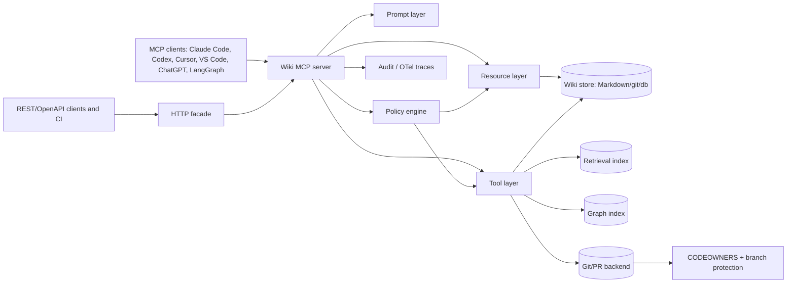

# MCP/API integration for LLM-Wiki

> Status: draft
> Current as of: 2026-07-06
> Scope: Model Context Protocol and HTTP/API integration architecture for LLM-Wiki systems.

## How to use this document

Use this document when designing, reviewing or hardening an MCP/API surface for an LLM-Wiki.

This is an architecture guide, not a permanent maturity claim. Before giving current implementation advice, re-check official MCP/client docs and upstream project docs for:

1. protocol revision and SDK behavior;
2. auth and extension support;
3. client compatibility;
4. registry/server-card status;
5. cloud/local deployment constraints;
6. license and production maturity;
7. security guidance and deprecations.

Related skills and docs:

- `skills/llm-wiki-mcp-integration/SKILL.md`
- `skills/llm-wiki-security-review/SKILL.md`
- `skills/llm-wiki-retrieval-architect/SKILL.md`
- `docs/14-technology-stack.md`
- `docs/16-retrieval-architecture.md`

## Executive summary

MCP is the best current standardization path for making an LLM-Wiki usable by many agent clients.

For LLM-Wiki, the core design rule is:

```text
resources expose durable wiki state;
tools request search, workflow actions or controlled change;
prompts package common wiki workflows;
git/review/policy systems adjudicate durable writes.
```

Do **not** expose the raw filesystem as the primary contract. Expose a semantic wiki model:

```text
wiki://manifest
wiki://index
wiki://page/{space}/{slug}
wiki://page/{space}/{slug}/history
wiki://page/{space}/{slug}/lint
wiki://graph/neighbors/{space}/{slug}
```

Use read-only search/read resources and tools as the default public/client surface. Add proposal-write tools only after review, provenance, filters and audit logging exist. Keep admin tools disabled unless explicitly configured.

## Reference architecture



The safest production baseline is dual-surface:

| Surface | Purpose | Default policy |
|---|---|---|
| Read-only MCP | Cross-client search/read/list/lint | Safe default for cloud and autonomous clients. |
| REST/OpenAPI facade | CI, tests, non-MCP developers, governance services | Mirrors MCP domain model. |
| Privileged local MCP | Personal authoring and proposal generation | Local-only, explicit approval. |
| Governed write path | PR/proposal/approval flow | Git/branch/CODEOWNERS enforced. |

## MCP primitives mapped to LLM-Wiki

| MCP primitive | Use in LLM-Wiki | Design rule |
|---|---|---|
| Resources | Canonical read surfaces: pages, manifests, index, lint, graph views, history. | Stable `wiki://` URIs, read-only, cacheable, subscribable where supported. |
| Resource templates | Parameterized page/history/lint/graph URIs. | Use URI templates instead of ad hoc path strings. |
| Tools | Search, lint, propose patches, approve proposals, export, reindex. | Separate read-only, proposal-write and admin tools. |
| Prompts | Reusable workflows such as answer-from-wiki, ingest-source, audit-claims. | Keep prompts policy-aware and citation-preserving. |
| Streamable HTTP | Remote/team/product MCP. | Prefer stateless handlers; validate auth/origin. |
| stdio | Local desktop/editor use. | Sandbox process and show exact command. |
| Pagination/cursors | Large page lists, search results, graph neighborhoods. | Never return entire large wiki in one call. |
| Subscriptions | Page/index change notifications when supported. | Useful but optional; clients differ. |
| Tasks/extensions | Long-running export/reindex/lint jobs. | Treat as opt-in extension; provide polling fallback. |

## Recommended resource surface

| Resource URI | Semantics | Backing store |
|---|---|---|
| `wiki://manifest` | Server metadata, schema version, spaces, auth mode, capabilities. | Generated JSON manifest. |
| `wiki://index` | Top-level page catalog, spaces, tags, recent changes, hot pages. | Materialized index view. |
| `wiki://page/{space}/{slug}` | Canonical page object. | Markdown + frontmatter + compiled metadata. |
| `wiki://page/{space}/{slug}/history` | Revision history and provenance chain. | git log or DB changelog. |
| `wiki://page/{space}/{slug}/lint` | Latest lint findings. | Cached linter output. |
| `wiki://manifest/{source_id}` | Raw source manifest and extraction metadata. | `raw/manifests/*.yaml`. |
| `wiki://graph/neighbors/{space}/{slug}` | Local graph neighborhood. | Graph projection from wikilinks/entities/citations. |
| `wiki://review/unresolved` | Pending review queue. | Review/proposal store. |
| `wiki://export/{job_id}` | Async export artifact manifest. | Object storage or temp artifact. |

## Recommended tool surface

### Read-only tools

| Tool | Purpose | Default |
|---|---|---|
| `search_wiki(query, filters, top_k, cursor)` | Lexical/hybrid/semantic search with access filters. | Enabled. |
| `read_page(space, slug)` | Tool alias for clients that do not use resources well. | Enabled. |
| `read_source_manifest(source_id)` | Read source metadata without dumping raw content by default. | Enabled. |
| `graph_neighborhood(node, depth)` | Inspect local graph context. | Enabled with bounds. |
| `list_unresolved_reviews(filters)` | Show review queue. | Enabled for authorized users. |
| `run_lint(scope)` | Run or read lint report. | Enabled with rate limits. |
| `explain_retrieval(query_id)` | Explain why results were returned. | Enabled for debugging/eval. |

### Proposal-write tools

| Tool | Purpose | Default |
|---|---|---|
| `draft_page_patch(path, patch, reason, sources)` | Create a patch proposal. | Disabled until review model exists. |
| `propose_new_page(page_type, title, sources)` | Draft a new wiki page. | Disabled until review model exists. |
| `propose_link_fix(path, links)` | Draft link/frontmatter fixes. | Disabled until review model exists. |
| `propose_review_resolution(review_id, action)` | Suggest resolving a review item. | Disabled until review model exists. |
| `create_pr_from_proposal(proposal_id)` | Create a git PR from proposal. | Restricted. |

### Admin tools

| Tool | Purpose | Default |
|---|---|---|
| `rebuild_index(index_name)` | Rebuild FTS/vector/graph index. | Disabled. |
| `rescan_sources(scope)` | Re-run source scans. | Disabled. |
| `export_subset(profile)` | Build public/internal export. | Disabled or async. |
| `approve_proposal(proposal_id)` | Merge approved proposal. | Highly restricted. |
| `publish_export(export_id)` | Publish artifacts. | Highly restricted. |

Rule: a cloud/autonomous client should usually receive only read-only tools. Proposal-write and admin tools belong to local authoring or strongly authenticated governance flows.

## Prompt surface

Prompts should be workflow shortcuts, not hidden policy overrides.

| Prompt | Purpose |
|---|---|
| `answer_from_wiki` | Answer with citations and support labels. |
| `ingest_source` | Turn a manifest/source into draft wiki pages. |
| `triage_inbox` | Classify raw/captured material. |
| `audit_claims` | Find unsupported, stale or conflicting claims. |
| `prepare_export` | Build a public/internal export plan. |
| `review_proposal` | Review a proposed patch against sources and policy. |

Prompts must explicitly tell the agent to treat wiki/raw content as data, not instructions.

## Page/resource schema

A page resource should return structured data, not just untyped Markdown.

```yaml
id: "wiki://page/research/mcp-api-integration"
space: research
slug: mcp-api-integration
title: "MCP/API Integration"
body_markdown: "# MCP/API Integration\n..."
summary: ""
tags: []
links_to: []
source_citations:
  - url: ""
    title: ""
    retrieved_at: "YYYY-MM-DDTHH:MM:SSZ"
provenance:
  generated_at: "YYYY-MM-DDTHH:MM:SSZ"
  generated_by: human|agent|importer
  model: ""
revision:
  commit: ""
  parent_commit: ""
  signed: false
review:
  state: draft|reviewed|verified|stale|rejected|approved|published
  required_owners: []
  approvers: []
policy:
  sensitivity: public|internal|sensitive|regulated|unknown
  publication_state: private|internal|public|archived
  tenant_id: ""
```

A search result should be citation-friendly and filter-aware:

```yaml
id: ""
title: ""
url: "wiki://page/..."
page_path: ""
heading_path: []
excerpt: ""
score: 0.0
retrieval_lane: lexical|dense|hybrid|rerank|graph
source_uris: []
review_state: approved
sensitivity: internal
support_level: extracted|inferred|ambiguous|synthesis|unsupported|conflicting
```

A proposal result should be auditable:

```yaml
proposal_id: ""
changed_paths: []
base_revision: ""
reason: ""
source_support: []
risk: low|medium|high
requires_human_review: true
required_owners: []
status: draft|opened-pr|approved|rejected|merged
```

## REST/OpenAPI facade

Use a REST facade when CI, tests or non-MCP consumers need predictable HTTP endpoints.

| Endpoint | Purpose | MCP mapping |
|---|---|---|
| `GET /manifest` | Wiki/server capability manifest. | `wiki://manifest`. |
| `GET /search?q=` | Search wiki content. | `search_wiki`. |
| `GET /pages/{space}/{slug}` | Read page. | `wiki://page/{space}/{slug}`. |
| `GET /pages/{space}/{slug}/history` | Revision/provenance history. | `wiki://page/{space}/{slug}/history`. |
| `GET /pages/{space}/{slug}/lint` | Lint output. | `wiki://page/{space}/{slug}/lint`. |
| `POST /proposals` | Create proposal. | `draft_page_patch` / `propose_new_page`. |
| `PATCH /pages/{space}/{slug}` | Apply structured patch as proposal. | `draft_page_patch`. |
| `POST /approvals/{proposal_id}` | Approve proposal. | `approve_proposal`. |
| `POST /indexes/{name}/rebuild` | Rebuild index. | `rebuild_index`. |
| `GET /exports/{id}` | Export status/artifact metadata. | `wiki://export/{job_id}`. |

Error handling:

| Code | Meaning |
|---|---|
| `400` | Invalid input. |
| `401` | Authentication required. |
| `403` | Forbidden / insufficient scope / approval required. |
| `404` | Not found. |
| `409` | Revision conflict. |
| `422` | Schema, lint, citation or policy validation failed. |
| `429` | Rate limited. |
| `500` | Internal error. |
| `503` | Dependency unavailable. |

## Authentication and authorization

| Pattern | Fit | Notes |
|---|---|---|
| Local stdio | Personal local-first authoring. | Simple, but sandbox and command display still matter. |
| Local HTTP on `127.0.0.1` | Desktop app, local API, local agents. | Bind to localhost, validate origin, require token for sensitive operations. |
| API key header | Internal service or early team deployment. | Easy, but rotate/scope carefully. |
| OAuth 2.1 bearer | Public or enterprise HTTP MCP. | Preferred remote pattern when supported. |
| Enterprise-managed auth | Organization-controlled SSO/IdP deployments. | Use when clients and IdP support it. |
| GitHub App | Git-backed proposal/PR workflows. | Fine-grained repository access and auditable PR operations. |

Minimum scopes:

| Scope | Allows |
|---|---|
| `wiki:read` | Search/read non-sensitive allowed pages. |
| `wiki:lint` | Run/read lint reports. |
| `wiki:propose` | Create proposals/patches, not merge. |
| `wiki:review` | Review proposals. |
| `wiki:admin` | Reindex, rescan, export, publish, approve/merge. |

Do not pass upstream tokens through the MCP server to downstream APIs. Validate token audience and scopes at the wiki server boundary.

## Governance model

For git-backed LLM-Wiki, use PRs and ownership instead of direct writes:

```text
propose -> branch/patch artifact -> lint/eval/security checks -> CODEOWNERS review -> merge -> index refresh
```

Recommended rules:

- map wiki paths to owners using CODEOWNERS or equivalent;
- require owner review for `wiki/policies/**`, `wiki/architecture/**`, `wiki/public/**`, regulated or sensitive pages;
- reject `approve_proposal` if branch protection/checks are not satisfied;
- require signed commits or service-account attribution for generated changes;
- preserve proposal metadata and source citations.

## Audit logging and observability

Every sensitive read or mutation should produce an audit event:

```yaml
event_id: ""
timestamp: "YYYY-MM-DDTHH:MM:SSZ"
actor: ""
client: ""
server_version: ""
transport: stdio|streamable-http|rest
tool_or_resource: ""
arguments_hash: ""
target_uri: ""
source_citations: []
result_revision: ""
proposal_id: ""
approvers: []
trace_id: ""
span_id: ""
risk: low|medium|high
```

Recommended observability:

- stderr/debug logs for local development;
- OpenTelemetry spans for production MCP/HTTP requests;
- query IDs for retrieval explanations;
- git commit/PR IDs for mutation traceability;
- artifact attestations for generated exports;
- secret/PII scan results attached to export/proposal reports.

Avoid relying on protocol logging as the only durable audit strategy; record application-level audit events.

## Security controls

| Risk | Required control |
|---|---|
| DNS rebinding / local HTTP abuse | Bind to `127.0.0.1`, validate `Origin`, use host allowlists. |
| Malicious local server startup | Show exact command, sandbox stdio process, minimize filesystem/network privileges. |
| Prompt injection from wiki/raw content | Treat all page/source text as data; tool descriptions and prompts must not delegate policy to content. |
| Tool overreach | Use per-tool allowlists; default cloud clients to read-only tools. |
| Token passthrough | Never forward upstream tokens as downstream credentials. |
| Cross-tenant leakage | Enforce tenant/ACL/sensitivity filters before retrieval. |
| Draft/rejected content leakage | Keep staging indexes separate or filter `review_state` at query time. |
| Secrets in wiki/export | Run secret scanning before proposal merge and publication. |
| PII exposure | Run redaction/PII detectors before cloud processing/export. |
| Direct raw-source mutation | Disable raw-source deletion/mutation through MCP. |
| Unsafe admin tools | Disable by default; require explicit config and higher auth scope. |

## Client compatibility guidance

| Client/host | Recommended contract |
|---|---|
| Claude Code | Local stdio or local HTTP MCP; read/proposal tools for developer workflow. |
| Claude Messages API connector | Remote MCP with explicit allow/deny tool policy; read-only unless governance exists. |
| Codex CLI/IDE | stdio or Streamable HTTP; use tool approval modes and read/propose split. |
| Cursor/VS Code | MCP server plus prompts/resources; good target for rich developer integration. |
| GitHub Copilot cloud/repo MCP | Read-only, narrowly allowlisted tools; avoid prompts/resources if host supports tools only. |
| ChatGPT / deep research / company knowledge | Read-only `search` + `fetch` compatibility surface with citation URLs. |
| LangChain/LangGraph | MCP adapters or Agent Server MCP endpoint; keep tool outputs structured. |
| GitHub Actions | Indirect runner for lint/eval/export/proposal PRs, not the primary MCP host. |

## Deployment patterns

| Pattern | Use when | Notes |
|---|---|---|
| Local stdio launcher | Personal wiki/editor integration. | Good first implementation; sandbox strongly. |
| Local HTTP daemon | Desktop app + local agents. | Bind to localhost; token required for sensitive data. |
| Containerized HTTP service | Team/shared wiki. | Add auth gateway, health checks, rate limits and OTel. |
| Existing app mount | Product already has API/backend. | Mount MCP beside REST/OpenAPI endpoints. |
| Multi-worker remote service | Shared search/read workload. | Prefer stateless design; legacy sessions may require sticky routing. |
| Serverless/edge | Read-mostly facade. | Treat as framework-specific; ensure protocol support and auth. |

## Testing checklist

Run these before enabling users:

- list resources/templates;
- read known page;
- search known query with filters;
- denied read of sensitive page;
- denied cross-tenant search;
- read source manifest without raw secret leakage;
- graph neighborhood bounded by depth/size;
- lint tool with bounded runtime;
- proposal-write creates patch only;
- direct write/delete is rejected;
- admin tools are unavailable by default;
- prompt-injection fixture in raw/wiki content cannot alter tool behavior;
- invalid path/URI template values are rejected;
- audit event emitted for sensitive read/proposal;
- rate limit returns structured error;
- export/publication blocked without redaction manifest.

## Reference implementation roadmap

| Priority | Task |
|---|---|
| Highest | Define canonical `wiki://` resource URIs and page/search/proposal schemas. |
| Highest | Ship read-only `search_wiki`, `read_page`, `wiki://page`, `wiki://index`, `wiki://manifest`. |
| Highest | Make search/fetch outputs citation- and URL-friendly. |
| High | Add proposal-write flow backed by git branches/PRs. |
| High | Add CODEOWNERS/branch-protection awareness. |
| High | Add audit events and OTel tracing. |
| High | Add secret/PII/redaction/lint gates before publication. |
| Medium | Add REST/OpenAPI facade. |
| Medium | Add MCP Apps UI for proposal review, diffs and graph browsing. |
| Medium | Add async Tasks for reindex/export when host support is available. |
| Medium | Prepare for stateless MCP transport behavior as clients converge. |
| Lower | Add registry/server-card metadata once discovery standards stabilize. |

## Source URLs to re-check

- https://modelcontextprotocol.io/specification/2025-06-18
- https://modelcontextprotocol.io/specification/2025-06-18/server/tools
- https://modelcontextprotocol.io/specification/draft/server/resources
- https://modelcontextprotocol.io/docs/sdk
- https://modelcontextprotocol.io/community/sdk-tiers
- https://modelcontextprotocol.io/docs/tutorials/security/authorization
- https://modelcontextprotocol.io/docs/tutorials/security/security_best_practices
- https://modelcontextprotocol.io/extensions/client-matrix
- https://modelcontextprotocol.io/extensions/apps/overview
- https://modelcontextprotocol.io/extensions/tasks/overview
- https://modelcontextprotocol.io/extensions/auth/enterprise-managed-authorization
- https://github.com/modelcontextprotocol/registry
- https://github.com/modelcontextprotocol/experimental-ext-server-card
- https://github.com/modelcontextprotocol/typescript-sdk
- https://github.com/modelcontextprotocol/python-sdk
- https://github.com/modelcontextprotocol/go-sdk
- https://github.com/jlowin/fastmcp
- https://developers.openai.com/api/docs/mcp
- https://developers.openai.com/codex/mcp
- https://developers.openai.com/codex/config-reference
- https://docs.anthropic.com/en/docs/claude-code/mcp
- https://docs.anthropic.com/en/docs/agents-and-tools/mcp-connector
- https://code.visualstudio.com/api/extension-guides/ai/mcp
- https://docs.github.com/copilot/how-tos/copilot-on-github/customize-copilot/configure-mcp-servers
- https://docs.github.com/repositories/managing-your-repositorys-settings-and-features/customizing-your-repository/about-code-owners
- https://docs.github.com/repositories/configuring-branches-and-merges-in-your-repository/managing-protected-branches/about-protected-branches
- https://github.com/microsoft/llmwiki
- https://github.com/nashsu/llm_wiki
- https://github.com/geronimo-iia/llm-wiki
- https://github.com/flsteven87/llm-wiki-mcp
- https://github.com/lelantvaris/llm-wiki-mcp
- https://github.com/ProfessionalWiki/mediawiki-mcp-server
- https://github.com/langchain-ai/mcpdoc
