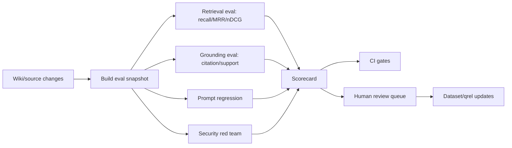

# Evaluation methodology for LLM-Wiki

> Status: draft
> Current as of: 2026-07-06
> Scope: retrieval, grounding, usefulness, operations, security and rollout evaluation for LLM-Wiki systems.

## How to use this document

Use this document to design an evaluation program for an LLM-Wiki, not just a one-off benchmark.

Evaluation for LLM-Wiki is layered:

```text
retrieval -> grounding -> answer quality -> wiki usefulness -> operational health -> security
```

Do not collapse these into one score. Each layer has different failure modes and different fixes.

Before recommending specific tools or commands, re-check current docs for Ragas, promptfoo, DeepEval, TruLens, LangSmith, OpenAI Evals/API Evals, Phoenix/Arize and any other evaluation platform because metrics, APIs, licenses, hosted features and deprecations change quickly.

Related skills and docs:

- `skills/llm-wiki-eval/SKILL.md`
- `skills/llm-wiki-eval-tooling/SKILL.md`
- `skills/llm-wiki-benchmark-suite/SKILL.md`
- `skills/llm-wiki-retrieval-architect/SKILL.md`
- `skills/llm-wiki-security-review/SKILL.md`
- `docs/16-retrieval-architecture.md`

## Executive summary

A rigorous LLM-Wiki evaluation program should measure these layers separately:

| Layer | Core question | Primary metrics |
|---|---|---|
| Retrieval | Did the system find the right pages/passages? | recall@k, MRR, nDCG@k, hit/miss labels, qrel coverage. |
| Grounding | Are answer claims supported by retrieved evidence? | citation coverage, unsupported-claim rate, faithfulness, source-support labels. |
| Answer quality | Does the answer solve the user's task? | human rubric score, pairwise preference, answer relevance, completeness, correctness. |
| Wiki usefulness | Does the wiki reduce real work over time? | answer reuse, read/write ratio, context reconstruction avoided, output beyond vault. |
| Operational health | Is the wiki alive and governed? | stale-page rate, review backlog, provenance coverage, freshness lag, broken links. |
| Security | Can untrusted context or prompts bypass policy? | prompt-injection success rate, PII/secret leakage, cross-tenant leakage, forbidden-source usage. |

The default tool stack:

| Need | Default tool path |
|---|---|
| Offline RAG metrics and synthetic testset generation | Ragas. |
| CI prompt/RAG regression and red-team checks | promptfoo. |
| Python unit-test style LLM evals | DeepEval. |
| Trace-level introspection and RAG Triad dashboards | TruLens. |
| Managed datasets, experiments, tracing and annotation queues | LangSmith. |
| Deterministic IR metrics | `pytrec_eval` or equivalent TREC-style scoring. |
| Fine-grained claim diagnostics | FActScore-style atomic claims, RAGChecker-style diagnostics, custom claim verifier. |

Best lean baseline:

```text
pytrec_eval + Ragas + promptfoo + custom wiki-lint/claim-audit scripts
```

Add LangSmith, TruLens, DeepEval, Phoenix/Arize, OpenAI Evals/API Evals or other platforms when the team's operating model requires their specific strengths.

## Metric framework

### Retrieval metrics

| Metric | Definition | Use when | Gate example |
|---|---|---|---|
| Recall@k | Share of relevant pages/passages present in top-k. | You must ensure evidence is found. | Recall@10 >= 0.85 on core set; Recall@20 >= 0.95 for high-stakes pages. |
| MRR | Mean reciprocal rank of first relevant result. | One correct page should be near the top. | MRR >= 0.70. |
| nDCG@k | Rank-aware graded relevance metric. | Relevance has levels: exact span > same section > related page. | nDCG@10 >= 0.80, no critical slice below 0.72. |
| Hit rate | Whether at least one relevant page appears. | Early pilots with sparse labels. | Hit@10 >= 0.90 for tier-1 queries. |
| Context precision/recall | Whether retrieved context is relevant and complete. | RAG-level evaluation with Ragas/DeepEval/TruLens-like tools. | Report first; gate after calibration. |

Minimum qrel schema:

```yaml
query_id: ""
query: ""
relevance:
  wiki/page.md#heading: 3
  raw/source.pdf#p12: 2
  wiki/related.md#section: 1
forbidden_sources: []
required_filters: {}
risk_tier: low|medium|high|critical
```

Use graded relevance when possible:

| Grade | Meaning |
|---|---|
| 3 | Exact supporting passage/span. |
| 2 | Correct section/page but not exact span. |
| 1 | Related but insufficient alone. |
| 0 | Irrelevant or forbidden. |

### Grounding metrics

| Metric | Definition | Measurement |
|---|---|---|
| Citation coverage | Share of answer sentences/atomic claims with valid citations. | Parse answer into sentences/claims and verify each cited source exists in retrieved context. |
| Unsupported-claim rate | Unsupported atomic claims divided by all atomic claims. | FActScore-style decomposition plus evidence verification. |
| Faithfulness | Whether answer is consistent with context. | Ragas/DeepEval/TruLens-like LLM judge with human calibration. |
| Source-support labels | `source-backed`, `wiki-backed`, `inferred`, `missing`, `conflicting`. | Deterministic + judge + human review for ambiguous cases. |
| Citation validity | Citations point to accessible source/page/span and support the cited claim. | Deterministic URI/anchor check plus sampled human verification. |

Recommended gates by risk:

| Risk tier | Citation coverage | Unsupported claims | Human review |
|---|---:|---:|---|
| Low | >= 0.80 | <= 0.10 | Sample only. |
| Medium | >= 0.90 | <= 0.05 | Review failures. |
| High | >= 0.95 | <= 0.02 | Review all failures and ambiguous cases. |
| Critical | >= 0.98 | 0 material unsupported claims | Human approval required. |

Claim-level evaluation matters because whole-answer scoring hides mixed outputs. A single answer can be 80% correct and still contain a dangerous unsupported claim.

### Answer quality metrics

| Metric | Use |
|---|---|
| Task success | Did the answer let the user complete the task? |
| Correctness | Is the answer factually correct relative to expected answer points? |
| Completeness | Does it include required steps/constraints/exceptions? |
| Relevance | Does it answer the actual question without irrelevant material? |
| Pairwise preference | Which of two systems is better under blind review? |
| Refusal/abstention quality | Does the system decline or ask for review when evidence is insufficient? |

Recommended human rubric:

```yaml
correctness: 1-5
completeness: 1-5
groundedness: 1-5
citation_quality: 1-5
actionability: 1-5
risk: low|medium|high|critical
reviewer_notes: ""
```

Use blind pairwise review for with-wiki vs without-wiki comparisons.

### Wiki usefulness metrics

| Metric | Definition | Interpretation |
|---|---|---|
| Answer reuse rate | Share of answers materially assembled from reviewed wiki pages. | Should rise as the wiki matures. |
| Retrieval hit rate | Share of real queries where relevant wiki pages were found. | Low value means capture/ingest/index is failing. |
| Read/write ratio | Wiki reads divided by wiki writes. | A mature wiki should be read, not only generated. |
| Context reconstruction avoided | Times the wiki prevented re-explaining/re-reading old context. | Useful adoption signal. |
| Output beyond vault | PRs, docs, reports, decisions or runbooks produced from wiki context. | Measures downstream work value. |
| Time saved estimate | Human-estimated time saved per answer/task. | Use trend, not precision. |

Do not optimize for note count, graph density or generated-page volume.

### Operational health metrics

| Metric | Definition | Gate example |
|---|---|---|
| Stale-page rate | Share of pages beyond freshness SLA. | Tier-1 pages <= 5% stale; all pages <= 15% stale. |
| Review backlog | Count/age of unreviewed changes. | Median age < 7 days; high-risk domains < 3 days. |
| Provenance coverage | Important claims with source links/anchors. | >= 95% for high-risk pages. |
| Broken-link rate | Broken wikilinks/citations. | 0 for verified pages. |
| Freshness lag | Time between source change and index/wiki update. | Repo docs <= 24h; incident/policy domains as defined. |
| Lint debt | Count/severity of lint findings. | No critical lint failures on main. |

### Security metrics

| Metric | Definition | Gate example |
|---|---|---|
| Prompt-injection success rate | Attacks that cause policy/tool/citation bypass. | <= 5% on non-critical suite; 0 critical exploits. |
| PII/secret leakage | Responses exposing protected data or canary secrets. | 0 confirmed leaks. |
| Cross-tenant leakage | Retrieval or answer includes unauthorized tenant content. | 0. |
| Forbidden-source usage | Answer uses sources excluded by policy. | 0. |
| Unsafe tool-use rate | Agent invokes tools outside allowed policy. | 0 for critical tools. |
| Redaction failure rate | Sensitive items missed before export/publication. | 0 material failures. |

LLM-Wiki systems ingest untrusted context. Security eval must include indirect prompt injection through retrieved chunks, PDFs, emails, tickets, browser clips and chat transcripts.

## Experimental designs

### With-wiki vs without-wiki

Question: does LLM-Wiki improve answers versus a baseline model without wiki access?

Design:

```text
same model + same prompt family + same question set
control: no wiki retrieval
variant: wiki retrieval / wiki context / wiki tools
measure: retrieval-independent quality, citation coverage, unsupported claims, human preference, latency
```

Recommended size:

- pilot: 30-50 questions;
- useful local benchmark: 200-300 examples;
- high-stakes slice: 50 critical examples.

### Retrieval ablation

Question: which retrieval architecture works best for this corpus?

Compare:

```text
rg/grep
FTS/BM25
vector only
hybrid lexical+dense
hybrid + reranker
hybrid + parent/context retrieval
graph/GraphRAG lane
```

Use the same qrels, filters and answer prompts. Report by query slice:

- exact lookup;
- conceptual;
- synthesis;
- multi-hop;
- recent/current-state;
- sensitive/policy;
- code/repo docs;
- table-heavy documents.

### Prompt robustness

Question: are results dependent on a brittle prompt?

Run 5-20 prompt variants over 50-100 examples. Track variance in citation coverage, unsupported claims, refusal quality and human preference.

### Human calibration

Question: do automated judges align with reviewers?

Monthly sample:

- 25 passing examples;
- 25 failing examples;
- 25 judge/human disagreements;
- 25 high-risk examples.

Use this set to recalibrate thresholds and update rubrics.

### Security red team

Question: can untrusted content or user prompts bypass policy?

Run scheduled suites against:

- `retrieved_chunks`;
- `email_body`;
- `chat_transcript`;
- `web_clip`;
- `pdf_text`;
- `tool_result`;
- `source_manifest`;
- `export_profile`.

Include canary secrets and synthetic PII in isolated fixtures.

## Dataset construction

### Recommended dataset sources

| Source | Use |
|---|---|
| Reviewed wiki pages | Core qrels and expected support spans. |
| Query logs | Real questions and failure cases. |
| Incident/runbook/policy pages | High-stakes slices. |
| PRs, issues, ADRs and changelogs | Repo-docs and decision-memory eval. |
| Support tickets and chat exports | Customer/workflow questions after redaction. |
| Synthetic test generation | Coverage expansion, not proof by itself. |
| Production trace failures | Regression cases. |

### Eval example schema

```yaml
id: "policy_014"
query: "What data can support agents export from the customer workspace?"
domain: policy
risk_tier: critical
query_type: factual
expected_pages:
  - wiki/policy/customer-data-access.md
expected_passages:
  - page: wiki/policy/customer-data-access.md
    anchor: allowed-exports
    span: "Agents may export case metadata but not raw payment credentials or full session transcripts."
forbidden_sources: []
required_filters:
  review_state: [approved, verified]
  sensitivity_allowed: [internal]
gold_answer_points:
  - Case metadata export is allowed.
  - Raw payment credentials are not exportable.
  - Full session transcripts are not exportable.
  - Escalate exceptions to security review.
must_cite_sources: true
freshness_sla_days: 14
```

### Dataset versioning

Version every eval dataset with:

```yaml
dataset_id: "llm-wiki-core-v1"
version: "2026-07-06"
source_revision: "git sha or wiki snapshot id"
qrel_revision: ""
labeling_policy: ""
reviewers: []
redaction_policy: ""
known_limitations: []
```

Track benchmark changes separately from system changes. Never compare two system versions using silently changed labels.

## Tool selection

| Tool | Best fit | Use cautiously when |
|---|---|---|
| Ragas | Offline RAG metrics, context precision/recall, faithfulness, synthetic testset generation. | You need deterministic IR-only scoring or strict no-cloud judge policy. |
| promptfoo | CI prompt/model/RAG regression, YAML tests, GitHub Actions, red-team/PII/prompt-injection checks. | You need complex trace dashboards or managed annotation queues. |
| DeepEval | Python-native pytest-like evaluation, G-Eval rubrics, faithfulness/contextual metrics, synthetic goldens. | You need fully declarative YAML-only workflows. |
| TruLens | RAG Triad, feedback functions, tracing, OpenTelemetry-style observability. | You only need simple offline qrel scoring. |
| LangSmith | Dataset versioning, experiments, traces, annotation queues, online/offline eval governance. | Fully OSS/local-only platform is required. |
| pytrec_eval | Deterministic Recall@k/MRR/nDCG/MAP on qrels. | You have no labeled qrels yet. |
| ARES | Calibrated RAG evaluation with synthetic data and small human annotation sets. | You are not ready for research-grade judge calibration. |
| RAGChecker | Fine-grained RAG diagnostics and human-correlation studies. | You need only lightweight CI pass/fail. |
| FActScore-style verifier | Atomic factuality/claim support. | Short answers with trivial citations are enough. |
| OpenAI Evals/API Evals | OpenAI-native eval workflows. | Check current deprecation/platform state before relying on specific APIs. |
| Phoenix/Arize | Observability and production tracing. | You only need local CI. |

## CI/CD evaluation pipeline

Recommended two-track pipeline:



PR-time gates:

- deterministic lint;
- broken links/citations;
- small retrieval smoke set;
- promptfoo regression subset;
- secret/PII scan;
- no critical unsupported-claim regressions.

Nightly gates:

- full retrieval eval;
- full grounding eval;
- security red-team suite;
- stale-page report;
- review backlog report;
- latency/cost trend report.

Release gates:

- with-wiki vs without-wiki comparison;
- retrieval ablations for major index changes;
- human calibration review;
- security sign-off for public/team deployments.

## Scorecard

Use a scorecard rather than one score.

```yaml
scorecard:
  retrieval:
    recall_at_10: 0.0
    mrr: 0.0
    ndcg_at_10: 0.0
  grounding:
    citation_coverage: 0.0
    unsupported_claim_rate: 0.0
    faithfulness: 0.0
  usefulness:
    retrieval_hit_rate: 0.0
    answer_reuse_rate: 0.0
    read_write_ratio: 0.0
  operations:
    stale_page_rate: 0.0
    review_backlog_count: 0
    median_review_age_days: 0
  security:
    prompt_injection_success_rate: 0.0
    pii_secret_leaks: 0
    cross_tenant_leaks: 0
  decision: continue|pause|redesign
```

## Failure taxonomy

| Failure | Likely fix |
|---|---|
| Relevant page missing from top-k | Retrieval/index/chunking fix. |
| Relevant page found but answer unsupported | Prompt/context-packing/grounding fix. |
| Correct answer but no citations | Answer formatting/citation enforcement fix. |
| Citation exists but does not support claim | Claim verifier/citation span fix. |
| Draft/rejected page used | Review-state filter fix. |
| Sensitive page surfaced | Permission/sensitivity filter fix. |
| Stale page trusted | Freshness/review policy fix. |
| Human says answer is bad but metrics pass | Judge/rubric calibration fix. |
| Metrics regress but humans prefer output | Label/qrel/rubric review. |
| Security red-team succeeds | Instruction hierarchy/tool boundary/redaction fix. |

## First 90 days roadmap

| Period | Work |
|---|---|
| Days 1-14 | Build a versioned core eval set from reviewed pages and real queries. Add page-level qrels. |
| Days 15-30 | Add Recall@k/MRR/nDCG scoring and retrieval smoke gates. |
| Days 31-45 | Add citation coverage and unsupported-claim checks. |
| Days 46-60 | Add promptfoo PR checks and nightly red-team runs. |
| Days 61-75 | Add human calibration queue and reviewer rubric. |
| Days 76-90 | Run retrieval ablations, set risk-tier thresholds and publish scorecard trend report. |

## Safety gates

- Do not use synthetic questions alone to justify adoption.
- Do not rely exclusively on LLM judges; keep human calibration samples.
- Do not evaluate sensitive corpora through cloud tools without model/data policy approval.
- Do not hide failed examples; they are the highest-value output.
- Do not compare runs across changed datasets without recording dataset revision.
- Do not treat external RAG benchmarks as proof that the user's local wiki works.
- Do not optimize for note count, graph density or other vanity metrics.

## Source URLs to re-check

- https://arxiv.org/abs/2405.07437
- https://arxiv.org/abs/2309.15217
- https://arxiv.org/abs/2311.09476
- https://arxiv.org/abs/2408.08067
- https://arxiv.org/abs/2305.14251
- https://arxiv.org/abs/2407.11005
- https://github.com/zeroentropy-ai/legalbenchrag
- https://arxiv.org/abs/2104.08663
- https://arxiv.org/abs/2009.02252
- https://arxiv.org/abs/2401.17043
- https://arxiv.org/abs/2506.12071
- https://docs.ragas.io/en/stable/
- https://www.promptfoo.dev/docs/intro/
- https://www.promptfoo.dev/docs/integrations/ci-cd/
- https://www.promptfoo.dev/docs/red-team/plugins/indirect-prompt-injection/
- https://www.promptfoo.dev/docs/red-team/plugins/pii/
- https://deepeval.com/docs/getting-started
- https://deepeval.com/docs/metrics-faithfulness
- https://www.trulens.org/getting_started/core_concepts/rag_triad/
- https://docs.langchain.com/langsmith/evaluation
- https://docs.langchain.com/langsmith/manage-datasets
- https://docs.langchain.com/langsmith/evaluation-concepts
- https://github.com/cvangysel/pytrec_eval
- https://github.com/stanford-futuredata/ARES
- https://github.com/amazon-science/RAGChecker
- https://github.com/felipemaiapolo/prompteval
- https://github.com/EleutherAI/lm-evaluation-harness
- https://github.com/openai/evals
- https://developers.openai.com/api/docs/guides/evals
- https://www.evidentlyai.com/ranking-metrics/precision-recall-at-k
- https://www.evidentlyai.com/ranking-metrics/ndcg-metric
- https://cheatsheetseries.owasp.org/cheatsheets/LLM_Prompt_Injection_Prevention_Cheat_Sheet.html
- https://genai.owasp.org/llmrisk/llm01-prompt-injection/
