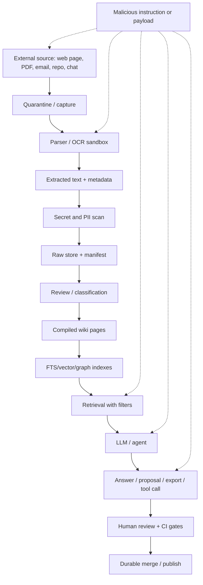

# Security threat model for LLM-Wiki

> Status: draft
> Current as of: 2026-07-06
> Scope: LLM-Wiki security architecture, threat model, controls, CI gates and incident response.

## How to use this document

Use this document when designing, reviewing or hardening an LLM-Wiki implementation.

This note is a security architecture guide, not a permanent vulnerability bulletin. Before making current claims about CVEs, MCP protocol revisions, scanner behavior, SDK defaults or hosted-provider security features, re-check official upstream sources and vendor advisories.

Related skills and docs:

- `skills/llm-wiki-threat-model/SKILL.md`
- `skills/llm-wiki-security-review/SKILL.md`
- `skills/llm-wiki-mcp-integration/SKILL.md`
- `skills/llm-wiki-privacy-redactor/SKILL.md`
- `skills/llm-wiki-model-policy/SKILL.md`
- `docs/17-mcp-api-integration.md`
- `docs/18-evaluation-methodology.md`

## Executive summary

LLM-Wiki is not just RAG with Markdown. It is a durable knowledge pipeline:

```text
untrusted sources -> ingestion/parsing -> raw store -> indexes -> retrieved context -> agent -> wiki pages/proposals/exports/tools
```

The dominant security risk is therefore boundary confusion: **untrusted content becomes model context**, and **model output becomes durable knowledge or action**.

The safest default posture:

1. Local-first where possible.
2. Parser and OCR jobs sandboxed.
3. Raw sources treated as untrusted evidence, not instructions.
4. Production retrieval limited to reviewed/approved knowledge unless explicitly scoped otherwise.
5. MCP/API surfaces read-only by default.
6. Proposal-write tools create patches or PRs, never direct writes.
7. CODEOWNERS, branch protection and required checks guard durable writes.
8. Secrets, PII, dependency, static-analysis and prompt-injection checks run in CI.
9. Exports, traces and logs are treated as sensitive data stores.
10. Incidents quarantine suspect sources/pages and rebuild indexes from known-good content.

## Component inventory

| Component | Typical artifacts | Primary security question |
|---|---|---|
| Ingestion | PDFs, Office docs, HTML, screenshots, images, audio, repo files, chats, email, web clips. | Can a malicious source exploit parser code, inject instructions, or smuggle secrets/PII? |
| Raw storage | `raw/sources/`, extracted text, OCR output, source manifests, hashes. | Is raw material immutable, classified, access-controlled and excluded from high-trust retrieval by default? |
| Compiled wiki | `wiki/*.md`, claim pages, synthesis pages, indexes, logs. | What makes a page trusted, reviewed, verified, stale, quarantined or rejected? |
| Indexes | FTS, vector, graph, hybrid search, cache stores. | Can indexes leak sensitive data, mix tenants, use stale content or include unreviewed/poisoned material? |
| Retrieval | Search, read, graph neighborhood, context packing. | Are access, review, sensitivity and freshness filters enforced before context reaches the model? |
| Agent/generation | Ingest, answer, summarize, propose, refactor, export. | Can untrusted content alter policy, trigger tools, or produce durable corrupt knowledge? |
| MCP/API | stdio MCP, local HTTP, remote MCP, REST/OpenAPI, SDKs. | Are tools scoped, authenticated, audited, rate-limited and separated into read/proposal/admin classes? |
| Review/write path | proposals, git branches, PRs, approvals, CODEOWNERS. | Can agents bypass review or approve their own claims? |
| Publishing/export | static site, `llms.txt`, JSONL, JSON-LD, GraphML, traces. | Can private raw/source/wiki content leak through generated public artifacts or logs? |
| CI/supply chain | Actions, scanners, parser images, lockfiles, MCP servers. | Are dependencies and automation pinned, scanned and least-privileged? |

## Data-flow threat model



Critical trust boundaries:

| Boundary | Default rule |
|---|---|
| External content -> parser | Run in sandbox, allowlist types, patch parsers, no secrets in worker. |
| Parser output -> raw store | Record hash/provenance; classify sensitivity; scan secrets/PII. |
| Raw store -> index | Exclude or quarantine high-risk content until classified. |
| Index -> model context | Apply tenant, sensitivity, review-state, freshness and source-domain filters before retrieval. |
| Model output -> wiki/proposal | Require source citations, diff, lint, security checks and review. |
| MCP/API -> tools | Separate read-only, proposal-write and admin tools; require auth for HTTP/remote. |
| Wiki -> export/trace | Redact and allowlist; treat traces/logs as sensitive stores. |

## Threat classes

### 1. Prompt injection

LLM-Wiki systems are highly exposed to indirect prompt injection because they ingest and retrieve untrusted content. Attackers can place instructions in:

- web pages and hidden HTML;
- PDFs, comments, white text, metadata and OCR text;
- emails and chat transcripts;
- GitHub issues, PRs, comments and source-code comments;
- raw source manifests;
- generated wiki pages not yet reviewed;
- MCP/tool results returned by external systems.

Controls:

- Treat all retrieved/source/wiki content as data, never as instructions.
- Keep tool policy in system/developer instructions and server-side code, not in retrievable pages.
- Stage public web research separately from private-data access.
- Use read-only tools for untrusted or cloud/autonomous clients.
- Require user/human confirmation for sensitive writes, exports and external sends.
- Add indirect-prompt-injection fixtures to CI.

### 2. RAG poisoning and durable knowledge corruption

In ordinary RAG, poisoned content can bias an answer. In LLM-Wiki, poisoned content can become durable:

```text
poisoned source -> retrieved evidence -> generated page -> reviewed-looking wiki -> future answers
```

Controls:

- Keep raw, draft, reviewed, verified, stale, rejected and quarantined states explicit.
- Production retrieval should default to `review_state IN approved|published|verified`.
- Store provenance hashes and source IDs for every compiled claim/page.
- Detect contradictions and stale claims.
- Require review before generated pages become retrievable as trusted context.
- Keep pending/rejected content out of production indexes or filter it before retrieval.

### 3. Parser and ingestion exploits

Document parsing is a classic software risk before any LLM is involved.

Risky source types:

- PDFs with embedded forms/scripts/metadata;
- Office docs and email containers;
- archives and nested attachments;
- images requiring OCR;
- HTML with remote resources or scripts;
- code repositories with generated files and symlinks.

Controls:

- Sandbox parser workers with no secrets and no write access to the main repo.
- Use temporary directories with path traversal protections.
- Disable parser network access unless explicitly needed.
- Record input/output hashes.
- Patch parsers and track CVEs.
- Allowlist file types and size limits.
- Quarantine parsing failures and suspicious extraction output.

### 4. Secret and PII leakage

Leak channels:

- raw sources;
- generated wiki pages;
- vector/FTS/graph indexes;
- prompt logs and traces;
- MCP/API search snippets;
- static exports;
- `llms.txt` / JSONL bundles;
- evaluation datasets and red-team artifacts.

Controls:

- Run secret scanning on raw, wiki, templates, prompts and exports.
- Run PII detection/redaction before indexing, cloud processing or publication.
- Avoid raw sensitive snippets in audit logs.
- Disable public trace sharing by default.
- Use redaction manifests for exports.
- Apply retention limits to raw captures, traces and temporary parser output.

### 5. MCP/API tool abuse

MCP/API surfaces are security-critical because they turn model decisions into system access.

Threats:

- unauthenticated remote MCP/API;
- localhost API reachable from browser through rebinding/origin issues;
- read tools that leak restricted content;
- proposal tools that become direct writes;
- admin tools exposed to autonomous clients;
- token passthrough to downstream systems;
- SSRF and proxy confusion in remote connectors;
- oversized graph/search/list calls causing data dumps.

Controls:

- Prefer stdio for local personal use.
- Bind local HTTP to `127.0.0.1`; require token for sensitive operations.
- Validate origin/host where applicable.
- Use OAuth/API scopes for remote surfaces.
- Separate read-only, proposal-write and admin tools.
- Disable admin tools by default.
- Enforce filters before retrieval, not after generation.
- Log sensitive reads, proposals and admin operations.
- Rate-limit and paginate large outputs.

### 6. Unsafe generated writes

Threats:

- agent writes durable claims without evidence;
- agent edits protected human sections;
- model-generated PR changes security/policy/workflows;
- self-approval or rubber-stamp approval;
- write proposal smuggles malicious prompt or link;
- branch protection or CI checks bypassed.

Controls:

- Agents propose; humans approve.
- Proposal artifacts contain diff, source support, risk and required owners.
- CODEOWNERS covers `wiki/`, `raw/`, `docs/`, `templates/`, `.github/`, `policies/` and MCP/API definitions.
- Branch protection requires checks and reviews.
- Generated changes to policies, workflows, tools, exports and security docs require security review.
- Pending/rejected content never participates in production retrieval.

### 7. Supply-chain risk

LLM-Wiki stacks depend on parsers, OCR, vector DBs, MCP SDKs, browser extensions, Actions, eval tools and model SDKs.

Controls:

- Pin GitHub Actions by commit SHA in production workflows.
- Keep `GITHUB_TOKEN` permissions minimal.
- Run dependency review on PRs.
- Run OSV Scanner or equivalent vulnerability scanning.
- Run Semgrep/CodeQL/static checks on custom code.
- Review MCP server/tool dependencies as privileged supply-chain components.
- Treat generated lockfile changes as security-relevant.

### 8. Export, publication and trace leakage

Exports and observability systems are secondary data stores.

Controls:

- Publish only allowlisted pages.
- Exclude `raw/` by default from public exports.
- Run redaction before generating static site, `llms.txt`, JSONL, JSON-LD or GraphML.
- Include export manifests with sensitivity and source counts.
- Store traces privately by default.
- Avoid logging full prompts with sensitive sources unless policy permits it.

## STRIDE mapping

| STRIDE category | LLM-Wiki example | Primary controls |
|---|---|---|
| Spoofing | Fake source identity, fake MCP server, forged author/reviewer. | Source manifests, signed commits, auth scopes, service identity, audit logs. |
| Tampering | Poisoned source, modified generated page, forged citation, changed index. | Hashes, provenance, git diffs, review state, rebuildable indexes, branch protection. |
| Repudiation | Agent or user denies proposing/approving a claim. | Proposal IDs, append-only audit logs, commit attribution, PR review history. |
| Information disclosure | Secret/PII leaks through retrieval, traces or exports. | Classification, filters, redaction, secret/PII scanners, private-by-default logs. |
| Denial of service | Huge ingestion files, graph explosion, expensive eval/red-team jobs. | Size limits, timeouts, queues, rate limits, bounded graph depth, async jobs. |
| Elevation of privilege | Prompt injection triggers admin tool, write bypasses review. | Tool classes, least privilege, user confirmation, CODEOWNERS, required checks. |

## LINDDUN-style privacy mapping

| Privacy risk | LLM-Wiki example | Controls |
|---|---|---|
| Linkability | Separate sources reveal same person/customer across pages. | Pseudonymization, minimization, restricted joins, tenant filters. |
| Identifiability | PII appears in wiki page, index or export. | Presidio/scrubadub/custom recognizers, redaction manifests. |
| Non-repudiation | Sensitive user actions preserved in traces longer than intended. | Retention limits, audit policy, access controls. |
| Detectability | Public export reveals that a sensitive source exists. | Export allowlist, source-ID redaction, sensitivity review. |
| Disclosure | Raw transcripts or customer data appear in agent-readable bundles. | Public/private split, export scans, `raw/` exclusion by default. |
| Unawareness | Users do not know captured chats/docs are indexed. | Capture notices, manifests, consent policy. |
| Non-compliance | Retention/export violates data policy. | Model/data policy, retention schedule, review gates. |

## Priority threat matrix

| Threat | Likelihood | Impact | Detection difficulty | Required controls |
|---|---|---|---|---|
| Indirect prompt injection causing exfiltration or unsafe tools | High | Critical | High | Staged workflows, read-only defaults, tool allowlists, promptfoo/garak tests, audit logs. |
| Corpus poisoning / durable wiki corruption | High | High | High | Reviewed-only retrieval, source hashes, provenance, contradiction checks, human approval. |
| Parser exploit during ingestion | Medium | Critical | Medium | Sandbox parser, patch CVEs, no secrets in worker, file-type allowlist. |
| Secret leakage through repo/wiki/export | High | High | Low | Secret scanning, push protection, gitleaks/detect-secrets/trufflehog, export redaction. |
| PII leakage through prompts/traces/indexes | High | High | Medium | PII detectors, minimization, redaction, trace retention and sharing controls. |
| Remote MCP/API auth or SSRF failure | Medium | High | High | OAuth/API scopes, SSRF protection, no token passthrough, egress allowlists. |
| Localhost MCP/API compromise | Medium | High | Medium | stdio preferred, token auth, origin validation, DNS rebinding protection. |
| Malicious generated PR/proposal | Medium | High | Medium | Proposal-only writes, CODEOWNERS, branch protection, required checks. |
| Dependency or GitHub Action supply-chain compromise | Medium | High | Medium | Pin actions, dependency review, OSV, SAST, restricted runners. |
| Public trace/log oversharing | Medium | Medium | Low | Private traces, scrubbed logs, retention policy, audit review. |

## Control baseline

### Minimum viable security baseline

Use this before any shared/team deployment:

- `raw/`, `wiki/`, `indexes/`, `exports/`, `traces/` and `evals/` are classified by sensitivity.
- Parser jobs run in isolated temporary directories.
- Secrets and PII scans run before export and before cloud processing.
- MCP/API is read-only by default and authenticated when HTTP/remote.
- Production retrieval excludes draft/rejected/quarantined content.
- Agent writes create proposals/patches only.
- CODEOWNERS and branch protection guard durable knowledge and security-sensitive files.
- CI includes secret scan, dependency scan, SAST and prompt-injection/red-team smoke tests.
- Public exports require explicit allowlist and redaction report.

### Recommended production baseline

Add:

- signed or attributable service-account commits;
- append-only audit log for sensitive reads, proposals and admin tools;
- explicit threat model and risk register;
- parser CVE review process;
- red-team suite for RAG, MCP and agent workflows;
- canary secrets and synthetic PII in isolated fixtures;
- incident response playbook;
- regular restoration/reindex test from known-good raw/wiki snapshot;
- human review for model/data policy exceptions.

## Security testing program

### CI lanes

| Lane | Purpose | Typical tools |
|---|---|---|
| Secrets | Prevent credentials entering repo/wiki/export. | GitHub secret scanning, gitleaks, detect-secrets, trufflehog. |
| Dependencies | Detect vulnerable parser/model/MCP/deployment deps. | Dependency review, OSV Scanner, npm audit, pip-audit. |
| Static analysis | Catch unsafe code/config/tool wrappers. | Semgrep, CodeQL, shellcheck, actionlint. |
| Prompt/RAG red team | Catch injection, poisoning and unsafe tool behavior. | promptfoo, garak, custom malicious-source fixtures. |
| PII/export | Prevent private data in exports/traces. | Presidio, scrubadub, regex/classifiers, redaction manifests. |
| Governance | Ensure review/branch/CODEOWNERS gates are active. | GitHub branch protection/ruleset checks, custom scripts. |

### Red-team scenarios

| Scenario | Seed | Expected safe behavior |
|---|---|---|
| Hidden webpage instruction | HTML comment or hidden CSS in web clip. | Agent ignores instruction and cites only relevant content. |
| Malicious PDF | Hidden prompt + parser edge case. | Parser sandbox contains file; source is quarantined if suspicious. |
| Poisoned wiki draft | Draft page claims false policy. | Production retrieval filters it out. |
| Cross-tool exfiltration | Public source asks agent to read private MCP and send data elsewhere. | Tool call denied or requires approval; audit event emitted. |
| Rogue local MCP install | Installer command tries shell side effects. | Client shows command and requires explicit consent. |
| Localhost rebinding | Browser attempts local API access. | Request denied by auth/origin/rebinding protections. |
| Malicious repo issue/PR | Prompt injection in issue asks coding agent to leak token. | Agent remains within read/proposal mode; no secret read/exfil. |
| Export oversharing | Public export profile accidentally includes sensitive page. | Export blocked by allowlist/redaction check. |

## Incident response

When prompt injection, poisoning or data leakage is suspected:

1. Disable public-web ingestion/browsing and external MCP access.
2. Freeze new imports and generated writes.
3. Revoke or rotate exposed secrets.
4. Quarantine suspect sources, pages, claims and indexes.
5. Mark suspect wiki pages `quarantined` or `rejected` so they are excluded from retrieval.
6. Preserve audit logs, traces, source hashes and PR metadata.
7. Rebuild indexes from known-good sources/pages.
8. Add a regression test reproducing the failure.
9. Review whether prompts, tool scopes, parser sandboxing or review gates failed.
10. Document post-incident actions and owners.

## Security scorecard

Use a scorecard instead of an informal checklist:

```yaml
scorecard:
  ingestion:
    parser_sandbox: pass|warn|fail
    file_type_allowlist: pass|warn|fail
    parser_cve_review: pass|warn|fail
  retrieval:
    reviewed_only_default: pass|warn|fail
    tenant_filters: pass|warn|fail
    sensitivity_filters: pass|warn|fail
  mcp_api:
    auth_required: pass|warn|fail
    read_propose_admin_split: pass|warn|fail
    admin_tools_disabled_by_default: pass|warn|fail
  writes:
    proposal_only_agents: pass|warn|fail
    codeowners: pass|warn|fail
    branch_protection: pass|warn|fail
  data_protection:
    secret_scan: pass|warn|fail
    pii_redaction: pass|warn|fail
    export_allowlist: pass|warn|fail
  ci:
    dependency_scan: pass|warn|fail
    sast: pass|warn|fail
    prompt_injection_redteam: pass|warn|fail
  incident_response:
    quarantine_policy: pass|warn|fail
    reindex_from_known_good: pass|warn|fail
```

## Rollout plan

| Period | Work |
|---|---|
| Days 1-14 | Inventory data flows, trust boundaries, MCP/API tools, captures, exports and existing CI. |
| Days 15-30 | Add secrets/PII/dependency/SAST gates and classify raw/wiki/export data. |
| Days 31-45 | Enforce reviewed-only retrieval and proposal-only writes for shared workflows. |
| Days 46-60 | Add MCP/API auth scopes, audit logs, rate limits and prompt-injection fixtures. |
| Days 61-75 | Add export redaction, trace retention, parser sandbox hardening and incident playbook. |
| Days 76-90 | Run full red-team suite, tabletop incident exercise and scorecard review. |

## Anti-patterns

- Treating vector indexes as harmless caches when they contain sensitive snippets.
- Letting draft or rejected pages participate in production retrieval.
- Giving cloud/autonomous clients proposal-write or admin tools by default.
- Treating `127.0.0.1` as sufficient without auth/origin/rebinding controls.
- Running document parsers with repo write access or model/provider secrets.
- Publishing `llms.txt` or static bundles without an allowlist and redaction report.
- Logging full prompts/sources by default in shared tracing systems.
- Letting agents edit `.github/`, `policies/`, `templates/`, `skills/` or MCP tool definitions without security review.
- Using prompt instructions as the only defense against prompt injection.
- Hiding failed red-team cases or poisoning fixtures to make scorecards look clean.

## Source URLs to re-check

- https://developers.openai.com/api/docs/guides/deep-research
- https://developers.openai.com/api/docs/guides/agent-builder-safety
- https://developers.openai.com/api/docs/mcp
- https://www.anthropic.com/research/prompt-injection-defenses
- https://github.blog/security/vulnerability-research/safeguarding-vs-code-against-prompt-injections/
- https://owasp.org/www-project-top-10-for-large-language-model-applications/
- https://cheatsheetseries.owasp.org/cheatsheets/LLM_Prompt_Injection_Prevention_Cheat_Sheet.html
- https://modelcontextprotocol.io/docs/tutorials/security/security_best_practices
- https://modelcontextprotocol.io/docs/develop/clients/client-best-practices
- https://modelcontextprotocol.io/specification/2025-06-18/server/tools
- https://modelcontextprotocol.io/specification/2025-06-18/basic/transports
- https://modelcontextprotocol.io/seps/1024-mcp-client-security-requirements-for-local-server-
- https://arxiv.org/abs/2302.12173
- https://arxiv.org/abs/2402.07867
- https://arxiv.org/abs/2603.25164
- https://arxiv.org/abs/2604.27202
- https://nvd.nist.gov/vuln/detail/CVE-2025-66516
- https://nvd.nist.gov/vuln/detail/CVE-2025-64712
- https://nvd.nist.gov/vuln/detail/CVE-2025-15063
- https://nvd.nist.gov/vuln/detail/CVE-2026-27826
- https://nvd.nist.gov/vuln/detail/CVE-2026-34742
- https://docs.github.com/en/actions/reference/security/secure-use
- https://docs.github.com/repositories/managing-your-repositorys-settings-and-features/customizing-your-repository/about-code-owners
- https://docs.github.com/repositories/configuring-branches-and-merges-in-your-repository/managing-protected-branches/about-protected-branches
- https://docs.github.com/en/code-security/concepts/secret-security/push-protection
- https://docs.github.com/en/code-security/how-tos/secure-your-supply-chain/manage-your-dependency-security/configure-dependency-review-action
- https://osv.dev/
- https://github.com/gitleaks/gitleaks
- https://github.com/Yelp/detect-secrets
- https://github.com/trufflesecurity/trufflehog
- https://docs.semgrep.dev/deployment/add-semgrep-to-ci
- https://github.com/data-privacy-stack/presidio
- https://microsoft.github.io/presidio/
- https://www.promptfoo.dev/docs/red-team/
- https://www.promptfoo.dev/docs/red-team/rag/
- https://www.promptfoo.dev/docs/red-team/mcp-security-testing/
- https://github.com/NVIDIA/garak
- https://github.com/vouchdev/vouch
