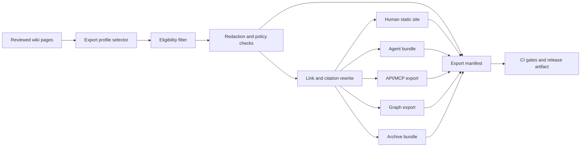

# Publishing and export architecture for LLM-Wiki

> Status: draft
> Current as of: 2026-07-07
> Scope: publishing reviewed LLM-Wiki content into human-readable, agent-readable, API, graph and archive outputs.

## How to use this document

Use this document when designing or reviewing an LLM-Wiki publishing/export pipeline.

This note is an architecture guide, not a permanent claim about current generator features. Before recommending concrete commands or hosted features, re-check upstream docs for MkDocs Material, Docusaurus, VitePress, Quartz, Astro/Starlight, Pagefind, `llms.txt`, OpenAPI, MCP, JSON-LD, archive tooling and hosted documentation platforms.

Related skills and docs:

- `skills/llm-wiki-export-publish/SKILL.md`
- `skills/llm-wiki-privacy-redactor/SKILL.md`
- `skills/llm-wiki-security-review/SKILL.md`
- `skills/llm-wiki-archive/SKILL.md`
- `docs/17-mcp-api-integration.md`
- `docs/18-evaluation-methodology.md`
- `docs/19-security-threat-model.md`
- `docs/20-ingestion-pipelines.md`

## Executive summary

Publishing should treat the wiki as one durable source of truth with multiple projections:

```text
reviewed wiki -> export profiles -> redaction/validation -> human site + agent bundle + API/graph/archive artifacts
```

Do not publish by copying the whole `wiki/` directory. Publish through explicit export profiles:

| Profile | Audience | Typical output | Default policy |
| --- | --- | --- | --- |
| `private-review` | maintainers and reviewers | review bundle, diff report, broken links, unsupported claims | includes draft/review material, never public |
| `internal-site` | team/company | static site, internal search, Markdown bundle | reviewed/approved internal pages only |
| `public-site` | public users | curated static docs, sitemap, Pagefind index | explicit allowlist, redaction required |
| `agent-bundle` | LLM/agent consumers | `llms.txt`, page Markdown/TXT, JSONL, JSON manifest | concise, cited, machine-friendly, no private raw content |
| `api-export` | product and integration clients | OpenAPI, MCP manifest/profile, JSON endpoints | read-only public/internal contract |
| `graph-export` | graph tools and visualization | JSON-LD, GraphML, Mermaid, GraphViz, Cytoscape JSON | edge provenance and sensitivity filtering |
| `archive` | long-term preservation | tar/zip, checksums, release artifact, WARC where applicable | immutable, versioned, access-controlled |

The safest default is:

```text
internal static build first -> filtered public build second -> agent-readable bundle last
```

Reason: agent-readable exports such as `llms.txt`, JSONL and graph files are easy to ingest wholesale. They need stricter allowlists, provenance and redaction than human sites.

## Reference architecture



Canonical output layout:

```text
exports/
  profiles/
    public-site.yaml
    internal-site.yaml
    agent-bundle.yaml
  builds/<profile>/<version>/
    site/
    markdown/
    llms.txt
    llms-full.txt
    pages.jsonl
    manifest.json
    graph.jsonld
    graph.graphml
    checksums.sha256
    export-manifest.yaml
  reports/<profile>/<version>/
    redaction-report.md
    citation-report.md
    broken-link-report.md
    search-index-report.md
```

Rules:

- `wiki/` remains source of truth.
- `exports/` is generated output.
- Public exports are allowlist-based, not denylist-based.
- `raw/` is excluded from public and agent exports by default.
- Every export has a manifest and checksum file.
- Export transforms must not rewrite source wiki pages.

## Export targets

### Human-readable sites

| Target | Best fit | Notes |
| --- | --- | --- |
| MkDocs Material | Documentation sites, handbooks, policy/runbook portals. | Strong Markdown docs workflow, built-in search, privacy/self-hosted asset controls. |
| Docusaurus | Product docs needing React/MDX components and versioned docs. | More frontend/tooling surface; good for interactive docs. |
| VitePress | Lightweight Vue/Vite docs with local search. | Good for lean docs with simple structure. |
| Quartz | Obsidian-style digital garden, backlinks, personal/team notes. | Strong fit for interlinked Markdown vaults. |
| Astro/Starlight | Modern docs site with custom web architecture. | Good when site/product frontend is already Astro-oriented. |
| Static Markdown bundle | Offline or repo-native consumption. | Lowest moving parts; good for internal handbooks. |

### Agent-readable exports

| Target | Purpose | Required controls |
| --- | --- | --- |
| `llms.txt` | Short root-level map of high-value pages for LLMs. | Include only approved public/internal pages for chosen profile. |
| `llms-full.txt` | De facto full-context bundle for tools that want one file. | High leakage risk; generate only from explicit profile. |
| Per-page `.md` / `.txt` | Direct page context for agents. | Stable URLs, title, status, citations, updated date. |
| `pages.jsonl` | Retrieval/eval/agent batch import. | Include metadata fields and source/citation support labels. |
| `manifest.json` / `manifest.yaml` | Machine-readable index of exported artifacts. | Include profile, version, counts, hashes, eligibility filters. |
| MCP resources | Live read interface to current wiki/export. | Read-only by default; auth and sensitivity filters. |
| OpenAPI | HTTP API contract for export/read/search endpoints. | Separate public/internal contracts. |

`/llms.txt` is the emerging canonical root file. `llms-full.txt` is useful but should be treated as an ecosystem convention, not a substitute for policy-aware exports.

### Graph and semantic exports

| Format | Use |
| --- | --- |
| JSON-LD | Linked-data-friendly graph and page metadata. |
| GraphML | Import into graph tools. |
| RDF/Turtle | Semantic web workflows. |
| Mermaid | Small human-readable diagrams in docs. |
| GraphViz DOT | Build diagrams and layout artifacts. |
| Cytoscape JSON | Interactive graph visualization. |
| CSV edge/node lists | Simple analysis and spreadsheet review. |

Graph exports must carry edge provenance, confidence and sensitivity. Generated edges are not trusted unless review state is explicit.

### Archive exports

| Artifact | Purpose |
| --- | --- |
| tar/zip bundle | Portable release artifact. |
| `checksums.sha256` | Integrity verification. |
| git tag/release | Versioned repository state. |
| WARC | Web-capture preservation when upstream pages matter. |
| source manifest snapshot | Provenance and rebuild context. |
| export manifest | Profile, policy and included/excluded paths. |

## Export profile schema

Every export should be driven by a profile.

```yaml
profile_id: public-site
version: "0.1.0"
audience: public|internal|private|agent|archive
purpose: ""
owner: ""
reviewers: []

include:
  paths: []
  tags: []
  spaces: []
  review_states:
    - approved
    - published
    - verified
  publication_states:
    - public
exclude:
  paths:
    - raw/**
    - wiki/drafts/**
    - wiki/private/**
  tags:
    - private
    - sensitive
  review_states:
    - draft
    - rejected
    - quarantined
  sensitivity:
    - sensitive
    - regulated
    - unknown

outputs:
  static_site: true
  markdown_bundle: true
  llms_txt: true
  llms_full_txt: false
  pages_jsonl: true
  jsonld_graph: true
  graphml: false
  openapi: false
  mcp_manifest: false
  archive_bundle: true

redaction:
  required: true
  report_path: exports/reports/public-site/latest/redaction-report.md
  fail_on_findings: true

validation:
  require_citations: true
  require_source_support: true
  require_no_broken_links: true
  require_checksums: true
  require_export_manifest: true
  require_search_index_allowlist: true
```

## Export manifest schema

An export manifest is the auditable record of what was produced.

```yaml
export_id: "public-site-2026-07-07"
profile_id: public-site
created_at: "YYYY-MM-DDTHH:MM:SSZ"
created_by: human|agent|ci
wiki_revision: ""
source_revision: ""
policy_revision: ""
profile_revision: ""

inputs:
  wiki_paths: []
  raw_manifest_paths: []
  excluded_paths: []

outputs:
  - path: exports/builds/public-site/2026-07-07/site/
    kind: static-site
    sha256: ""
  - path: exports/builds/public-site/2026-07-07/llms.txt
    kind: llms-txt
    sha256: ""

counts:
  pages_included: 0
  pages_excluded: 0
  citations_checked: 0
  links_checked: 0
  redactions_applied: 0
  files_emitted: 0

reports:
  redaction: ""
  citation: ""
  broken_links: ""
  search_index: ""
  security: ""

status: draft|passed|failed|published|archived
approvals: []
```

## Page export contract

Every exported page should carry enough metadata for humans and agents.

```yaml
id: ""
title: ""
slug: ""
source_path: "wiki/..."
export_url: ""
summary: ""
tags: []
review_state: approved|published|verified
publication_state: public|internal
sensitivity: public|internal
updated_at: "YYYY-MM-DD"
source_citations: []
claim_support:
  supported: 0
  unsupported: 0
  conflicting: 0
links:
  outgoing: []
  backlinks: []
checksums:
  markdown_sha256: ""
```

## `llms.txt` design

Recommended `llms.txt` structure:

```markdown
# Project or Wiki Name

> One-paragraph description of the exported knowledge boundary.

## Important

- This export includes only reviewed public pages from profile `public-site`.
- Source citations are preserved per page.
- Last generated: YYYY-MM-DD.

## Start here

- [Overview](./overview.md): High-level map of the wiki.
- [Concept index](./concepts/index.md): Core concepts.
- [FAQ](./faq.md): Common questions.

## Reference

- [Architecture](./architecture/index.md): System architecture pages.
- [Runbooks](./runbooks/index.md): Public runbooks.

## Optional

- [Full export](./llms-full.txt): Expanded single-file export when enabled.
```

Rules:

- Keep it concise.
- Prefer stable Markdown URLs.
- Explain export scope and exclusions.
- Do not include private source summaries.
- Link to per-page Markdown/TXT rather than stuffing everything into `llms.txt`.
- Generate `llms-full.txt` only when the profile explicitly permits it.

## Redaction and allowlist pipeline

Safe publication uses both allowlisting and scanning:

```text
candidate pages -> profile allowlist -> policy filters -> redaction scan -> citation/link validation -> search-index check -> export manifest -> publish
```

Default blockers:

- sensitivity is `sensitive`, `regulated` or `unknown`;
- review state is `draft`, `rejected`, `stale` or `quarantined`;
- publication state is `private` or `archived`;
- source citation is missing for material claims;
- broken links or citations remain;
- redaction report has blocking findings;
- public search index includes excluded content;
- `raw/` content appears in public or agent bundle.

## Static search indexing

Static search can leak excluded material if indexing happens after page generation but before redaction/filtering.

Recommended sequence:

```text
filter pages -> redact -> build site -> build Pagefind/search index -> inspect index report -> publish
```

Controls:

- use explicit include roots for indexed content;
- mark internal-only sections as non-indexable;
- verify generated search index does not include excluded paths;
- generate separate search indexes for internal and public sites;
- never reuse an internal search index in public builds.

## CI/CD publishing gates

PR-time gates:

- export profile schema valid;
- no draft/private/sensitive page in public profile;
- links and citations resolve;
- redaction scan passes;
- `llms.txt` generated and scoped correctly;
- export manifest and checksums generated.

Nightly gates:

- full public/internal build;
- static search index inspection;
- broken-link report;
- citation-support report;
- stale-page report;
- archive bundle smoke test.

Release gates:

- owner approval;
- security review for public/agent bundle;
- comparison against previous export manifest;
- changelog generated;
- rollback artifact retained;
- release tag or artifact published.

## Rollout plan

| Period | Work |
| --- | --- |
| Days 1-14 | Define export profiles and publication states. |
| Days 15-30 | Build internal Markdown/static-site export and manifest. |
| Days 31-45 | Add redaction, broken-link and citation gates. |
| Days 46-60 | Add public static site profile and search-index inspection. |
| Days 61-75 | Add `llms.txt`, JSONL and JSON-LD agent bundle. |
| Days 76-90 | Add archive artifacts, release process, rollback and monitoring. |

## Anti-patterns

- Publishing by copying the entire `wiki/` directory.
- Treating `llms-full.txt` as safe because it is plain text.
- Building public search indexes from internal site output.
- Losing citations while converting Markdown to static site pages.
- Rewriting source wiki links during export.
- Publishing graph exports without edge provenance or sensitivity filters.
- Publishing API/MCP surfaces with proposal-write or admin tools enabled.
- Archiving only rendered HTML and losing source manifests/checksums.
- Reusing one export profile for public, internal and agent audiences.

## Source URLs to re-check

- <https://llmstxt.org/>
- <https://www.mintlify.com/docs/ai/llmstxt>
- <https://squidfunk.github.io/mkdocs-material/>
- <https://squidfunk.github.io/mkdocs-material/plugins/search/>
- <https://squidfunk.github.io/mkdocs-material/plugins/privacy/>
- <https://docusaurus.io/>
- <https://vitepress.dev/reference/default-theme-search>
- <https://quartz.jzhao.xyz/>
- <https://starlight.astro.build/>
- <https://pagefind.app/>
- <https://pagefind.app/docs/indexing/>
- <https://json-ld.org/>
- <https://schema.org/>
- <https://graphviz.org/>
- <https://mermaid.js.org/>
- <https://js.cytoscape.org/>
- <https://graphml.graphdrawing.org/>
- <https://www.openapis.org/>
- <https://spec.openapis.org/oas/v3.1.0.html>
- <https://modelcontextprotocol.io/specification/2025-11-25>
- <https://www.w3.org/TR/activitystreams-core/>
- <https://iipc.github.io/warc-specifications/>
- <https://github.com/webrecorder/warcio>
- <https://github.com/internetarchive/warcprox>
- <https://www.gnu.org/software/tar/manual/html_node/Standard.html>
- <https://docs.github.com/en/actions>
- <https://docs.github.com/en/repositories/releasing-projects-on-github/about-releases>
- <https://docs.github.com/en/pages>
- <https://docs.github.com/en/code-security/secret-scanning/about-secret-scanning>
- <https://github.com/data-privacy-stack/presidio>
- <https://github.com/gitleaks/gitleaks>
- <https://github.com/Pratiyush/llm-wiki>
- <https://github.com/atomicstrata/llm-wiki-compiler>
- <https://github.com/swarmclawai/swarmvault>
