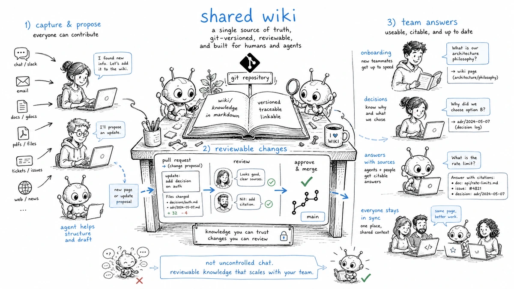
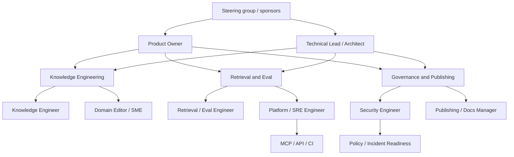

# Team operating model for LLM-Wiki

> Status: draft
> Current as of: 2026-07-07
> Scope: organizational model, governance, ownership, review workflows, metrics, rituals and rollout practices for teams operating LLM-Wiki systems.

## How to use this document

Use this document when an LLM-Wiki is moving from personal/local use to a team, company or multi-domain operating model.

This note is an operating-model guide, not a universal staffing mandate. Adapt it to team size, regulatory context, support hours, hosting model and risk. Before giving current advice about external platforms, re-check current GitHub, SRE, OpenTelemetry, Prometheus, OpenAI evals, MCP/OpenAPI and vendor documentation.

Related skills and docs:

- `skills/llm-wiki-team-rollout/SKILL.md`
- `skills/llm-wiki-company-flow-audit/SKILL.md`
- `skills/llm-wiki-github-action/SKILL.md`
- `skills/llm-wiki-eval-tooling/SKILL.md`
- `skills/llm-wiki-security-review/SKILL.md`
- `skills/llm-wiki-mcp-integration/SKILL.md`
- `docs/17-mcp-api-integration.md`
- `docs/18-evaluation-methodology.md`
- `docs/19-security-threat-model.md`
- `docs/20-ingestion-pipelines.md`
- `docs/21-publishing-export.md`

## Executive summary

The best operating model for a serious LLM-Wiki is a **cross-functional product-and-reliability pod**. It treats the wiki as a production knowledge system, not as a passive documentation folder or a prompt-only AI experiment.

The core workstreams are:

```text
source ingestion -> wiki compilation -> retrieval/eval -> security/governance -> publishing/interfaces -> operations/incident response
```

Recommended default:

```text
single accountable product pod + shared platform/security support + domain-owner review network
```

For most teams:



- use **PR/proposal-based writes** rather than direct agent writes;
- use **CODEOWNERS/branch protection/required checks** for durable knowledge changes;
- use **DACI** for high-stakes decisions and **RACI** for repeatable execution;
- make **review queues** visible and time-bounded;
- measure **retrieval, grounding, freshness, review backlog, reliability and adoption** separately;
- apply **SLO/error-budget thinking** to production-facing query/API/MCP/export surfaces;
- keep **human domain ownership** for acceptance of ambiguous claims;
- avoid 24/7 promises unless the team is staffed for a real on-call rotation.

## Operating principles

| Principle | Meaning |
| --- | --- |
| Product, not folder | The wiki has users, interfaces, releases, incidents, and quality gates. |
| Agents propose, owners approve | Automation maintains bookkeeping and drafts; humans own truth promotion. |
| Reviewed knowledge is a separate state | Draft, rejected, stale and quarantined pages do not equal production knowledge. |
| Ownership follows domain and path | `wiki/policies/**`, `wiki/architecture/**`, `api/**`, `exports/**`, `skills/**` need named owners. |
| Evals are operational controls | Retrieval and answer quality are monitored like product quality. |
| Publishing is a release | Public/internal/agent bundles require profiles, redaction, manifests and approval. |
| Incidents teach the system | Retrieval failures, poisoning, stale-policy answers and unsafe exports create regression tests. |

## Reference organization model



Recommended roles:

| Role | Mission | Primary artifacts |
| --- | --- | --- |
| Product Owner | Own scope, value, priority, stakeholder alignment and acceptance thresholds. | roadmap, rollout plan, KPI targets, decision records. |
| Technical Lead / Architect | Own system architecture and technical coherence across ingest, retrieval, eval, MCP/API and export. | architecture docs, schemas, API/MCP contracts, ADRs. |
| Knowledge Engineer | Own source normalization, taxonomy, provenance, page conventions and content QA. | manifests, wiki structure, page templates, review queues. |
| Retrieval / Eval Engineer | Own answer quality, retrieval performance, eval datasets and regression gates. | eval suites, scorecards, index configs, failure taxonomy. |
| Platform / SRE Engineer | Own CI/CD, observability, SLOs, runbooks, deployment and incident readiness. | workflows, dashboards, alerts, runbooks, release plans. |
| Security Engineer | Own threat model, data boundaries, secret/private-data controls, approval rules and security testing. | threat model, security scorecard, red-team tests, policy exceptions. |
| Domain Editor / SME | Own factual correctness, domain acceptance and edge-case interpretation. | approved pages, glossary/taxonomy, claim reviews. |
| Publishing / Docs Manager | Own information architecture, release notes, export profiles and audience-specific publications. | docs IA, export manifests, changelogs, training material. |

## RACI model

| Workflow | PO | TL | KE | RE | PE | SEC | SME | PUB |
| --- | --- | --- | --- | --- | --- | --- | --- | --- |
| Source intake/classification | A | C | R | I | I | C | C | I |
| Ingestion parser/profile change | I | A | R | C | C | C | C | I |
| Schema/chunking/metadata change | I | A | R | C | C | C | C | I |
| Wiki page promotion to reviewed/verified | I | C | R | I | I | C | A | C |
| Retrieval/index tuning | I | A | C | R | C | C | I | I |
| Eval rubric/threshold change | A | C | C | R | I | C | C | I |
| MCP/API contract change | I | A | C | C | R | C | I | I |
| Security policy or threat model change | A | C | I | I | C | R | C | I |
| Public/agent export release | A | C | C | C | I | C | C | R |
| Production deployment | I | C | I | C | A/R | C | I | C |
| Incident response | I | C | I | I | R | A | I | C |

Legend:

- `R` = responsible;
- `A` = accountable;
- `C` = consulted;
- `I` = informed.

Use DACI for irreversible or cross-team decisions:

```yaml
decision:
  title: ""
  driver: ""
  approver: ""
  contributors: []
  informed: []
  context: ""
  options: []
  decision: ""
  consequences: []
  revisit_at: "YYYY-MM-DD"
```

## Governance layers

| Layer | Mechanism | Default rule |
| --- | --- | --- |
| Domain ownership | path ownership, domain SMEs, wiki spaces | each high-value domain has a named owner. |
| Technical ownership | architecture lead, ADRs, schema owners | architecture/schema/API/MCP changes require technical review. |
| Change control | PRs, CODEOWNERS, branch protection, required checks | team/shared knowledge uses PR/proposal writes. |
| Quality governance | eval datasets, scorecards, lint, review backlog | failures create cases and owner follow-up. |
| Security governance | threat model, redaction policy, model policy, incident playbooks | sensitive/public/external surfaces require security review. |
| Publishing governance | export profiles, release notes, manifests, approval | public/agent/API exports are releases. |
| Operational governance | SLOs, runbooks, alerts, error budgets | production surfaces have measurable reliability and support boundaries. |

## Write and review model

Recommended default flow:

```text
agent proposal -> branch/patch -> lint/eval/security checks -> CODEOWNERS/domain review -> merge -> index refresh -> release/export if needed
```

Review states:

| State | Meaning | Production retrieval default |
| --- | --- | --- |
| `draft` | generated or unreviewed content | excluded |
| `reviewed` | human checked for domain fitness | included for internal retrieval |
| `verified` | high-confidence source-backed material | included |
| `published` | approved for target publication profile | included for matching profile |
| `stale` | past freshness SLA | excluded or warning, depending on profile |
| `rejected` | known bad or superseded | excluded |
| `quarantined` | suspected poisoning/leak/security issue | excluded |

Risk-tiered approval:

| Change type | Approval |
| --- | --- |
| Low-risk page edits | normal PR review by domain owner or knowledge engineer. |
| Ingestion profile/parser change | technical + knowledge review. |
| Retrieval/index/eval threshold change | technical + retrieval/eval review. |
| Sensitive-policy/security content | security + domain owner. |
| MCP/API tool or permission change | technical + platform + security. |
| Public/agent export profile | product + publishing + security + domain owner. |
| CI/workflow/CODEOWNERS/branch rule change | platform + security. |

## Core operating workflows

### Source intake and ingestion

```text
capture -> classify -> manifest -> conversion -> extraction QA -> source page -> draft wiki update -> review -> index
```

Standing queue fields:

```yaml
source_item:
  id: ""
  owner: ""
  source_type: ""
  sensitivity: public|internal|sensitive|regulated|unknown
  ingestion_state: captured|manifested|converted|qa-failed|drafted|reviewed|indexed
  blocker: ""
  due: "YYYY-MM-DD"
```

### Retrieval and answer-quality operations

```text
query/failure -> classify failure -> add eval case -> fix index/prompt/schema/source -> rerun eval -> document decision
```

Failure classes:

- missing source;
- bad conversion;
- poor chunking;
- ranking miss;
- stale page;
- unsupported answer claim;
- citation mismatch;
- permission/filter failure;
- unsafe tool path.

### Publishing and interface operations

```text
candidate pages -> export profile -> redaction/citation/link checks -> manifest/checksums -> release approval -> publish
```

Public, agent-readable, API and graph exports must be treated as release artifacts, not ad hoc copies.

### Incident workflow

Incident types:

- retrieval returns restricted material;
- answer cites unsupported or stale policy;
- poisoned source enters reviewed content;
- public/agent export leaks excluded page;
- MCP/API tool bypasses expected scope;
- CI/eval gates fail after a change.

Default response:

1. freeze unsafe pipeline or export;
2. quarantine affected source/page/index/export;
3. preserve logs/manifests/PRs;
4. rebuild indexes from known-good state if needed;
5. add regression case;
6. publish post-incident action items.

## Metrics and SLOs

Layered scorecard:

| Layer | Metrics |
| --- | --- |
| Delivery | deployment frequency, lead time, change failure rate, MTTR. |
| Reliability | SLO attainment, latency, traffic, errors, saturation, index freshness lag. |
| Retrieval | recall@k, MRR, nDCG, query success rate, retrieval hit rate. |
| Grounding | citation coverage, unsupported-claim rate, source-support labels. |
| Wiki operations | review backlog, median review age, stale-page rate, provenance coverage, broken links. |
| Security | policy bypasses, secret/private-data findings, cross-tenant leak tests, incident MTTD/MTTC. |
| Adoption | active users, answer reuse, onboarding questions answered, read/write ratio, output beyond vault. |
| Team health | toil percentage, pager load, meeting load, ramp time, health-monitor score. |

Example SLOs:

```yaml
slos:
  retrieval_api:
    availability: "99.5% monthly"
    p95_latency_ms: 1500
  index_freshness:
    reviewed_page_indexed_within_hours: 24
  answer_grounding:
    citation_coverage_min: 0.90
    material_unsupported_claims_max: 0
  review_queue:
    median_age_days_max: 7
    high_risk_age_days_max: 3
  public_export:
    redaction_blocking_findings_max: 0
    broken_public_links_max: 0
```

Error-budget policy:

- if retrieval/export/API SLO is breached, pause feature rollout and prioritize reliability fixes;
- if grounding or citation gates fail, pause promotion of affected pages;
- if redaction/security gates fail, block public/agent export;
- if review backlog exceeds threshold, reduce automation intake or add reviewer capacity.

## Rituals and cadences

| Cadence | Ritual | Purpose |
| --- | --- | --- |
| Daily async | ingest/retrieval/security triage | classify new sources, broken queries, failed checks, urgent reviews. |
| Weekly | retrieval/eval review | inspect regressions, promote new test cases, approve threshold changes. |
| Weekly | review queue grooming | unblock high-risk pages and stale claims. |
| Weekly/biweekly | release/export review | confirm readiness, profile scope, approvers, rollback and publication status. |
| Biweekly | architecture/security review | decide medium/high-risk schema, MCP/API, ingestion, eval and policy changes. |
| Monthly | team health and toil review | check overload, pager load, meeting load, role gaps and automation opportunities. |
| Monthly | scorecard review | track SLOs, evals, review backlog, adoption and security metrics. |
| Quarterly | operating model review | revisit RACI, staffing, domains, policies and maturity roadmap. |
| Per incident | incident command and postmortem | restore safety, document root cause, add regression tests. |

## Staffing stages

These ranges are planning heuristics, not mandates.

| Stage | What is true | Suggested staffing |
| --- | --- | --- |
| Pilot | one domain, limited users, manual review acceptable, no external publishing. | 3-4 core FTE + part-time security/SME. |
| Early production | recurring ingest, CI evals, protected releases, growing stakeholders. | 5-8 FTE. |
| Business-critical | multi-domain, API/MCP surface, formal incident discipline, regular publishing/export. | 8-12 FTE. |
| Regulated or 24/7 | strict approvals, strong auditability, dedicated security, real on-call. | 12-20+ FTE; true 24/7 on-call needs dedicated rotation capacity. |

Hiring order:

1. Technical Lead / Architect.
2. Knowledge Engineer.
3. Retrieval/Eval Engineer.
4. Shared Platform/SRE and Security support.
5. Publishing/Docs Manager and domain reviewer network.
6. Dedicated platform/security/editorial roles at scale.

## Onboarding model

Ramp plan:

| Window | Focus | Exit criteria |
| --- | --- | --- |
| First 2 weeks | system map, policies, access, read core docs, observe ingest/eval/release. | can explain boundaries, owners, escalation and review states. |
| First month | perform one low-risk source ingest, one eval run, one page review under supervision. | can complete routine tasks with review. |
| Second month | own one recurring workflow or queue; improve one runbook. | can run a lane independently and escalate. |
| Third month | ship one change from planning to release; join incident drill. | ready for normal team rotation and ownership. |

Minimum onboarding checklist:

- team charter and working agreements;
- architecture overview;
- source model and review states;
- CODEOWNERS and approval rules;
- eval and security gates;
- incident and release playbooks;
- dashboards and scorecards;
- MCP/API/export boundaries;
- one shadowed ingest, eval review, release and incident drill.

## GitOps and repository controls

Recommended repository rules:

| Path | Owners / controls |
| --- | --- |
| `wiki/policies/**` | domain owner + security. |
| `wiki/architecture/**` | technical lead + domain owner. |
| `raw/manifests/**` | knowledge engineer + domain owner. |
| `skills/**` | skill owner + security review for tool/write behavior. |
| `templates/**` | technical lead + relevant workflow owner. |
| `.github/**` | platform + security. |
| `api/**`, `mcp/**` | technical lead + platform + security. |
| `exports/profiles/**` | publishing + security + product owner. |
| `evals/**` | retrieval/eval owner + domain reviewer where high-risk. |

Required checks by PR type:

| PR type | Checks |
| --- | --- |
| content/source page | lint, link/citation checks, review-state validation. |
| ingestion | manifest validation, parser smoke, private-data scan. |
| retrieval/eval | retrieval smoke, grounding gates, scorecard diff. |
| security/model policy | threat-model/security review. |
| MCP/API | contract tests, auth/scope tests, tool allowlist tests. |
| export/publish | profile validation, redaction, broken links, search-index inspection. |
| workflow/CI | CODEOWNERS, security review, minimal permissions review. |

## Dashboards

Minimum dashboard sections:

```yaml
dashboards:
  operations:
    - review_backlog_count
    - median_review_age_days
    - stale_page_rate
    - source_refresh_lag_hours
    - index_refresh_lag_hours
  quality:
    - retrieval_recall_at_10
    - citation_coverage
    - unsupported_claim_rate
    - eval_gate_pass_rate
  reliability:
    - query_latency_p95
    - query_error_rate
    - mcp_api_availability
    - export_pipeline_success_rate
  security:
    - blocking_redaction_findings
    - denied_cross_tenant_tests
    - prompt_injection_regressions
    - open_policy_exceptions
  adoption:
    - active_users
    - answer_reuse_rate
    - docs_read_write_ratio
    - onboarding_questions_answered
  team_health:
    - toil_percentage
    - pager_load
    - ramp_time_days
    - health_monitor_score
```

## First 90 days rollout

| Period | Work |
| --- | --- |
| Days 1-14 | Charter, team poster, working agreements, owners, domains, initial RACI. |
| Days 15-30 | PR-based write model, CODEOWNERS draft, review states, review queues. |
| Days 31-45 | Eval scorecard, ingestion/retrieval/publishing/security handoff maps. |
| Days 46-60 | SLOs, dashboards, runbooks, release and incident templates. |
| Days 61-75 | MCP/API/export governance, protected environments, decision records. |
| Days 76-90 | Health monitor, toil review, staffing gap review and maturity roadmap. |

## Anti-patterns

- Treating the wiki as a side folder with no product owner.
- Letting agents directly write team knowledge without review.
- Making the platform/SRE team the manual operator of every content update.
- Measuring only note count or generated page count.
- Hiding review backlog and stale pages.
- Combining draft and verified knowledge in production retrieval.
- Treating public export, `llms-full.txt`, MCP/API and internal search as the same risk profile.
- Creating a 24/7 support promise without enough people for a sustainable rotation.
- Having CODEOWNERS but no required checks or branch protection.
- Running evals without owners for failed cases.

## Source URLs to re-check

- <https://sre.google/sre-book/introduction/>
- <https://sre.google/workbook/engagement-model/>
- <https://sre.google/workbook/eliminating-toil/>
- <https://sre.google/sre-book/being-on-call/>
- <https://sre.google/sre-book/monitoring-distributed-systems/>
- <https://sre.google/workbook/implementing-slos/>
- <https://sre.google/workbook/error-budget-policy/>
- <https://sre.google/workbook/incident-response/>
- <https://sre.google/workbook/postmortem-culture/>
- <https://sre.google/workbook/canarying-releases/>
- <https://sre.google/workbook/overload/>
- <https://www.atlassian.com/team-playbook/plays/daci>
- <https://www.atlassian.com/team-playbook/plays/roles-and-responsibilities>
- <https://www.atlassian.com/team-playbook/plays/working-agreements>
- <https://www.atlassian.com/team-playbook/plays/team-poster>
- <https://www.atlassian.com/team-playbook/health-monitor>
- <https://rework.withgoogle.com/intl/en/guides/a-data-driven-approach-to-optimizing-employee-onboarding>
- <https://cloud.google.com/blog/products/devops-sre/using-the-four-keys-to-measure-your-devops-performance>
- <https://opentelemetry.io/docs/>
- <https://prometheus.io/docs/alerting/latest/overview/>
- <https://prometheus.io/docs/operating/security/>
- <https://nvlpubs.nist.gov/nistpubs/specialpublications/nist.sp.800-61r3.pdf>
- <https://nvlpubs.nist.gov/nistpubs/specialpublications/nist.sp.800-218.pdf>
- <https://slsa.dev/spec/v1.2/>
- <https://slsa.dev/provenance/v1>
- <https://docs.github.com/repositories/managing-your-repositorys-settings-and-features/customizing-your-repository/about-code-owners>
- <https://docs.github.com/en/repositories/configuring-branches-and-merges-in-your-repository/managing-protected-branches/managing-a-branch-protection-rule>
- <https://docs.github.com/actions/deployment/targeting-different-environments/using-environments-for-deployment>
- <https://docs.github.com/en/actions/concepts/security/openid-connect>
- <https://modelcontextprotocol.io/specification/2025-11-25>
- <https://spec.openapis.org/oas/v3.1.0.html>
- <https://developers.openai.com/api/docs/guides/evaluation-best-practices>
- <https://developers.openai.com/api/docs/guides/evals>
- <https://gist.github.com/karpathy/442a6bf555914893e9891c11519de94f>
- <https://github.com/nashsu/llm_wiki>
- <https://github.com/nvk/llm-wiki>
