# Self-hosted GitLab operating model for LLM-Wiki

> Status: draft
> Current as of: 2026-07-07
> Scope: team operating model for LLM-Wiki in self-managed GitLab and internal enterprise environments.

## How to use this document

Use this document when an LLM-Wiki team operates inside a company perimeter on GitLab Self-Managed rather than GitHub/GitLab.com.

This note assumes no specific company size, regulatory regime, cloud stance or Kubernetes footprint. Treat it as a neutral baseline for internal enterprise deployments, then tighten it for your actual risk profile.

Before giving current GitLab configuration advice, re-check official GitLab docs for edition availability, feature flags, API behavior, group/project inheritance, protected branches, merge request approvals, CODEOWNERS, protected environments, CI/CD components, runners, Pages, package/container registries, audit events, LDAP/SAML/SCIM, Geo, backup/restore, offline installation, compliance frameworks and GitLab agent for Kubernetes.

Related skills and docs:

- `skills/llm-wiki-gitlab-operating-model/SKILL.md`
- `skills/llm-wiki-team-rollout/SKILL.md`
- `skills/llm-wiki-security-review/SKILL.md`
- `skills/llm-wiki-github-action/SKILL.md`
- `docs/22-team-operating-model.md`
- `docs/19-security-threat-model.md`
- `docs/21-publishing-export.md`

## Executive summary

For internal enterprises running self-hosted GitLab, the recommended LLM-Wiki operating model is:

```text
central GitLab platform hub + federated domain/content pods + security/compliance guardrails + SRE-owned reliability
```

The core GitLab-native workflow is:

```text
issue/proposal -> feature branch -> merge request -> CI gates -> CODEOWNERS/approval rules -> protected branch -> protected environment -> release/evidence
```

Default recommendations:

- Use **one top-level group** for the organization and controlled subgroups for platform, security, domains, delivery and artifact management.
- Use **Merge Requests** as the write/review surface for LLM-Wiki changes.
- Use **CODEOWNERS + approval rules + protected branches** for durable wiki, policies, templates, CI, MCP/API and export profiles.
- Set production-bound protected branches so direct push is explicitly blocked.
- Use **protected environments + deployment approvals** for production or public/internal export publication.
- Use **group runners** for most shared enterprise CI and **project runners** for sensitive workloads; use instance runners only with segmentation and clear trust assumptions.
- Prefer external secrets managers over broad CI variables for sensitive credentials.
- Treat GitLab as a sensitive internal platform even when it is not Internet-exposed.
- Design for offline/air-gapped constraints with mirrors, dependency proxies, internal package feeds and runner images from day one.
- Use GitLab **Premium as the practical minimum** for serious multi-team governance; use **Ultimate** when centralized compliance policy enforcement and broad audit/compliance automation are mandatory.

## Self-managed GitLab capability model

GitLab self-managed operations have two layers:

| Layer | Meaning | Operating-model impact |
|---|---|---|
| Distribution layer | CE/EE terminology still appears in upgrade, restore and compatibility docs. | Backup/restore and upgrade compatibility must match GitLab version and type. |
| Subscription layer | Features are practically gated as Free, Premium, Ultimate. | Operating controls such as required approvals, CODEOWNERS enforcement, group protected branches, deployment approvals, Geo and compliance capabilities influence tier choice. |

Governance tier heuristic:

| Need | Minimum posture |
|---|---|
| Small internal pilot, low-risk docs, basic CI | Free may be sufficient. |
| Multi-team LLM-Wiki with required MR approvals, CODEOWNERS, protected environment approvals, Geo or group-level branch policy | Premium should be treated as the default minimum. |
| Centralized compliance frameworks, policy enforcement, broad audit-event streaming and compliance evidence workflows | Ultimate should be evaluated as the target. |

Do not decide tier based only on CI/CD. Built-in CI/CD is not the usual blocker; governance, compliance and auditability are.

## GitLab group and repository topology

Recommended topology:

```text
corp/                                  # top-level group
  platform/                            # GitLab platform, CI components, runners, deployment tooling
  security/                            # policy, threat model, red-team, audit integrations
  knowledge/                           # shared LLM-Wiki schemas, skills, templates, evals
  domains/
    product-a/
    product-b/
    support/
    architecture/
  delivery/                            # GitOps delivery repos, environment manifests
  artifacts/                           # package/container/OCI promotion projects
```

Rules:

- Keep top-level ownership small and audited.
- Use subgroups to separate permissions, runners, registries and compliance requirements.
- Keep platform-owned CI components separate from domain-owned content repositories.
- Use a separate `delivery/` group or subgroup when production deployment intent must be separated from application/content authoring.
- Use an `artifacts/` group for package/container promotion when package governance should be separated from source repositories.

## GitLab-native LLM-Wiki workflow

```mermaid
flowchart LR
    A[Issue / proposal] --> B[Feature branch]
    B --> C[Merge request]
    C --> D[Pipeline: lint/eval/security]
    D --> E[CODEOWNERS + approval rules]
    E --> F[Protected branch]
    F --> G[Index refresh / package artifact]
    G --> H[Protected environment]
    H --> I[Deployment approval]
    I --> J[Internal publish / MCP/API / export]
    J --> K[Release evidence and audit trail]
```



Recommended mappings:

| LLM-Wiki concern | GitLab primitive | Recommended use |
|---|---|---|
| Work intake | Issues, labels, milestones, issue boards | One issue per significant ingestion, policy, export, eval or platform change. |
| Review surface | Merge Requests | All shared durable changes go through MR review. |
| Domain ownership | CODEOWNERS | Path-based review for wiki domains, policies, templates, skills, CI and export profiles. |
| Mandatory approval | MR approval rules | Block merge until role/path/risk requirements are satisfied. |
| Branch protection | Protected branches | Explicitly prevent direct push to production-bound branches. |
| Validation | GitLab CI/CD | Lint, eval, security, manifest, redaction, export and contract tests. |
| Temporary validation | Review apps / dynamic environments | Use for docs/site/MCP/API previews where feasible. |
| Production authorization | Protected environments and deployment approvals | Require human approval for production, public exports and agent bundle publication. |
| Durable evidence | Releases, release evidence, package registry, artifacts | Attach scorecards, manifests, checksums and release notes. |
| Operations | Issue boards and labels | Run review queues, incident queues, policy exceptions and release readiness. |

## Roles and RACI

Recommended GitLab-specific role model:

| Role | Owns | Should not own alone |
|---|---|---|
| Content/domain owners | Wiki domain paths, CODEOWNERS entries, factual approval, domain backlog. | GitLab instance administration, runner fleet, global policy. |
| Platform engineers | GitLab administration, CI components, runners, registries, backup/restore, upgrades. | Domain truth, policy exceptions. |
| Security | Protected-branch baseline, secrets policy, supply-chain controls, red-team, audit integration. | Every routine content approval. |
| Compliance | Evidence model, retention requirements, compliance framework labels, approval records. | Pipeline implementation details. |
| SRE/platform operations | GitLab availability, SLOs, observability, patch windows, DR/failover drills. | Domain content correctness. |
| Publishing/docs owners | GitLab Pages/internal portal, export profiles, release notes, public/internal bundles. | Security exceptions. |

RACI baseline:

| Activity | Content owners | Platform | Security | Compliance | SRE | Publishing |
|---|---:|---:|---:|---:|---:|---:|
| Repository/subgroup placement | A/R | C | I | I | I | I |
| Shared CI component design | C | A/R | C | I | C | I |
| CODEOWNERS maintenance | A/R | C | C | I | I | C |
| Protected branch baseline | C | R | A | C | C | I |
| MR approval rules | C | R | A | C | I | I |
| Production deployment approvals | C | R | A | C | C | C |
| Runner fleet topology | I | A/R | C | I | C | I |
| Backup/restore design | I | R | C | C | A | I |
| GitLab patch/upgrade program | I | R | C | I | A | I |
| Audit event streaming / SIEM | I | R | A | C | C | I |
| Internal/public export release | C | C | C | C | I | A/R |
| DR / Geo failover drill | I | C | I | C | A/R | I |

## CODEOWNERS and approval rules

Recommended protected paths:

```text
.github/**                         # only if mirrored from GitHub; otherwise replace with .gitlab/** or CI paths
.gitlab-ci.yml
.gitlab/**
skills/**
templates/**
policies/**
api/**
mcp/**
exports/profiles/**
evals/**
wiki/policies/**
wiki/security/**
wiki/architecture/**
raw/manifests/**
```

Example GitLab `CODEOWNERS`:

```text
# GitLab / LLM-Wiki CODEOWNERS example

# Platform and CI
/.gitlab-ci.yml                 @corp/platform @corp/security
/.gitlab/**                     @corp/platform @corp/security
/templates/gitlab-*.yml         @corp/platform @corp/security

# Skills and agent behavior
/skills/**                      @corp/llm-wiki-maintainers @corp/security
/templates/**                   @corp/llm-wiki-maintainers

# Security, policy and model boundaries
/policies/**                    @corp/security @corp/compliance
/docs/*security*.md             @corp/security
/docs/*threat*.md               @corp/security
/mcp/**                         @corp/platform @corp/security
/api/**                         @corp/platform @corp/security

# Wiki domains
/wiki/policies/**               @corp/domain-policy @corp/security
/wiki/security/**               @corp/security
/wiki/architecture/**           @corp/architecture
/wiki/runbooks/**               @corp/sre
/wiki/sources/**                @corp/knowledge-engineering
/wiki/synthesis/**              @corp/knowledge-engineering @corp/domain-editors

# Evaluation and publishing
/evals/**                       @corp/retrieval-eval
/exports/profiles/**            @corp/publishing @corp/security
```

Approval rules by risk:

| Change type | Required approvals |
|---|---|
| Low-risk content update | domain owner or knowledge engineer. |
| Wiki page promotion to reviewed/verified | domain owner + knowledge engineer where provenance matters. |
| Ingestion/chunking/retrieval/eval change | technical lead + retrieval/eval or knowledge owner. |
| Security/model/data policy change | security + product/risk owner. |
| GitLab CI, runners, protected branch, environment or deployment policy | platform + security. |
| Public/internal/agent export profile | publishing + security + domain owner. |
| MCP/API permission/tool change | platform + security + technical lead. |

## CI/CD architecture for internal contour

Recommended CI architecture:

```text
central CI components + group/project extension points + scoped runners + protected deployments + release artifacts
```

Runner policy:

| Runner scope | Use | Caution |
|---|---|---|
| Instance runners | Low-risk shared jobs with strong isolation. | Broad blast radius; avoid for sensitive jobs unless segmented. |
| Group runners | Default for enterprise LLM-Wiki groups. | Keep group boundaries meaningful. |
| Project runners | Sensitive, high-privilege or special hardware/network jobs. | Higher operational overhead. |
| Offline runners | Air-gapped CI, internal mirrors, no Internet egress. | Requires curated images, package feeds and scanner data. |

Recommended CI stages for LLM-Wiki:

```yaml
stages:
  - validate
  - lint
  - eval
  - security
  - package
  - preview
  - deploy
  - release
```

Required checks by path:

| Path/change | Checks |
|---|---|
| `wiki/**` | wiki lint, link/citation checks, review-state validation. |
| `raw/manifests/**` | manifest schema, sensitivity classification, source hash. |
| `evals/**` | eval dataset schema, smoke run, scorecard diff. |
| `skills/**` | skill lint, trigger overlap, safety review. |
| `.gitlab-ci.yml` / `.gitlab/**` | CI lint, security review, protected variable/environment review. |
| `mcp/**` / `api/**` | contract tests, auth/scope tests, tool allowlist tests. |
| `exports/profiles/**` | export profile validation, redaction report, search-index inspection. |

## Protected branches and environments

Policy-as-document example:

```yaml
protected_branches:
  - name: main
    allowed_to_merge:
      - Maintainers
    allowed_to_push_and_merge: []
    require_code_owner_approval: true
    required_mr_approvals: 2
    allow_force_push: false
  - name: release/*
    allowed_to_merge:
      - ReleaseManagers
    allowed_to_push_and_merge: []
    require_code_owner_approval: true
    required_mr_approvals: 2
    allow_force_push: false
  - name: hotfix/*
    allowed_to_merge:
      - Maintainers
    allowed_to_push_and_merge:
      - ReleaseAutomation
    require_code_owner_approval: true
    required_mr_approvals: 1
    allow_force_push: false
```

Protected environment policy:

```yaml
protected_environments:
  - name: production
    allowed_deployers:
      - ReleaseManagers
      - PlatformDeployers
    required_approvals: 2
    approvers:
      - SecurityApprovers
      - DomainOwners
  - name: public-export
    allowed_deployers:
      - PublishingMaintainers
    required_approvals: 2
    approvers:
      - SecurityApprovers
      - PublishingApprovers
  - name: agent-bundle
    allowed_deployers:
      - PublishingMaintainers
    required_approvals: 2
    approvers:
      - SecurityApprovers
      - ProductOwners
```

## Internal publishing and LLM-Wiki outputs

Internal publication targets:

| Target | GitLab-native path | Controls |
|---|---|---|
| Internal docs portal | GitLab Pages or internal static hosting | protected environment, redaction scan, search-index inspection. |
| Agent bundle | package registry artifact or release asset | explicit export profile, checksums, security approval. |
| MCP/API deployment | internal Kubernetes/service platform | protected environment, auth scopes, audit logs, network segmentation. |
| Release evidence | GitLab Releases, artifacts, package registry | attach scorecards, manifests, checksums and changelog. |
| Graph/export bundle | generic package registry or release asset | sensitivity filters, edge provenance, owner approval. |

GitLab Wiki vs repository docs:

| Option | Use when | Avoid when |
|---|---|---|
| GitLab Wiki | Lightweight project/group notes, quick team pages, non-critical collaboration. | Need CI/eval/redaction, CODEOWNERS review, export profiles or reproducible release artifacts. |
| Repository docs / LLM-Wiki | Production knowledge, agent-readable context, governed export, reviewed truth states. | Very small ad hoc notes where process overhead is unjustified. |

For LLM-Wiki, repository docs are the default. GitLab Wiki can be a convenience surface, but durable reviewed knowledge should stay in versioned repository paths with MR governance.

## Identity, RBAC and internal security

Internal network does not equal trusted network.

Recommended internal controls:

- SSO through LDAP or SAML.
- Group membership through SAML group sync, SCIM or LDAP sync where available and approved.
- Least-privilege GitLab roles; restrict Owner/Maintainer sprawl.
- Separate platform/admin groups from content contributor groups.
- External secrets provider for sensitive CI secrets where possible.
- Protected variables only for protected branches/tags/environments.
- Protected runners for privileged jobs.
- IP restrictions or zero-trust access proxy where the environment requires it.
- Audit event collection and forwarding to internal SIEM where tier permits.
- Segmented network zones for GitLab app nodes, database/cache, runners, registries, object storage, secrets backend, Kubernetes agents and MCP/API services.

## Offline, air-gapped and restricted-egress environments

Plan for these from the start when egress is restricted:

| Need | Internal substitute |
|---|---|
| Base runner images | internal container registry mirror. |
| Language packages | internal package registry / proxy / curated artifact project. |
| Security analyzers | mirrored scanner images and offline analyzer data. |
| CI components | internal `platform/ci-components` project with versioned releases. |
| Docs/Pages build tools | pinned internal packages or container images. |
| MCP/API images | signed internal OCI images. |
| SBOM/provenance | generated and stored as CI artifacts/release assets. |

Rules:

- No pipeline should silently fetch from the Internet in restricted environments.
- Artifact promotion should use digests and checksums, not mutable tags alone.
- Offline package mirrors need owners, refresh cadence and vulnerability review.
- Restore drills must include object storage, registries, packages, uploads and GitLab secrets, not only the GitLab backup archive.

## GitOps deployment model

For Kubernetes deployments, use:

```text
app/content repo -> CI build/test/package -> internal registry -> delivery repo -> Flux + GitLab agent -> protected environment approval -> cluster
```

Recommended repository split:

| Repository type | Owns |
|---|---|
| application/content repo | LLM-Wiki source, skills, docs, tests, export configs. |
| CI components repo | reusable pipeline components and security baselines. |
| delivery repo | cluster/app desired state and promotion intent. |
| artifact project | packages, OCI images, release artifacts and signed bundles. |

Use one delivery repository per team or service family when production authorization must be separated from authorship.

## Operational SLOs and dashboards

Suggested SLOs:

```yaml
slos:
  gitlab_availability:
    target: "99.5% monthly"
  backup:
    scheduled_backup_success_rate: "99% monthly"
    restore_drill_success: "quarterly"
  runners:
    median_queue_wait_seconds_max: 60
    p95_queue_wait_seconds_max: 300
  wiki_index_freshness:
    reviewed_change_indexed_within_hours: 24
  release_pipeline:
    protected_export_success_rate: "99% monthly"
  security:
    blocking_redaction_findings_max: 0
    secret_push_bypass_max: 0
```

Dashboard sections:

- GitLab UI/API health;
- Sidekiq/job queue health;
- runner fleet utilization and wait time;
- CI pipeline success/failure by group;
- package/container registry health;
- backup and restore drill status;
- audit stream delivery;
- review backlog and stale pages;
- protected environment approval latency;
- export/publish pipeline status;
- GitLab patch/upgrade compliance.

## Incident and recovery model

Minimum runbooks:

- failed GitLab backup;
- restore rehearsal;
- runner saturation;
- runner compromise or privileged job misuse;
- registry or package feed outage;
- blocked deployment approval;
- accidental direct push / protected branch bypass;
- leaked secret or private data in wiki/export;
- failed GitLab upgrade;
- Geo failover / DR exercise;
- MCP/API internal service incident.

Incident response workflow:

```text
detect -> freeze unsafe workflow -> preserve audit/events/artifacts -> revoke/rotate credentials -> quarantine source/page/export -> restore/rebuild -> add regression test -> postmortem
```

## Rollout plan

| Window | Work | Exit criteria |
|---|---|---|
| Days 1-30 | GitLab admin ownership, SSO/LDAP/SAML, top-level group/subgroups, runner MVP, backup job, base CI components. | Pilot projects onboarded; access and backup baseline visible. |
| Days 31-60 | Protected branches, MR approval rules, CODEOWNERS, issue boards, artifact/package conventions, audit collection. | MR-driven workflow active; production policy agreed. |
| Days 61-90 | Protected environments, deployment approvals, release evidence, SIEM forwarding, restore rehearsal, dashboards, HA/Geo decision. | First restore drill and protected release completed; architecture decision ratified. |
| Days 91-180 | Offline mirrors, GitOps delivery repos, runner fleet tuning, compliance framework mapping, SLO/error budget review. | Platform operating cadence stable; owner model validated. |

## Anti-patterns

- Treating self-hosted GitLab as trusted because it is internal-only.
- Using GitLab Wiki for production LLM-Wiki knowledge that needs CI, CODEOWNERS and export gates.
- Letting instance runners execute sensitive workloads without segmentation.
- Letting Maintainers push directly to production-bound branches.
- Storing all secrets as broad CI variables instead of using external secrets and protected scopes.
- Publishing agent bundles or internal Pages without export profiles and redaction reports.
- Confusing GitLab Geo with high availability.
- Backing up only GitLab database/repositories while ignoring object storage, registry, packages, uploads and secrets.
- Running online scanners/build images in an air-gapped environment without internal mirrors.
- Buying Ultimate for compliance without staffing the operating model that makes compliance evidence credible.

## Source URLs to re-check

- https://docs.gitlab.com/user/group/
- https://docs.gitlab.com/user/group/subgroups/
- https://docs.gitlab.com/user/group/manage/
- https://docs.gitlab.com/user/project/repository/branches/protected/
- https://docs.gitlab.com/user/project/merge_requests/approvals/
- https://docs.gitlab.com/user/project/codeowners/
- https://docs.gitlab.com/user/project/issue_board/
- https://docs.gitlab.com/ci/yaml/includes/
- https://docs.gitlab.com/ci/components/
- https://docs.gitlab.com/ci/runners/runners_scope/
- https://docs.gitlab.com/ci/runners/configure_runners/
- https://docs.gitlab.com/runner/fleet_scaling/
- https://docs.gitlab.com/ci/environments/
- https://docs.gitlab.com/ci/environments/protected_environments/
- https://docs.gitlab.com/ci/environments/deployment_approvals/
- https://docs.gitlab.com/user/project/releases/
- https://docs.gitlab.com/api/releases/
- https://docs.gitlab.com/user/packages/
- https://docs.gitlab.com/user/packages/container_registry/
- https://docs.gitlab.com/user/packages/generic_packages/
- https://docs.gitlab.com/user/packages/workflows/project_registry/
- https://docs.gitlab.com/administration/auth/ldap/
- https://docs.gitlab.com/integration/saml/
- https://docs.gitlab.com/user/group/saml_sso/group_sync/
- https://docs.gitlab.com/administration/settings/scim_setup/
- https://docs.gitlab.com/ci/secrets/
- https://docs.gitlab.com/ci/pipeline_security/
- https://docs.gitlab.com/administration/compliance/audit_event_streaming/
- https://docs.gitlab.com/user/compliance/audit_event_types/
- https://docs.gitlab.com/user/compliance/compliance_frameworks/
- https://docs.gitlab.com/user/compliance/compliance_frameworks/centralized_compliance_frameworks/
- https://docs.gitlab.com/administration/backup_restore/backup_gitlab/
- https://docs.gitlab.com/administration/backup_restore/restore_gitlab/
- https://docs.gitlab.com/administration/geo/
- https://docs.gitlab.com/update/plan_your_upgrade/
- https://docs.gitlab.com/policy/maintenance/
- https://docs.gitlab.com/topics/offline/quick_start_guide/
- https://docs.gitlab.com/user/clusters/agent/gitops/
- https://docs.gitlab.com/user/clusters/agent/enterprise_considerations/
- https://csrc.nist.gov/pubs/sp/800/207/final
- https://www.cisa.gov/resources-tools/resources/layering-network-security-through-segmentation-infographic
- https://www.cisa.gov/resources-tools/resources/microsegmentation-zero-trust-part-one-introduction-and-planning
- https://slsa.dev/spec/v1.2/
