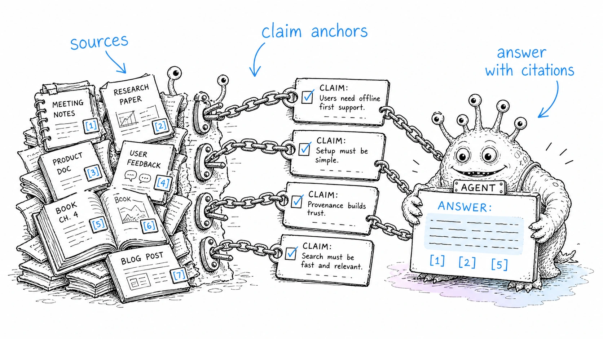

# Claim-level provenance anchors

> Status: draft
> Scope: deterministic Markdown convention for claim-level provenance in LLM-Wiki pages.

## Thesis

Page-level provenance is useful but not enough for high-trust knowledge. Important claims need stable anchors that can be audited, refreshed and linked back to raw sources.



## Anchor format

Use deterministic anchors:

```markdown
- Claim text. ^claim-20260706-001
  - Support: extracted
  - Source: `raw/sources/example.md` ^src-20260706-001
```

Allowed support values:

```text
extracted | inferred | ambiguous | synthesis | unsupported | conflicting
```

## Rules

1. Claim anchors start with `^claim-YYYYMMDD-NNN`.
2. Source anchors start with `^src-YYYYMMDD-NNN`.
3. Each claim anchor must be followed within three lines by a `Support:` line.
4. Anchors must be unique across real Markdown content.
5. Anchors inside fenced code examples are ignored by the validator.
6. Do not fabricate anchors for sources the agent did not inspect.
7. Use `unsupported` instead of forcing weak evidence to fit a claim.

## Example

```markdown
- Good answers should be filed back into the wiki. ^claim-20260706-002
  - Support: extracted
  - Source: `raw/sources/llm-wiki-idea.md` ^src-20260706-002
```

## Validator

Run the default repository-wide check:

```bash
npm run validate:claim-anchors
```

Run a scoped check:

```bash
node scripts/validate-claim-anchors.mjs wiki examples/minimal-vault/wiki
```

Show usage:

```bash
node scripts/validate-claim-anchors.mjs --help
```

The validator:

- preserves line numbers while ignoring fenced code blocks;
- rejects duplicate claim anchors and source anchors;
- requires each claim anchor to have a nearby `Support:` line;
- accepts optional path arguments, including external vault paths, for scoped validation;
- ignores files with `<!-- claim-anchor-validator: ignore-file -->`;
- ignores the line after `<!-- claim-anchor-validator: ignore-next -->`.

## Review workflow

1. `llm-wiki-provenance` finds unsupported or high-impact claims.
2. `llm-wiki-claim-anchors` adds deterministic anchors.
3. `npm run validate:claim-anchors` checks uniqueness and support lines.
4. `llm-wiki-conflict-resolver` handles conflicting claims.

## Failure modes

- Anchors without source inspection create false trust.
- Generated summaries citing other generated summaries are not enough for verified claims.
- Claim IDs that are rewritten during refactors break audit history.
- Fenced examples should not consume real claim IDs or create false duplicate failures.
