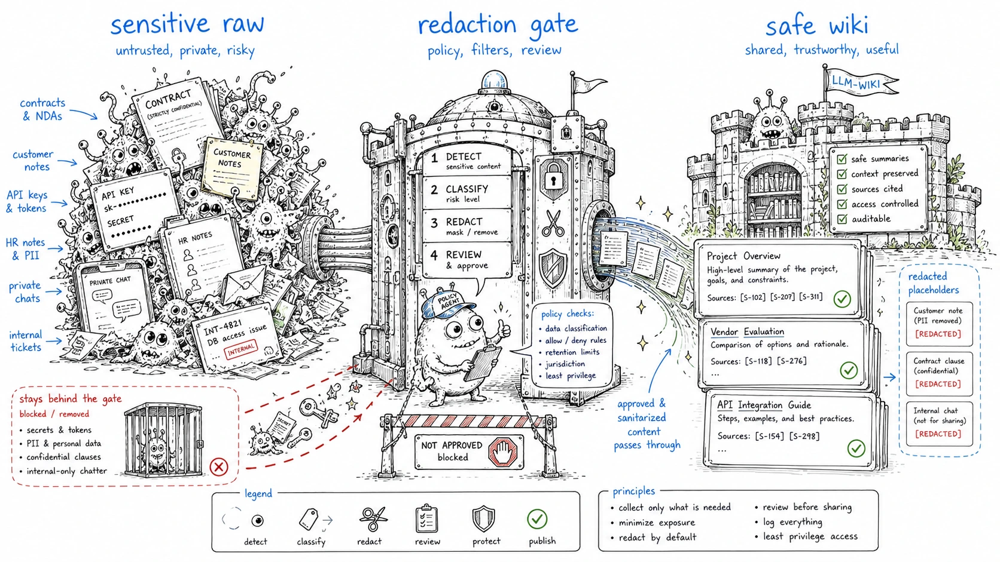

# Redaction policy

> Status: draft
> Scope: privacy checks before publishing an LLM-Wiki subset or sending context to external models.

## Default stance

Preview redactions first. Patch only an export copy unless the user explicitly asks to modify the source wiki.



## Sensitive patterns

| Category | Examples | Placeholder |
|---|---|---|
| Email | personal or company emails | `[REDACTED_EMAIL]` |
| Phone | phone-like strings | `[REDACTED_PHONE]` |
| Internal URL | private domains, localhost dashboards, intranet links | `[REDACTED_INTERNAL_URL]` |
| Secret-like token | API keys, bearer tokens, private keys | `[REDACTED_SECRET]` |
| Sensitive metadata | `privacy: sensitive`, `classification: confidential` | exclude page by default |

## Preview command

Run a human-readable preview:

```bash
npm run redact:preview -- examples/redaction-case
```

Run a JSON preview for tooling:

```bash
node scripts/redact-preview.mjs --json examples/redaction-case
```

Fail when findings exist, useful for publish gates:

```bash
node scripts/redact-preview.mjs --fail-on-findings publish/
```

The preview prints categories and line numbers, not matched sensitive values.

## Rules

1. Do not publish `status: draft` unless explicitly included.
2. Do not publish `privacy: sensitive` pages by default.
3. Do not send raw sensitive sources to external model providers without explicit approval.
4. Do not rely on regex-only redaction for legal, HR, medical or financial material.
5. Keep redaction logs private.
6. Treat redaction as a review aid, not proof that publishing is safe.

## Workflow

```text
select export subset -> redact preview -> human review -> export copy -> publish check
```
