# Ingestion pipelines for LLM-Wiki

> Status: draft
> Current as of: 2026-07-06
> Scope: capture, parsing, normalization, enrichment, chunking, provenance, review and compilation into durable LLM-Wiki artifacts.

## How to use this document

Use this document when designing, reviewing or upgrading an LLM-Wiki ingestion pipeline.

This note is an architecture guide, not a permanent tool benchmark. Before recommending concrete commands or supported-format claims, re-check official upstream docs for current parser support, license, cloud/local behavior, security notes, API changes and version compatibility.

Related skills and docs:

- `skills/llm-wiki-ingestion-stack/SKILL.md`
- `skills/wiki-ingest/SKILL.md`
- `skills/llm-wiki-capture-pipeline/SKILL.md`
- `skills/llm-wiki-channel-capture/SKILL.md`
- `skills/llm-wiki-security-review/SKILL.md`
- `skills/llm-wiki-retrieval-architect/SKILL.md`
- `docs/16-retrieval-architecture.md`
- `docs/19-security-threat-model.md`

## Executive summary

The safest LLM-Wiki ingestion architecture is **structure-first and provenance-preserving**:

```text
capture -> quarantine -> manifest -> convert/OCR/ASR -> normalize -> enrich -> chunk -> QA -> source page -> wiki draft -> review -> index
```

The main failure mode is not bad embeddings. It is bad conversion:

- dropped tables;
- broken reading order;
- missing page, timestamp, row or message anchors;
- lost attachments;
- flattened code or schema structure;
- missing sensitivity metadata;
- untrusted source instructions leaking into agent behavior.

The default stack by source class:

| Source class | Default path |
|---|---|
| Native PDF/Office/HTML | Docling for structure/provenance; MarkItDown for lightweight Markdown conversion. |
| Scanned PDFs/images | OCRmyPDF first; Docling/PaddleOCR/Marker for downstream structure. |
| Web pages | Playwright render capture + Readability extraction; ArchiveBox/SingleFile for durable snapshots. |
| Audio/video | yt-dlp where lawful + Whisper/faster-whisper; keep timestamped segments. |
| Code repositories | tree-sitter/ast-grep for AST-aware chunks; OpenWiki/RepoAgent-style docs for higher-level maps. |
| Emails/chats | mail-parser/Notmuch/official exports; preserve thread/message/attachment structure. |
| Tables/databases | dlt/Airbyte/DuckDB/pandas; preserve schema, query, row-group and source lineage. |

## Source taxonomy

| Source type | Canonical capture unit | Primary risks | Best default representation |
|---|---|---|---|
| PDF / Office / HTML documents | file or URL | reading-order loss, table loss, layout flattening | structured JSON + Markdown + page anchors |
| Scanned documents | scanned PDF or image | OCR errors, page skew, missing text layer | OCR'd PDF + structured JSON + confidence metadata |
| Web pages | rendered page snapshot | JS-rendered content loss, link rot, boilerplate | archived HTML/PDF/PNG + extracted article text |
| Audio / video | media file or stream | transcription drift, timestamp drift, speaker loss | transcript segments with timestamps |
| Code repositories | repo / commit / file tree | syntactic flattening, stale docs, missing symbols | AST-aware chunks + repo metadata |
| Chats / emails | thread / message / attachment | thread breakup, attachment detachment, privacy risk | thread-aware JSON + message-level metadata |
| Databases / tables | table / query / partition | schema drift, row-level provenance loss | Parquet/JSON + schema + query lineage |
| Images / figures | image / figure / page region | no surrounding context, OCR/table loss | extracted text/caption + bounding boxes + source anchor |

## Reference architecture

```mermaid
flowchart LR
    A[Capture source] --> B[Quarantine / staging]
    B --> C[Source manifest]
    C --> D[Parser / OCR / ASR worker]
    D --> E[Normalized structured output]
    E --> F[Security and privacy scan]
    F --> G[Enrichment and metadata]
    G --> H[Structure-aware chunking]
    H --> I[Ingestion QA]
    I --> J[wiki/sources page]
    J --> K[Entity/concept/synthesis draft]
    K --> L[Review gate]
    L --> M[Indexes: lexical, vector, graph]
```



Durable storage layout:

```text
raw/
  sources/<source_id>/original.ext
  manifests/<source_id>.yaml
  extracted/<source_id>/docling.json
  extracted/<source_id>/content.md
  extracted/<source_id>/chunks.jsonl
wiki/
  sources/<source_id>.md
  entities/
  concepts/
  synthesis/
indexes/
  fts/
  vectors/
  graph/
evals/
  ingestion-golden-corpus.yaml
  ingestion-fidelity-report.json
```

Rules:

- Raw sources are preserved unless retention policy explicitly says otherwise.
- Manifests are created before synthesis.
- Extraction artifacts are reproducible from raw source + manifest + parser version.
- Production indexes use reviewed or policy-approved content by default.
- Untrusted content remains data; it must not modify agent or tool instructions.

## Tool selection matrix

| Need | First choice | Upgrade / alternate | Main caution |
|---|---|---|---|
| Broad high-fidelity docs | Docling | Unstructured, Apache Tika, Marker | Verify current supported formats and layout fidelity. |
| Lightweight Markdown | MarkItDown | Pandoc | Not enough for high-fidelity tables/layout by itself. |
| Scanned PDF OCR | OCRmyPDF | Tesseract, PaddleOCR | OCR quality must be sampled. |
| Complex tables/forms/charts | PaddleOCR, Marker | Docling table structure | Licensing/version compatibility can matter. |
| Scientific PDFs/math | Nougat | Marker/Docling with formula extraction | Domain-specialized; do not assume general document fidelity. |
| Rendered web pages | Playwright | Browser-use/harnesses where appropriate | Must archive snapshots for provenance. |
| Web article extraction | Readability/ReadabiliPy | Custom DOM extraction | Weak on apps/dashboards. |
| Durable web archive | ArchiveBox, SingleFile | WARC tooling | More operational complexity; license review for SingleFile. |
| Audio/video | Whisper, faster-whisper | Cloud ASR with policy approval | Keep timestamp provenance and review transcription quality. |
| Video acquisition | yt-dlp | platform export/API where available | Use only where lawful and policy-compliant. |
| Code structure | tree-sitter, ast-grep | language servers, RepoAgent/OpenWiki | Preserve commit/path/symbol metadata. |
| Email | mail-parser, Notmuch | platform export APIs | Preserve thread and attachment links. |
| Chat exports | official export format | custom connector/API | Plan for sensitivity and workspace permissions. |
| Tables/DBs | DuckDB/pandas for local; dlt/Airbyte for pipelines | warehouse-native exports | Preserve schema, query and row-group provenance. |
| PII/private-data redaction | Presidio/scrubadub/custom recognizers | provider-native DLP with policy approval | Redact before external processing or embedding. |
| Secret scanning | gitleaks, detect-secrets, trufflehog | platform secret scanning | Scan raw, wiki, exports and configs. |
| Policy enforcement | OPA/custom policy | app-native RBAC | Enforce before retrieval, not after generation. |

## Pipeline archetypes

### 1. Local-first office/PDF knowledge base

Use for internal docs, reports, slide decks and policy PDFs.

```text
filesystem capture -> Docling/MarkItDown -> optional OCRmyPDF -> heading/page chunks -> local FTS/vector index
```

Recommended defaults:

- Parser: Docling for fidelity; MarkItDown for simple Markdown-first conversion.
- OCR: OCRmyPDF only when scans are present.
- Chunking: heading-aware, page-aware, 300-700 token target.
- Retrieval: SQLite FTS5 + LanceDB or local pgvector.
- Review: source pages first, synthesis later.

### 2. Scanned archive / records pipeline

Use for image-only PDFs, scanned records and paper archives.

```text
scanned PDF -> OCRmyPDF -> Docling/PaddleOCR/Marker -> page/region chunks -> QA -> reviewed source page
```

Required metadata:

- `ocr_engine`;
- `ocr_languages`;
- `ocr_confidence` where available;
- page number;
- bounding box if available;
- scan quality flags;
- review required.

Quality checks:

- empty-page detection;
- OCR gibberish/low confidence;
- page rotation/skew;
- table loss;
- duplicate pages;
- missing page anchors.

### 3. Web capture and normalization

Use for product docs, help centers, research pages and changing websites.

```text
URL list -> Playwright render -> ArchiveBox/SingleFile snapshot -> Readability extraction -> chunk by DOM/heading -> cite archive
```

Required metadata:

- canonical URL;
- fetched URL;
- fetch timestamp;
- HTTP status where available;
- title;
- snapshot path/hash;
- extractor version;
- robots/legal review flag when crawling.

Rule: cite the archived artifact or snapshot ID, not only the normalized text.

### 4. Media and meeting ingestion

Use for audio/video, meeting archives, trainings and webinars.

```text
media capture -> ASR -> timestamp segments -> speaker/section metadata -> source page -> synthesis draft
```

Recommended defaults:

- Acquisition: yt-dlp only where lawful or platform export where available.
- Transcription: Whisper or faster-whisper for local ASR.
- Chunking: by segment/time window, optionally topic boundary.
- Provenance: timestamp ranges must survive into citations.
- Review: sample transcripts before using as high-trust evidence.

### 5. Code + structured data hybrid pipeline

Use for engineering wikis, repo docs, data catalogs and lineage-heavy product knowledge.

```text
repo clone + data export -> tree-sitter/ast-grep + OpenWiki/RepoAgent maps + DuckDB/dlt/Airbyte -> symbol/schema chunks -> wiki docs
```

Required metadata:

- repository;
- branch;
- commit SHA;
- file path;
- symbol path;
- language;
- table name/schema;
- query/source connector;
- row group or partition where applicable.

Rule: do not chunk code by arbitrary token windows when AST/symbol boundaries are available.

### 6. Communication ingestion

Use for emails, Slack/Telegram/Discord exports, issue comments and meeting notes.

```text
platform export -> thread/message parser -> attachment extraction -> redaction/classification -> message/thread chunks -> source page
```

Required metadata:

- workspace/project;
- channel/thread/message IDs;
- author role if policy permits;
- timestamp;
- attachment IDs;
- privacy/sensitivity class;
- export scope and approval.

Rule: preserve thread/message/attachment relationships; do not flatten into one blob.

## Source manifest schema

Every source must have a manifest before generated wiki pages are trusted.

The canonical standalone template is `references/templates/source-manifest.yaml` inside this installed skill. Do not maintain partial schema copies in docs or skills.

Key field boundaries:

- `captured_by` is the actor class: `human|agent|connector|importer`.
- `capture_method` is the mechanism: `manual|watch-folder|api|export|crawler|repo-scan`.
- Channel names belong in channel-specific metadata, source identifiers, or capture pipeline envelopes, not in `captured_by`.

## Chunk schema

Chunks should be retrieval units, not the source of truth.

```yaml
chunk_id: ""
source_id: ""
source_type: ""
page_path: "wiki/sources/<source_id>.md"
source_anchor:
  page_no: null
  slide_no: null
  time_start_ms: null
  time_end_ms: null
  message_id: null
  thread_id: null
  row_group: null
  symbol_path: null
  bbox: null
section_path: []
text: ""
token_count: 0
hash_sha256: ""
created_by: parser|chunker|agent|human
review_state: draft|reviewed|verified|rejected|quarantined
sensitivity: public|internal|sensitive|regulated|unknown
acl_tags: []
```

## Quality gates

Evaluate conversion, provenance and retrieval separately.

| Gate | Purpose | Example threshold |
|---|---|---|
| Parser success rate | Detect broken converters. | No parser crash on golden PR set. |
| Text coverage | Detect empty or truncated extraction. | >= 0.98 for native text docs. |
| Heading preservation | Detect structure loss. | >= 0.95 on golden docs. |
| Table preservation | Detect table flattening. | >= 0.90 where tables matter. |
| Timestamp coverage | Detect ASR/media provenance loss. | >= 0.99 of transcript segments have timestamps. |
| Thread integrity | Detect chat/email flattening. | 1.0 for required test fixtures. |
| Provenance coverage | Ensure source-to-chunk traceability. | >= 0.99 for all production chunks. |
| Duplicate chunk rate | Detect repeated extraction noise. | <= 0.02. |
| Sensitive-data scan | Prevent unsafe indexing/export. | 0 unreviewed high-risk findings. |
| Retrieval smoke | Ensure new ingestion is findable. | Recall@10 does not regress. |

## Golden corpus strategy

Keep two corpora:

| Corpus | Size | Run when | Contents |
|---|---:|---|---|
| PR smoke corpus | 10-30 files | every PR | representative small docs, one scan, one web page, one chat/email fixture, one code sample. |
| Nightly corpus | 100-500 files | scheduled | difficult PDFs, scans, tables, charts, web pages, media, multilingual examples, repo snapshots. |

For each fixture, store expected properties, not just expected text:

```yaml
id: "scan_invoice_001"
source: "tests/golden/scan_invoice_001.pdf"
expected:
  source_type: scanned_pdf
  ocr_required: true
  min_pages: 2
  anchors:
    page: true
  max_duplicate_chunk_rate: 0.02
  required_fields:
    - source_id
    - content_sha256
    - parser.name
    - sensitivity
```

## Security and privacy controls

Ingestion security runs before indexing.

Required controls:

- quarantine untrusted sources before parsing;
- sandbox conversion/OCR/ASR workers;
- prevent parser workers from accessing repo write credentials and model/provider secrets;
- scan extracted text before external processing or embedding;
- classify sensitivity before production retrieval;
- keep raw, extracted, index, trace and export artifacts classified;
- enforce source-domain, tenant, sensitivity, review-state and publication filters before retrieval;
- block public exports without allowlist and redaction report.

Redaction order:

```text
capture -> hash -> convert in sandbox -> scan extracted text -> redact or classify -> write indexes -> review -> export
```

## Incremental sync and deduplication

Use content hashing and source IDs to avoid churn.

Recommended fields:

```yaml
sync:
  source_cursor: ""
  last_seen_at: "YYYY-MM-DDTHH:MM:SSZ"
  previous_sha256: ""
  current_sha256: ""
  change_type: new|updated|unchanged|deleted|renamed
  dedupe_key: ""
  canonical_source_id: ""
```

Rules:

- Reuse `source_id` when only metadata changes.
- Re-parse when content hash changes.
- Re-embed only changed chunks when chunk hashes are stable.
- Keep tombstone manifests for deleted upstream sources when citations may still reference them.
- Do not deduplicate across tenants or sensitivity classes without policy approval.

## Operational models

| Mode | Use when | Requirements |
|---|---|---|
| Manual batch | First migration or sensitive corpus. | Report-only dry run, human review. |
| Watched inbox | Personal capture. | Low-risk sources, clear review states. |
| PR-based ingest | Team repo/wiki. | Branch, diff, CODEOWNERS, CI gates. |
| Queue/worker ETL | Production scale. | Retries, idempotency, observability, dead-letter queue. |
| Connector platform | SaaS/db-heavy org. | Source scopes, incremental cursors, access review. |

## Observability

Track:

- ingest queue depth;
- parser success/failure by source type and parser version;
- conversion latency;
- OCR/ASR latency;
- average chunks per source;
- duplicate chunk rate;
- chunks missing provenance anchors;
- scan/redaction findings;
- embedding job failures;
- index refresh lag;
- retrieval recall drift after ingestion changes.

## First 90 days rollout

| Period | Work |
|---|---|
| Days 1-14 | Inventory source types, data classes, owners and retention constraints. |
| Days 15-30 | Add manifests, content hashing and raw/source/wiki layout. |
| Days 31-45 | Build golden corpus and ingestion smoke tests. |
| Days 46-60 | Add source-type pipelines for docs, scans, web, media, code and chats/email. |
| Days 61-75 | Add security scans, redaction, parser sandbox and reviewed-only indexing. |
| Days 76-90 | Add incremental sync, dedupe, observability and nightly fidelity regression. |

## Anti-patterns

- Flattening every source into one text field.
- Creating synthesis pages from unmanifested files.
- Discarding raw sources after conversion.
- Embedding raw sensitive captures before classification/redaction.
- Treating OCR/table extraction as trustworthy without sampling.
- Losing page, timestamp, message, row or symbol anchors.
- Using source URLs as durable provenance without archived snapshots.
- Mixing draft/rejected/quarantined content into production indexes.
- Running untrusted parsers with broad filesystem, network or credential access.
- Re-embedding the whole corpus on every small metadata change.

## Source URLs to re-check

- https://docling-project.github.io/docling/
- https://docling-project.github.io/docling/concepts/chunking/
- https://github.com/microsoft/markitdown
- https://docs.unstructured.io/open-source/introduction/overview
- https://tika.apache.org/
- https://ocrmypdf.readthedocs.io/
- https://tesseract-ocr.github.io/tessdoc/Installation.html
- https://paddlepaddle.github.io/PaddleOCR/main/en/index.html
- https://github.com/datalab-to/marker
- https://github.com/facebookresearch/nougat
- https://playwright.dev/
- https://github.com/mozilla/readability
- https://archivebox.io/
- https://github.com/gildas-lormeau/singlefile
- https://github.com/openai/whisper
- https://github.com/SYSTRAN/faster-whisper
- https://github.com/yt-dlp/yt-dlp
- https://github.com/tree-sitter/tree-sitter
- https://ast-grep.github.io/
- https://github.com/langchain-ai/openwiki
- https://github.com/openbmb/repoagent
- https://github.com/SpamScope/mail-parser
- https://notmuchmail.org/getting-started/
- https://slack.com/help/articles/201658943-Export-your-workspace-data
- https://dlthub.com/docs/intro
- https://docs.airbyte.com/
- https://duckdb.org/
- https://pandas.pydata.org/docs/reference/api/pandas.read_sql.html
- https://qdrant.tech/documentation/search/filtering/
- https://qdrant.tech/documentation/manage-data/indexing/
- https://docs.lancedb.com/quickstart
- https://github.com/pgvector/pgvector
- https://github.com/data-privacy-stack/presidio
- https://github.com/gitleaks/gitleaks
- https://github.com/Yelp/detect-secrets
- https://docs.semgrep.dev/getting-started/quickstart-ce
- https://docs.docker.com/engine/security/seccomp/
- https://openpolicyagent.org/docs
- https://docs.ragas.io/en/stable/concepts/metrics/available_metrics/context_precision/
- https://github.com/eXascaleInfolab/pytrec_eval
- https://www.promptfoo.dev/docs/intro/
- https://deepeval.com/docs/getting-started
